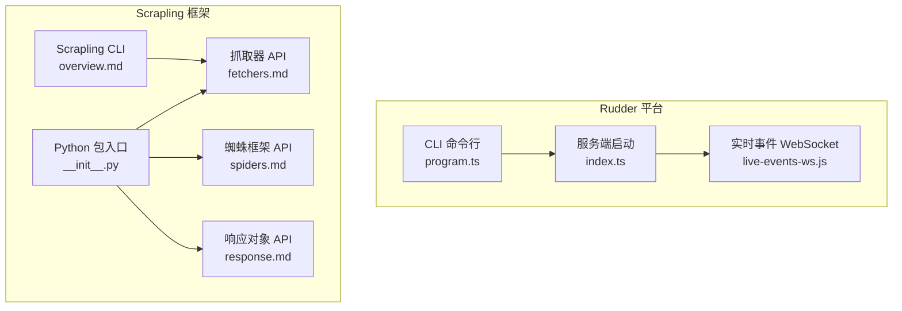
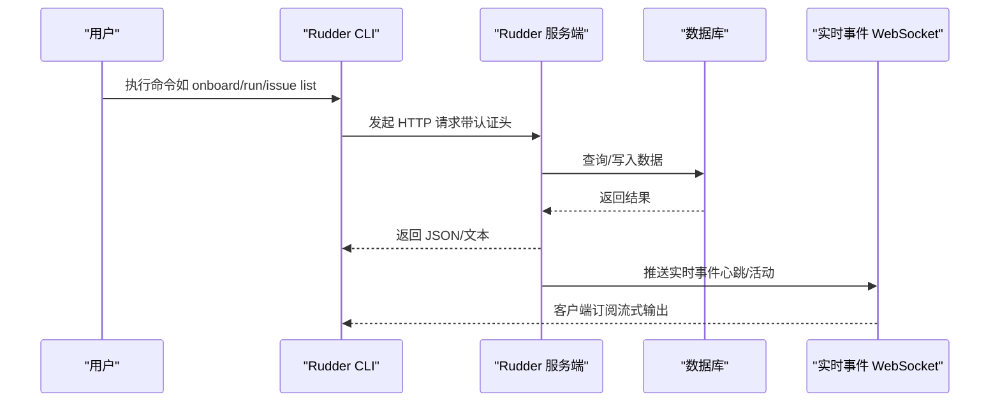
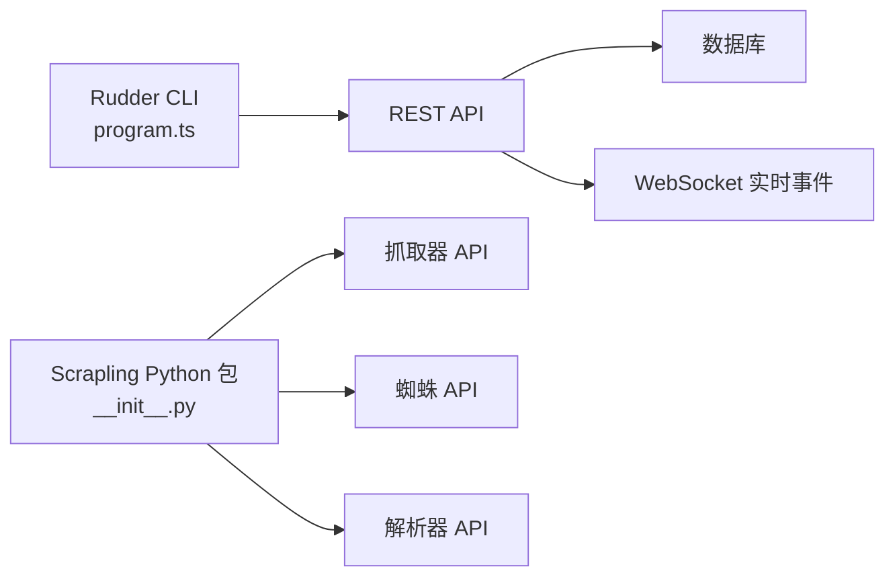

# API 参考文档

<cite>
**本文档引用的文件**
- [README.md](file://team/rudder/README.md)
- [CLI.md](file://team/rudder/doc/CLI.md)
- [index.ts](file://team/rudder/cli/src/index.ts)
- [program.ts](file://team/rudder/cli/src/program.ts)
- [index.ts](file://team/rudder/server/src/index.ts)
- [README.md](file://crawl/Scrapling/README.md)
- [spiders.md](file://crawl/Scrapling/docs/api-reference/spiders.md)
- [fetchers.md](file://crawl/Scrapling/docs/api-reference/fetchers.md)
- [response.md](file://crawl/Scrapling/docs/api-reference/response.md)
- [overview.md](file://crawl/Scrapling/docs/cli/overview.md)
- [__init__.py](file://crawl/Scrapling/scrapling/__init__.py)
</cite>

## 目录
1. [简介](#简介)
2. [项目结构](#项目结构)
3. [核心组件](#核心组件)
4. [架构总览](#架构总览)
5. [详细组件分析](#详细组件分析)
6. [依赖关系分析](#依赖关系分析)
7. [性能考量](#性能考量)
8. [故障排查指南](#故障排查指南)
9. [结论](#结论)
10. [附录](#附录)

## 简介
本参考文档面向三类使用者：
- Rudder 平台 REST API：提供完整的端点清单、参数与认证方式、错误码与版本管理策略。
- CLI 工具：覆盖 Rudder CLI 的命令、选项、上下文配置与使用示例。
- Scrapling 框架：提供爬虫 API、解析器 API、工具函数、CLI 命令与交互 Shell 的完整参考。

此外，文档还涵盖 WebSocket 实时事件、速率限制与安全注意事项、客户端实现建议与性能优化实践。

## 项目结构
仓库包含三个主要子系统：
- Rudder 平台（服务端与 CLI）
- Scrapling 爬虫框架（Python 包含 CLI 与交互 Shell）
- 其他技能与项目示例（非本次文档重点）

图表来源
- [program.ts:55-216](file://team/rudder/cli/src/program.ts#L55-L216)
- [index.ts:1-120](file://team/rudder/server/src/index.ts#L1-L120)
- [__init__.py:13-38](file://crawl/Scrapling/scrapling/__init__.py#L13-L38)
- [fetchers.md:1-64](file://crawl/Scrapling/docs/api-reference/fetchers.md#L1-L64)
- [spiders.md:1-43](file://crawl/Scrapling/docs/api-reference/spiders.md#L1-L43)
- [response.md:1-19](file://crawl/Scrapling/docs/api-reference/response.md#L1-L19)
- [overview.md:1-30](file://crawl/Scrapling/docs/cli/overview.md#L1-L30)

章节来源
- [README.md:1-136](file://team/rudder/README.md#L1-L136)
- [CLI.md:1-282](file://team/rudder/doc/CLI.md#L1-L282)
- [index.ts:1-13](file://team/rudder/cli/src/index.ts#L1-L13)
- [program.ts:55-216](file://team/rudder/cli/src/program.ts#L55-L216)
- [index.ts:1-120](file://team/rudder/server/src/index.ts#L1-L120)
- [README.md:1-568](file://crawl/Scrapling/README.md#L1-L568)
- [spiders.md:1-43](file://crawl/Scrapling/docs/api-reference/spiders.md#L1-L43)
- [fetchers.md:1-64](file://crawl/Scrapling/docs/api-reference/fetchers.md#L1-L64)
- [response.md:1-19](file://crawl/Scrapling/docs/api-reference/response.md#L1-L19)
- [overview.md:1-30](file://crawl/Scrapling/docs/cli/overview.md#L1-L30)
- [__init__.py:13-38](file://crawl/Scrapling/scrapling/__init__.py#L13-L38)

## 核心组件
- Rudder CLI：提供实例引导、诊断、配置、心跳、组织/议题/代理/审批/活动/仪表盘等控制平面操作。
- Rudder 服务端：负责业务路由、数据库初始化与迁移、嵌入式/外部数据库、实时事件 WebSocket、本地运行时管理。
- Scrapling：提供 HTTP/动态/隐身抓取器、多会话管理、自适应解析、CLI 提取与交互 Shell、MCP 服务器集成。

章节来源
- [CLI.md:1-282](file://team/rudder/doc/CLI.md#L1-L282)
- [program.ts:55-216](file://team/rudder/cli/src/program.ts#L55-L216)
- [index.ts:1-120](file://team/rudder/server/src/index.ts#L1-L120)
- [README.md:230-274](file://crawl/Scrapling/README.md#L230-L274)

## 架构总览
Rudder 采用“CLI 控制 + 服务端 API + 实时 WebSocket”的分层架构；Scrapling 则以 Python 包为核心，提供抓取器、解析器与 CLI 工具。

图表来源
- [program.ts:55-216](file://team/rudder/cli/src/program.ts#L55-L216)
- [index.ts:58-66](file://team/rudder/server/src/index.ts#L58-L66)

## 详细组件分析

### Rudder REST API（控制平面）
说明
- 认证方式：支持基于 API Key 的 Bearer Token 认证（通过 CLI 上下文或环境变量注入）。
- 端点模式：遵循 REST 风格路径，资源命名复数化，使用标准 HTTP 方法。
- 错误码：统一返回 4xx/5xx，错误体包含错误类型与描述；CLI 输出人类可读提示。
- 版本管理：CLI 与服务端版本解耦，可通过启动参数选择目标版本；建议保持 CLI 与服务端版本一致以避免兼容问题。

端点概览（按功能分组）
- 组织管理
  - GET /api/orgs
  - GET /api/orgs/:orgId
  - DELETE /api/orgs/:orgId
- 代理管理
  - GET /api/orgs/:orgId/agents
  - GET /api/orgs/:orgId/agents/:agentId
  - POST /api/orgs/:orgId/agent-hires
  - GET /api/orgs/:orgId/agent-configs
  - GET /api/orgs/:orgId/agent-configs/:agentId
  - GET /api/orgs/:orgId/agent-icons
- 议题管理
  - GET /api/orgs/:orgId/issues
  - GET /api/orgs/:orgId/issues/:issueId
  - POST /api/orgs/:orgId/issues
  - PUT /api/orgs/:orgId/issues/:issueId
  - POST /api/orgs/:orgId/issues/:issueId/comments
  - POST /api/orgs/:orgId/issues/:issueId/actions/done
  - POST /api/orgs/:orgId/issues/:issueId/actions/block
  - POST /api/orgs/:orgId/issues/:issueId/actions/checkout
  - POST /api/orgs/:orgId/issues/:issueId/actions/release
- 审批管理
  - GET /api/orgs/:orgId/approvals
  - GET /api/orgs/:orgId/approvals/:approvalId
  - POST /api/orgs/:orgId/approvals
  - POST /api/orgs/:orgId/approvals/:approvalId/actions/approve
  - POST /api/orgs/:orgId/approvals/:approvalId/actions/reject
  - POST /api/orgs/:orgId/approvals/:approvalId/actions/request-revision
  - POST /api/orgs/:orgId/approvals/:approvalId/actions/resubmit
  - POST /api/orgs/:orgId/approvals/:approvalId/comments
- 活动日志
  - GET /api/orgs/:orgId/activities
- 仪表盘
  - GET /api/orgs/:orgId/dashboard
- 心跳
  - POST /api/orgs/:orgId/heartbeats/run

认证与上下文
- CLI 支持通过上下文文件设置默认 API Base 与 API Key，并可从环境变量注入密钥。
- 组织范围命令支持 --org-id 参数覆盖当前上下文。

错误码
- 400 Bad Request：请求参数无效或缺失。
- 401 Unauthorized：未提供或无效的 API Key。
- 403 Forbidden：无权限执行该操作。
- 404 Not Found：资源不存在。
- 409 Conflict：资源冲突（如删除被禁用）。
- 422 Unprocessable Entity：语义校验失败（如审批状态流转非法）。
- 500 Internal Server Error：服务器内部错误。

版本与兼容性
- CLI 与服务端版本独立发布；CLI 启动时可指定目标版本，但需确保与服务端兼容。
- 迁移策略：首次运行或嵌入式数据库初始化时自动应用迁移；外部数据库需手动迁移。

章节来源
- [CLI.md:130-282](file://team/rudder/doc/CLI.md#L130-L282)
- [program.ts:55-216](file://team/rudder/cli/src/program.ts#L55-L216)

### Rudder CLI（命令与参数）
命令分类
- 实例引导与诊断
  - start：准备持久 CLI 与桌面应用，支持版本选择与进度 JSON 输出。
  - onboard：首次运行向导，支持快速启动。
  - doctor：诊断检查，支持自动修复。
  - env：打印部署所需环境变量。
  - configure：更新配置段（LLM/数据库/日志/服务器/存储/密钥）。
  - run：引导并运行本地实例。
  - allowed-hostname：允许认证/私有模式访问的主机名。
- 心跳工具
  - heartbeat run：运行一次代理心跳并流式输出日志。
- 工作树辅助
  - worktree:make/init/env/list/merge-history/cleanup：工作树隔离实例管理。
- 客户端命令（组织作用域）
  - organization：list/get/delete
  - issue：list/search/get/create/update/comment/done/block/checkout/release
  - agent：list/get/config/index/doc/list/get/icons/hire/skills/*、local-cli
  - approval：list/get/create/approve/reject/request-revision/resubmit/comment
  - activity：list
  - dashboard：get
  - auth：bootstrap-ceo、登录/登出等（在 auth 子命令组中）

通用选项
- --data-dir：隔离本地状态目录，默认位于 ~/.rudder。
- --api-base：API 基础地址。
- --api-key：Bearer Token。
- --context/--profile：上下文文件与配置文件。
- --json：以 JSON 输出。
- 组织级命令支持 --org-id。

使用示例
- 首次安装并启动：npx @rudderhq/cli@latest start
- 列出议题：rudder issue list --org-id <org-id>
- 创建代理并启用技能：rudder agent hire --org-id <org-id> --payload '{...}'
- 运行心跳并查看日志：rudder heartbeat run --agent-id <agent-id> --api-base <url> --api-key <token>

章节来源
- [CLI.md:1-282](file://team/rudder/doc/CLI.md#L1-L282)
- [program.ts:55-216](file://team/rudder/cli/src/program.ts#L55-L216)
- [index.ts:1-13](file://team/rudder/cli/src/index.ts#L1-L13)

### Scrapling 爬虫框架 API

#### 抓取器（Fetcher/Session）
- Fetcher/AsyncFetcher：HTTP 请求，支持 TLS 指纹伪装、HTTP/3、异步。
- StealthyFetcher/AsyncStealthySession：隐身模式，绕过 Cloudflare Turnstile 等反爬。
- DynamicFetcher/AsyncDynamicSession：动态加载，Playwright/Chrome 自动化。
- 会话管理：FetcherSession/StealthySession/DynamicSession 及其异步变体，支持持久化 Cookie 与状态。

参数要点
- 伪装指纹：impersonate（浏览器指纹）、stealthy_headers、disable_resources、network_idle、headless、load_dom 等。
- 代理轮换：内置 ProxyRotator，支持循环与自定义策略。
- 异步并发：支持 asyncio.gather 并发抓取，查看池统计信息。

章节来源
- [fetchers.md:1-64](file://crawl/Scrapling/docs/api-reference/fetchers.md#L1-L64)
- [README.md:243-251](file://crawl/Scrapling/README.md#L243-L251)

#### 蜘蛛框架（Spider/Request/Response）
- Spider：定义 start_urls、并发、回调 parse，支持多会话路由与暂停/恢复。
- Request/Response：统一的请求/响应封装，支持 follow、yield 结果。
- CrawlResult/CrawlStats/ItemList：结果聚合与统计。
- SessionManager：集中管理多会话（fast/stealth/dynamic）。

章节来源
- [spiders.md:1-43](file://crawl/Scrapling/docs/api-reference/spiders.md#L1-L43)
- [README.md:232-242](file://crawl/Scrapling/README.md#L232-L242)

#### 响应对象（Response）
- 封装状态码、头部、主体、Cookie、Selector，便于链式解析。
- 选择器支持 CSS/XPath/BeautifulSoup 风格，以及智能相似度查找与文本搜索。

章节来源
- [response.md:1-19](file://crawl/Scrapling/docs/api-reference/response.md#L1-L19)

#### 解析器与导航
- 选择器：css/xpath/find_all/find_by_text 等。
- 导航：父子兄弟元素、相似元素查找、下方元素等。
- 自适应：自动跟踪网站变更后的元素定位。

章节来源
- [README.md:369-404](file://crawl/Scrapling/README.md#L369-L404)

#### CLI 与交互 Shell
- scrapling shell：交互式 Web 爬取 Shell（IPython 驱动）。
- scrapling extract：无需编程直接提取页面内容到文件（支持 .txt/.md/.html）。
- scrapling install：安装浏览器与指纹依赖。
- 选项：--css-selector、--impersonate、--no-headless、--solve-cloudflare 等。

章节来源
- [overview.md:1-30](file://crawl/Scrapling/docs/cli/overview.md#L1-L30)
- [README.md:429-449](file://crawl/Scrapling/README.md#L429-L449)

#### MCP 服务器（AI 辅助）
- 内置 MCP 服务器，用于 AI 协同提取与内容处理，减少令牌消耗并加速流程。
- 与 Claude/Cursor 等 AI 工具集成。

章节来源
- [README.md:257-257](file://crawl/Scrapling/README.md#L257-L257)

### WebSocket API（实时事件）
- 用途：推送心跳、活动、议题状态变更等实时事件。
- 连接：由服务端启动并暴露实时通道；CLI/桌面应用可订阅。
- 消息格式：JSON 文本帧，包含事件类型、时间戳与负载。
- 交互模式：一次性心跳运行时流式输出，或长期订阅事件流。

章节来源
- [index.ts:58-66](file://team/rudder/server/src/index.ts#L58-L66)

## 依赖关系分析
- Rudder CLI 依赖服务端提供的 REST API；CLI 通过统一的上下文与环境变量注入认证信息。
- Scrapling Python 包通过延迟导入机制暴露核心 API（Fetcher/Selector 等），便于按需加载。
- 服务端启动时根据配置决定数据库模式（外部/嵌入式），并在首次运行时自动应用迁移。

图表来源
- [program.ts:55-216](file://team/rudder/cli/src/program.ts#L55-L216)
- [index.ts:1-120](file://team/rudder/server/src/index.ts#L1-L120)
- [__init__.py:13-38](file://crawl/Scrapling/scrapling/__init__.py#L13-L38)

章节来源
- [program.ts:55-216](file://team/rudder/cli/src/program.ts#L55-L216)
- [index.ts:1-120](file://team/rudder/server/src/index.ts#L1-L120)
- [__init__.py:13-38](file://crawl/Scrapling/scrapling/__init__.py#L13-L38)

## 性能考量
- Rudder
  - 数据库：优先使用外部 PostgreSQL 以获得更好的并发与稳定性；嵌入式模式适合开发与单用户场景。
  - 迁移：首次运行自动应用迁移，避免旧 schema 导致的性能退化。
  - 日志与可观测：Langfuse 可选开启，便于追踪与性能分析。
- Scrapling
  - 异步抓取：充分利用 asyncio.gather 并发，结合会话池统计优化资源占用。
  - 伪装与反反爬：合理设置指纹与隐身模式，平衡成功率与性能。
  - 选择器与自适应：在页面频繁变化时启用自适应解析，减少维护成本。

[本节为通用指导，不直接分析具体文件]

## 故障排查指南
- Rudder
  - doctor：运行诊断并尝试自动修复；必要时使用 --repair 与 --yes。
  - 迁移失败：若存在陈旧迁移历史，先修复再继续；或设置 RUDDER_MIGRATION_AUTO_APPLY=true。
  - 嵌入式数据库：共享内存段异常时，服务端会清理旧段并重试启动。
- Scrapling
  - 浏览器依赖：首次使用隐身/动态抓取前，执行 scrapling install 安装浏览器与指纹依赖。
  - CLI 提示：extra shell 依赖需单独安装；否则无法使用 shell/extract 命令。

章节来源
- [CLI.md:103-131](file://team/rudder/doc/CLI.md#L103-L131)
- [index.ts:725-747](file://team/rudder/server/src/index.ts#L725-L747)
- [overview.md:21-29](file://crawl/Scrapling/docs/cli/overview.md#L21-L29)

## 结论
本参考文档提供了 Rudder 平台 REST API、CLI 与 Scrapling 框架的权威参考。建议在生产环境中：
- 使用外部 PostgreSQL 并定期备份；
- 严格管理 API Key 与上下文配置；
- 在 Scrapling 中合理选择抓取器与伪装策略；
- 通过实时 WebSocket 订阅关键事件以增强可观测性。

[本节为总结性内容，不直接分析具体文件]

## 附录

### 速率限制与安全
- 速率限制：未在公开文档中定义固定配额；建议在高并发场景下增加请求间隔与重试退避。
- 安全建议：始终使用 HTTPS 与受控网络；API Key 通过环境变量注入；避免在日志中泄露敏感信息。

[本节为通用指导，不直接分析具体文件]

### 客户端实现指南
- Rudder 客户端
  - 使用 CLI 上下文与环境变量管理认证；对组织级命令统一注入 --org-id。
  - 对长耗时任务（如心跳）使用流式输出解析，及时处理错误。
- Scrapling 客户端
  - 根据目标站点特性选择 Fetcher/StealthyFetcher/DynamicFetcher。
  - 使用 Session 管理持久化状态，避免重复登录与风控触发。

[本节为通用指导，不直接分析具体文件]