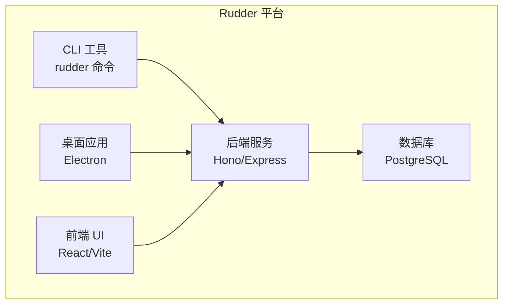
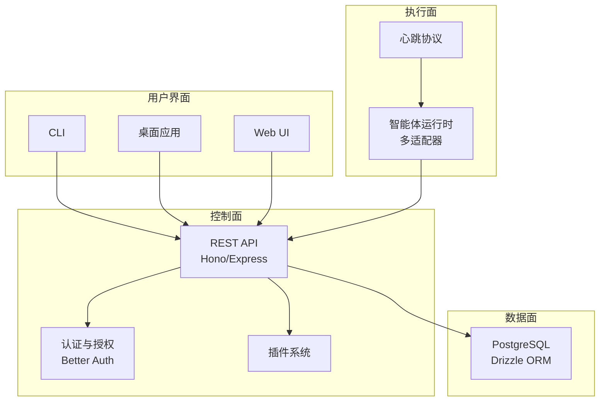
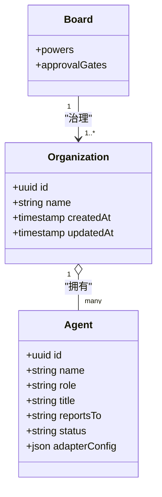
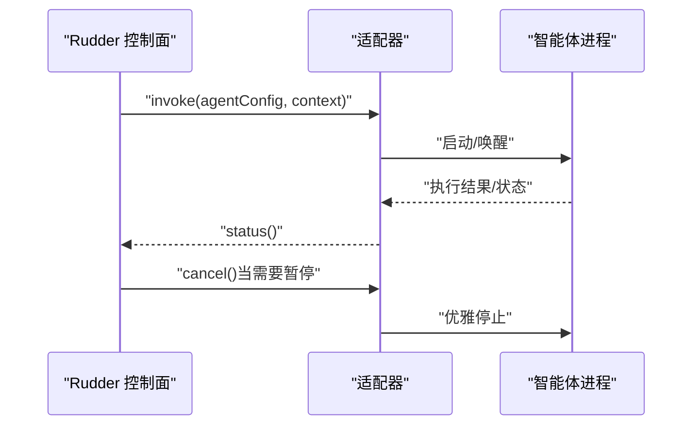
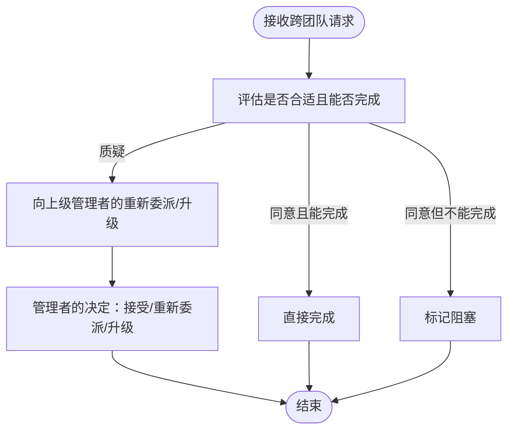
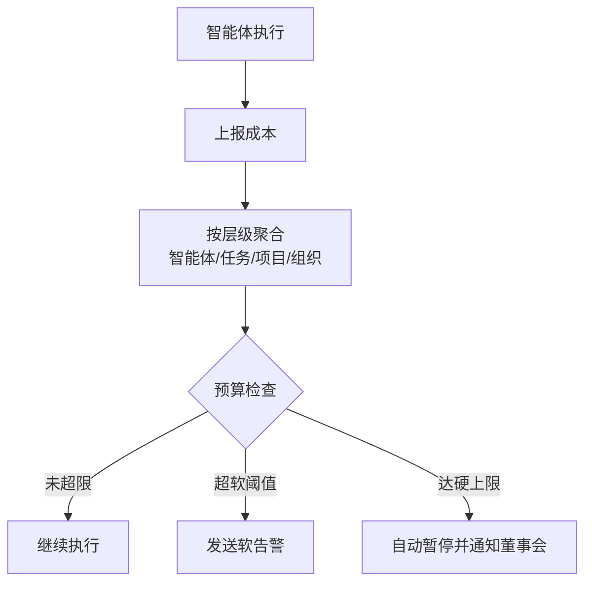
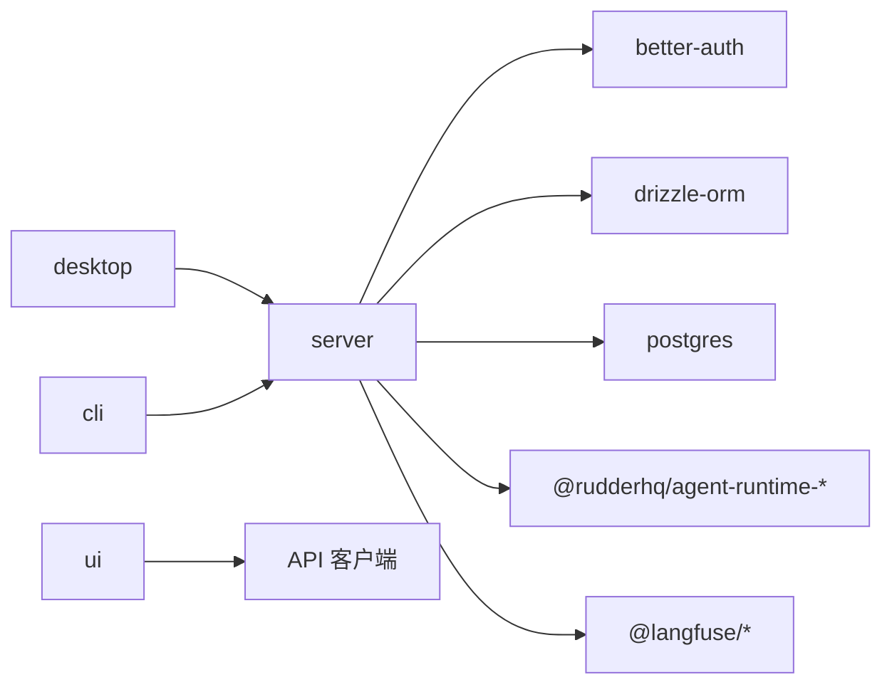
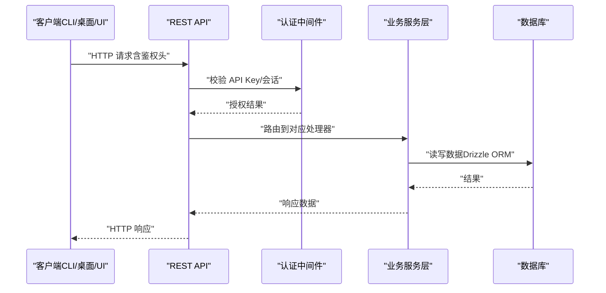

# Rudder 团队协作平台

<cite>
**本文引用的文件**
- [README.md](file://team/rudder/README.md)
- [SPEC.md](file://team/rudder/doc/SPEC.md)
- [DESIGN.md](file://team/rudder/doc/DESIGN.md)
- [DEVELOPING.md](file://team/rudder/doc/DEVELOPING.md)
- [DESKTOP.md](file://team/rudder/doc/DESKTOP.md)
- [DATABASE.md](file://team/rudder/doc/DATABASE.md)
- [CLI.md](file://team/rudder/doc/CLI.md)
- [package.json](file://team/rudder/package.json)
- [server/package.json](file://team/rudder/server/package.json)
- [app.ts](file://team/rudder/server/src/app.ts)
- [index.ts](file://team/rudder/server/src/index.ts)
- [paths.ts](file://team/rudder/server/src/paths.ts)
- [auth.ts](file://team/rudder/server/src/auth/index.ts)
- [orgs.ts](file://team/rudder/server/src/routes/orgs.ts)
- [issues.ts](file://team/rudder/server/src/routes/issues.ts)
- [agents.ts](file://team/rudder/server/src/routes/agents.ts)
- [heartbeats.ts](file://team/rudder/server/src/routes/heartbeats.ts)
- [approvals.ts](file://team/rudder/server/src/routes/approvals.ts)
- [budgets.ts](file://team/rudder/server/src/routes/budgets.ts)
- [dashboard.ts](file://team/rudder/server/src/routes/dashboard.ts)
- [costs.ts](file://team/rudder/server/src/routes/costs.ts)
- [client.ts](file://team/rudder/ui/src/api/client.ts)
- [agents.ts](file://team/rudder/ui/src/api/agents.ts)
- [issues.ts](file://team/rudder/ui/src/api/issues.ts)
- [heartbeats.ts](file://team/rudder/ui/src/api/heartbeats.ts)
- [approvals.ts](file://team/rudder/ui/src/api/approvals.ts)
- [budgets.ts](file://team/rudder/ui/src/api/budgets.ts)
- [dashboard.ts](file://team/rudder/ui/src/api/dashboard.ts)
- [costs.ts](file://team/rudder/ui/src/api/costs.ts)
</cite>

## 目录
1. [简介](#简介)
2. [项目结构](#项目结构)
3. [核心组件](#核心组件)
4. [架构总览](#架构总览)
5. [详细组件分析](#详细组件分析)
6. [依赖关系分析](#依赖关系分析)
7. [性能考虑](#性能考虑)
8. [故障排除指南](#故障排除指南)
9. [结论](#结论)
10. [附录](#附录)

## 简介
Rudder 是面向智能体团队的编排与控制平台，旨在为人类与智能体提供共享的组织边界内的目标、任务、知识、工作流、审批与反馈结构，使工作能在清晰的边界内持续推进。平台以“更贴近人类协作方式”的设计理念为核心：通过角色、汇报线、交接、记忆、信任边界与可见反馈回路，将这些协作模式转化为智能体团队的产品原语。

Rudder 的核心价值在于：
- 将工作归属到组织而非散乱线程
- 每个任务都可追溯到目标
- 智能体拥有明确的角色、运行时配置与汇报线
- 聊天用于澄清与路由工作，而持久化的执行与输出附着于问题、审批与产出
- 自主性保持可辨识、可治理与预算感知

平台默认采用嵌入式 PostgreSQL（开发环境），支持单租户自托管，并提供桌面应用、CLI 与 Web UI 的统一控制面。

**章节来源**
- [README.md:1-136](file://team/rudder/README.md#L1-L136)

## 项目结构
仓库采用多包工作区（monorepo）结构，核心模块包括：
- server：后端 API 服务器（基于 Hono/Express）
- ui：React/Vite 前端
- desktop：Electron 打包的本地应用
- db：数据库模型与迁移
- cli：命令行工具
- run-intelligence：运行智能体相关服务
- 各类 agent-runtimes：不同适配器的本地运行时

开发脚本与工作区配置集中在根目录 package.json 中，提供一键启动开发环境、打包、测试与发布流程。

**图表来源**
- [package.json:1-60](file://team/rudder/package.json#L1-L60)
- [server/package.json:1-102](file://team/rudder/server/package.json#L1-L102)

**章节来源**
- [package.json:1-60](file://team/rudder/package.json#L1-L60)
- [DEVELOPING.md:160-175](file://team/rudder/doc/DEVELOPING.md#L160-L175)

## 核心组件
- 组织（Organization）：平台的最高实体，一个实例可运行多个组织；组织无独立“目标”字段，其方向由一组“倡议（Initiative）”定义。
- 智能体（Agent）：每个员工即智能体，负责执行工作；支持多种适配器类型（进程、HTTP、OpenClaw 网关、Gemini、Hermes 等）。
- 组织结构：CEO 之上为层级汇报结构；全组织可见，跨团队协作通过任务与评论实现。
- 心跳系统：协议层定义如何触发智能体周期；Rudder 控制触发时机、方式与上下文，智能体决定周期内做什么。
- 成本追踪：完全仪器化的智能体上报令牌/API 使用量，支持按智能体、任务、项目、组织层级的可视化与预算控制。
- 默认智能体与引导流程：提供默认 CEO 与通用智能体模板，配合 Rudder 技能（SKILL.md）实现 API 交互能力。

**章节来源**
- [SPEC.md:7-61](file://team/rudder/doc/SPEC.md#L7-L61)
- [SPEC.md:64-140](file://team/rudder/doc/SPEC.md#L64-L140)
- [SPEC.md:190-250](file://team/rudder/doc/SPEC.md#L190-L250)
- [SPEC.md:279-311](file://team/rudder/doc/SPEC.md#L279-L311)
- [SPEC.md:314-353](file://team/rudder/doc/SPEC.md#L314-L353)

## 架构总览
Rudder 采用“控制面 + 执行面分离”的架构：
- 控制面：统一 REST API，服务于前端 UI 与智能体；认证区分板级权限与智能体权限。
- 执行面：智能体在各自运行时中执行，通过适配器与控制面交互；心跳触发与状态上报由智能体实现。
- 数据面：PostgreSQL（开发默认嵌入式，生产可选 Docker 或 Supabase）；Drizzle ORM 提供类型安全访问。
- 安全：Better Auth 提供认证；智能体通过 API Key 认证；桌面应用与 CLI 共享同一本地实例数据。

**图表来源**
- [SPEC.md:381-389](file://team/rudder/doc/SPEC.md#L381-L389)
- [SPEC.md:408-422](file://team/rudder/doc/SPEC.md#L408-L422)
- [server/package.json:46-84](file://team/rudder/server/package.json#L46-L84)

**章节来源**
- [SPEC.md:356-444](file://team/rudder/doc/SPEC.md#L356-L444)
- [server/package.json:1-102](file://team/rudder/server/package.json#L1-L102)

## 详细组件分析

### 组织与组织结构
- 组织模型：包含 id、名称、创建/更新时间等字段；董事会治理高层决策，具备暂停/恢复任意智能体与工作项的能力。
- 预算委托：董事会设定组织级预算，CEO 可向下委派预算，管理者可对其下属进行预算管理。
- 组织可见性：全组织可见，跨团队协作通过任务与评论实现，遵循 Rudder 技能规则。

**图表来源**
- [SPEC.md:7-61](file://team/rudder/doc/SPEC.md#L7-L61)
- [SPEC.md:20-47](file://team/rudder/doc/SPEC.md#L20-L47)

**章节来源**
- [SPEC.md:7-61](file://team/rudder/doc/SPEC.md#L7-L61)
- [SPEC.md:20-47](file://team/rudder/doc/SPEC.md#L20-L47)

### 心跳系统与适配器
- 执行适配器：process、http、openclaw_gateway、gemini_local、hermes_local 等。
- 适配器接口：invoke(agentConfig, context?)、status(agentConfig)、cancel(agentConfig)。
- Rudder 控制：触发时机、方式与上下文；暂停行为包含优雅信号、宽限期与强制终止。
- 智能体集成等级：可调用、状态上报、完全仪器化（双向集成）。

**图表来源**
- [SPEC.md:194-218](file://team/rudder/doc/SPEC.md#L194-L218)
- [SPEC.md:232-241](file://team/rudder/doc/SPEC.md#L232-L241)

**章节来源**
- [SPEC.md:190-250](file://team/rudder/doc/SPEC.md#L190-L250)

### 任务系统与跨团队协作
- 模型：任务 + 评论；委派即创建任务并分配给其他智能体；协调即在任务上评论；状态更新即修改任务状态与字段。
- 层级映射：倡议（组织目标）→ 项目 → 里程碑 → 问题 → 子问题。
- 跨团队规则：接受、标记阻塞或向上管理者的重新委派/升级；请求深度跟踪与账单码用于成本归集。

**图表来源**
- [SPEC.md:157-179](file://team/rudder/doc/SPEC.md#L157-L179)

**章节来源**
- [SPEC.md:253-277](file://team/rudder/doc/SPEC.md#L253-L277)
- [SPEC.md:157-179](file://team/rudder/doc/SPEC.md#L157-L179)

### 成本追踪与预算管理
- 成本上报：完全仪器化的智能体上报令牌/API 使用量，支持按智能体、任务、项目、组织层级的可视化。
- 预算控制：可见性、软告警、硬上限（自动暂停）三级；预算可设为无限。
- 账单码：任务携带账单码，使 Agent A 请求 Agent B 的成本可归集到 A 的请求上游。

**图表来源**
- [SPEC.md:279-311](file://team/rudder/doc/SPEC.md#L279-L311)

**章节来源**
- [SPEC.md:279-311](file://team/rudder/doc/SPEC.md#L279-L311)

### 默认智能体与引导流程
- 引导序列：创建组织与初始倡议 → 定义初始顶层任务 → 创建 CEO 智能体 → CEO 首次心跳提出战略分解 → 董事会批准 → CEO 开始执行。
- 默认智能体：基本 Claude Code/Codex 循环，内置 Rudder 技能；默认 CEO 在此基础上增加战略规划、委派与进度审查能力。
- Rudder 技能：提供任务 CRUD、状态上报、组织上下文读取、成本上报与跨智能体沟通规则。

**章节来源**
- [SPEC.md:314-353](file://team/rudder/doc/SPEC.md#L314-L353)

### 插件与扩展架构
- 插件注册：新适配器类型可通过插件系统注册；事件系统或钩子响应任务/智能体生命周期事件；插件可贡献 UI 组件。
- 插件 SDK 与 CLI：提供 `rudder plugin` 命令用于作者与安装插件。

**章节来源**
- [SPEC.md:434-443](file://team/rudder/doc/SPEC.md#L434-L443)

## 依赖关系分析
- 后端依赖：Better Auth（认证）、Drizzle ORM（数据库）、Express/Hono（HTTP）、Langfuse/OpenTelemetry（可观测性）、各种 agent-runtimes 包等。
- 前端依赖：React、Vite、UI 组件库与 API 客户端。
- 数据库：Drizzle ORM + PostgreSQL；开发默认嵌入式，生产可选 Docker 或 Supabase。
- 桌面应用：Electron + electron-builder，支持 macOS/Windows/Linux 便携包。

**图表来源**
- [server/package.json:46-84](file://team/rudder/server/package.json#L46-L84)

**章节来源**
- [server/package.json:1-102](file://team/rudder/server/package.json#L1-L102)

## 性能考虑
- 并发模型：原子任务领取（单分配 + 原子领取），避免冲突与乐观锁复杂度。
- 心跳与暂停：优雅信号 + 宽限期 + 强制终止，确保暂停可控。
- 数据库模式：Drizzle ORM + PostgreSQL；开发默认嵌入式，生产建议使用连接池与合适的索引策略。
- 观测性：Langfuse/OpenTelemetry 集成，便于成本与运行时分析。
- UI 与桌面：轻量级设计，减少不必要的动画与重渲染，提升扫描效率。

**章节来源**
- [SPEC.md:390-398](file://team/rudder/doc/SPEC.md#L390-L398)
- [SPEC.md:408-422](file://team/rudder/doc/SPEC.md#L408-L422)
- [DESIGN.md:46-94](file://team/rudder/doc/DESIGN.md#L46-L94)

## 故障排除指南
- 开发环境启动失败：确认 Node.js 与 pnpm 版本要求；检查本地端口占用；必要时使用工作树隔离实例。
- 数据库问题：若未设置 DATABASE_URL，默认使用嵌入式 PostgreSQL；可通过 `db:migrate` 手动应用迁移。
- 桌面应用：开发壳关闭即退出；打包壳支持驻留托盘菜单；如 UI 渲染异常，桌面提供恢复界面。
- CLI 与桌面一致性：桌面与浏览器/CLI 共享同一本地实例数据；首次启动会尝试导出 `rudder` 命令。
- 日志与诊断：使用 `pnpm dev:reset` 清理开发数据；通过 `pnpm desktop:verify` 进行桌面验证。

**章节来源**
- [DEVELOPING.md:160-214](file://team/rudder/doc/DEVELOPING.md#L160-L214)
- [DATABASE.md:5-44](file://team/rudder/doc/DATABASE.md#L5-L44)
- [DESKTOP.md:77-107](file://team/rudder/doc/DESKTOP.md#L77-L107)
- [DESKTOP.md:164-175](file://team/rudder/doc/DESKTOP.md#L164-L175)

## 结论
Rudder 将人类协作模式抽象为智能体团队的操作原语：组织、任务、心跳、成本与预算。通过统一 REST API 与插件化扩展，平台既保持对执行面的最小耦合，又提供强大的治理与可视性。开发与部署路径清晰，从单机一键安装到生产托管均可平滑过渡。

## 附录

### 安装与启动指南
- 本地开发：安装依赖后运行 `pnpm dev`，默认在 http://localhost:3100 提供 API 与 UI。
- 桌面应用：`pnpm desktop:verify` 进行开发壳烟雾测试、打包构建与打包应用烟雾测试。
- Docker：使用提供的 Compose 文件快速启动本地 PostgreSQL；设置 DATABASE_URL 后运行迁移与服务。

**章节来源**
- [README.md:71-102](file://team/rudder/README.md#L71-L102)
- [DEVELOPING.md:334-356](file://team/rudder/doc/DEVELOPING.md#L334-L356)
- [DESKTOP.md:23-50](file://team/rudder/doc/DESKTOP.md#L23-L50)

### 用户界面使用说明
- 主要视图：组织结构（实时状态指示器）、任务看板（列表/看板视图）、仪表盘（概览指标）、智能体详情、项目/倡议视图、成本仪表盘。
- 板级控制：在任一视图暂停/恢复智能体与任务/项目；直接创建/编辑/评论任务；审批待定操作。

**章节来源**
- [SPEC.md:447-467](file://team/rudder/doc/SPEC.md#L447-L467)

### 后端 API 架构与端点参考
- 认证与授权：统一 REST API，认证决定权限级别（板级全权，智能体受限）。
- 关键资源端点（示例）：
  - 组织：列出、获取、删除
  - 智能体：列表、获取、配置索引/文档/列表/获取、图标、雇佣、技能创建/启用/同步、本地 CLI
  - 任务：列表、搜索、获取、创建、更新、评论、完成、阻塞、领取、释放
  - 心跳：运行
  - 审批：列表、获取、创建、批准、拒绝、要求修订、重新提交、评论
  - 预算：查询预算
  - 仪表盘：获取组织级指标
  - 成本：查询成本与消耗

**图表来源**
- [SPEC.md:408-422](file://team/rudder/doc/SPEC.md#L408-L422)
- [server/src/app.ts:13-27](file://team/rudder/server/src/app.ts#L13-L27)

**章节来源**
- [SPEC.md:408-422](file://team/rudder/doc/SPEC.md#L408-L422)
- [server/src/app.ts:1-36](file://team/rudder/server/src/app.ts#L1-L36)

### 数据库设计与迁移
- Drizzle ORM + PostgreSQL；开发默认嵌入式，生产可选 Docker 或 Supabase。
- 支持三种模式：嵌入式 PostgreSQL（零配置）、本地 Docker PostgreSQL、托管 Supabase。
- 秘钥存储：公司级密钥与版本存储于表中，本地加密提供者默认使用本地主密钥文件。

**章节来源**
- [DATABASE.md:1-199](file://team/rudder/doc/DATABASE.md#L1-L199)

### CLI 参考
- 基本用法：`npx @rudderhq/cli@latest start` 与 `rudder start` 等价；首次运行准备持久 CLI 与桌面应用。
- 上下文配置：支持设置 API 基础地址、API Key、组织 ID、数据目录与配置文件。
- 组织命令：列出、获取、删除（受服务器开关控制）。
- 任务命令：列表、搜索、获取、创建、更新、评论、完成、阻塞、领取、释放。
- 智能体命令：列表、获取、配置索引/文档/列表/获取、图标、雇佣、技能创建/启用/同步、本地 CLI。
- 审批命令：列出、获取、创建、批准、拒绝、要求修订、重新提交、评论。
- 活动命令：列出活动。
- 仪表盘命令：获取组织指标。
- 心跳命令：支持传入 agent-id 与 API Key。

**章节来源**
- [CLI.md:1-282](file://team/rudder/doc/CLI.md#L1-L282)

### 桌面应用
- 作用：将现有板级 UI 与本地 API 打包为桌面壳，不再单独维护桌面数据库根目录。
- 生命周期：开发壳关闭即退出；打包壳支持驻留托盘菜单；首次启动尝试导出 `rudder` 命令。
- 数据路径：业务数据位于共享 Rudder 主目录，Electron userData 仅存储壳偏好。

**章节来源**
- [DESKTOP.md:1-269](file://team/rudder/doc/DESKTOP.md#L1-L269)

### 设计系统与 UI 原则
- 产品特性：控制面板式操作工具，强调“正在发生什么、谁在做、需要干预、结果是什么”。
- 设计原则：工具优先、密度与清晰度、渐进披露、输出优先、静默自信、滚动条策略。
- 排版、间距、表面层次、颜色与强调、文案规则、对话框与编辑器规则、表格与列表、空状态、动效与反馈。

**章节来源**
- [DESIGN.md:23-585](file://team/rudder/doc/DESIGN.md#L23-L585)