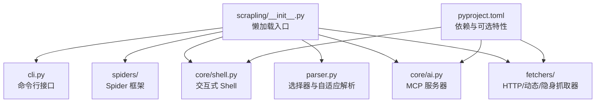
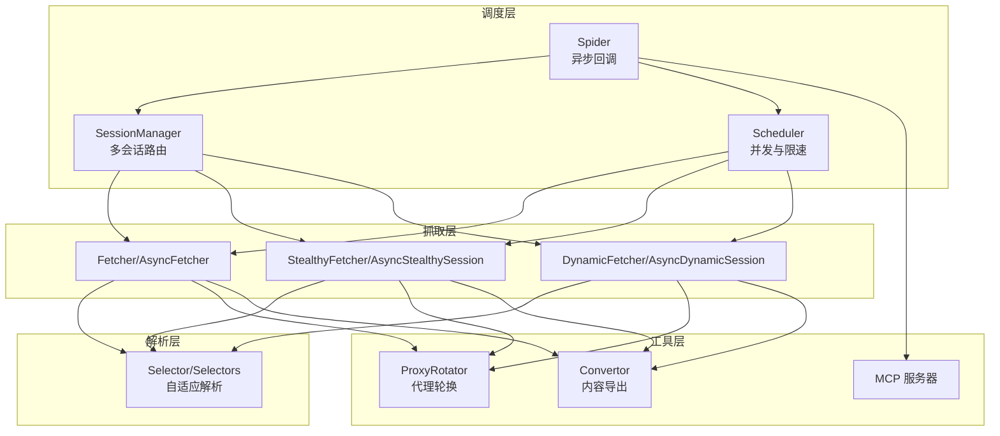
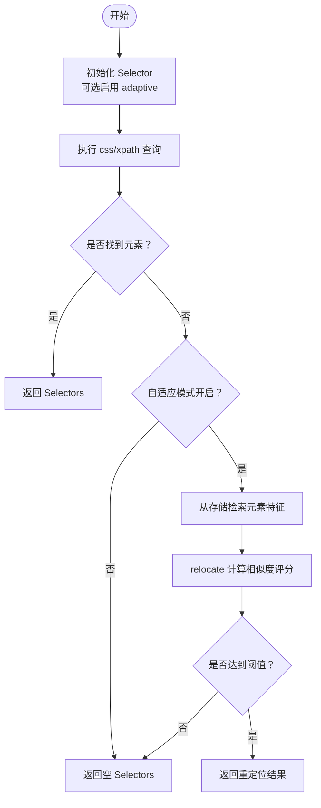
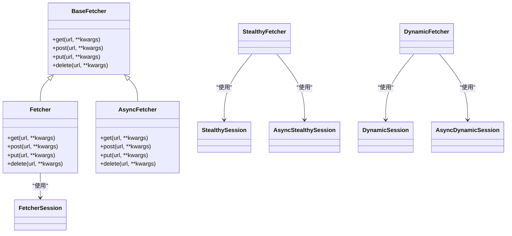
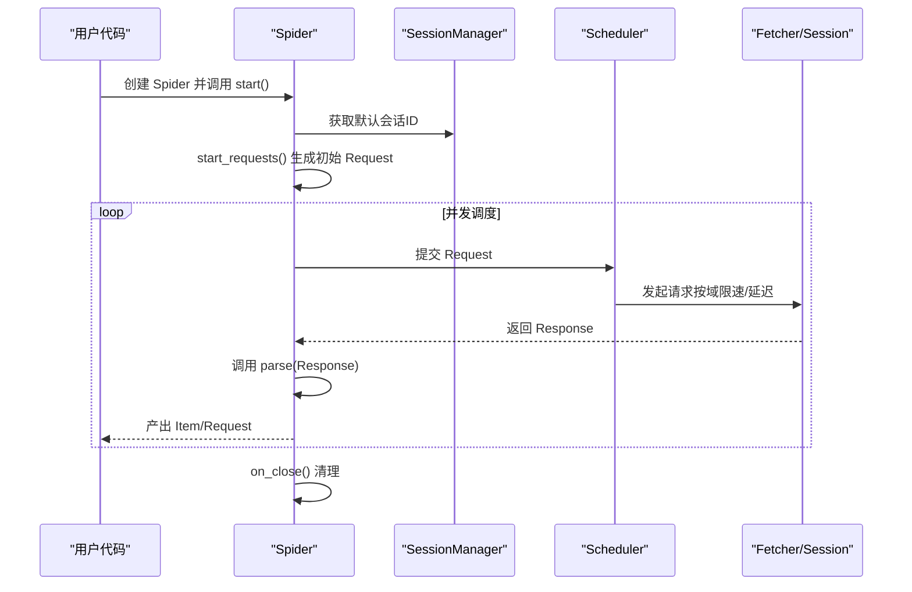
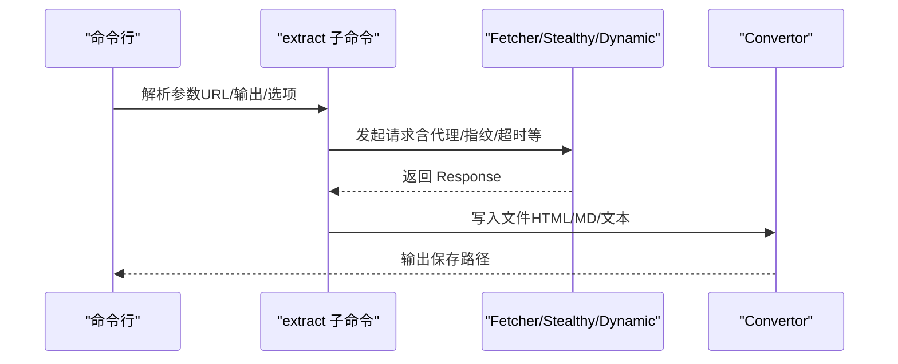
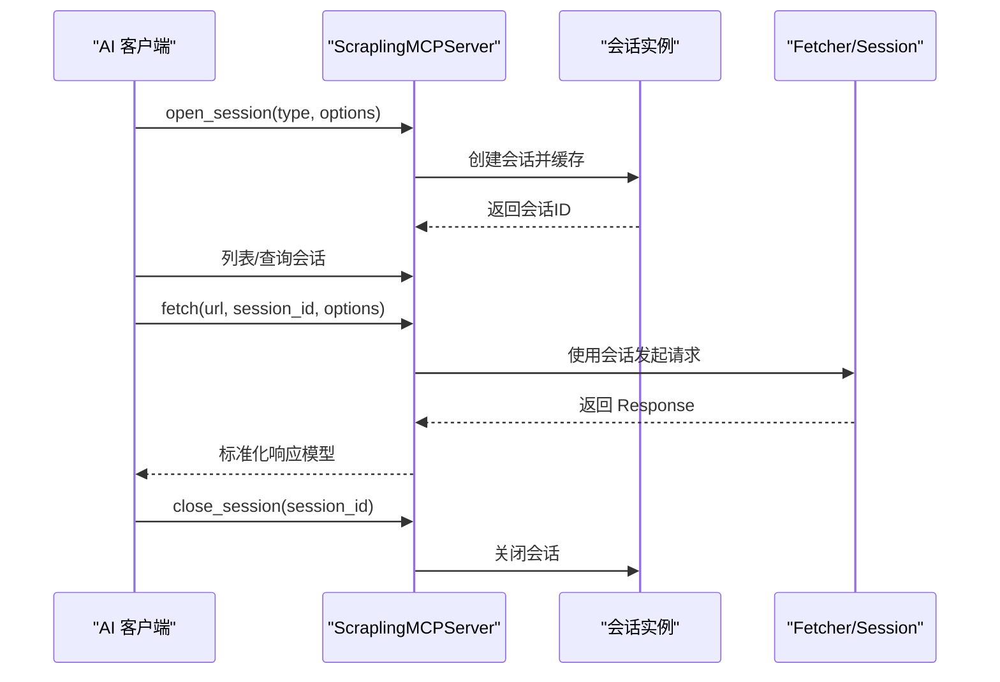
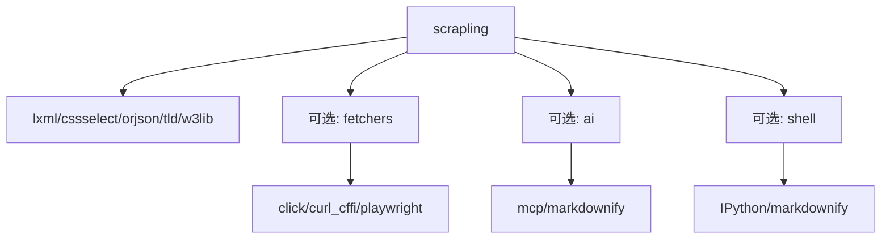

# Scrapling 网络爬虫框架

<cite>
**本文档引用的文件**
- [README.md](file://README.md)
- [pyproject.toml](file://pyproject.toml)
- [setup.cfg](file://setup.cfg)
- [scrapling/__init__.py](file://scrapling/__init__.py)
- [docs/index.md](file://docs/index.md)
- [scrapling/cli.py](file://scrapling/cli.py)
- [scrapling/parser.py](file://scrapling/parser.py)
- [scrapling/spiders/__init__.py](file://scrapling/spiders/__init__.py)
- [scrapling/fetchers/__init__.py](file://scrapling/fetchers/__init__.py)
- [scrapling/fetchers/requests.py](file://scrapling/fetchers/requests.py)
- [scrapling/core/shell.py](file://scrapling/core/shell.py)
- [scrapling/core/ai.py](file://scrapling/core/ai.py)
- [scrapling/spiders/spider.py](file://scrapling/spiders/spider.py)
- [benchmarks.py](file://benchmarks.py)
</cite>

## 目录
1. [简介](#简介)
2. [项目结构](#项目结构)
3. [核心组件](#核心组件)
4. [架构总览](#架构总览)
5. [详细组件分析](#详细组件分析)
6. [依赖分析](#依赖分析)
7. [性能考虑](#性能考虑)
8. [故障排除指南](#故障排除指南)
9. [结论](#结论)
10. [附录](#附录)

## 简介
Scrapling 是一个自适应网络爬虫框架，专注于现代网页的高效抓取与解析。其核心特性包括：
- 自适应解析：页面结构变化后仍能自动定位元素
- 并发爬取：支持可配置的并发限制、按域限速与下载延迟
- 代理轮换：内置 ProxyRotator 支持循环或自定义策略
- 反机器人绕过：通过指纹伪装与浏览器自动化绕过常见反爬机制
- Spider API：类 Scrapy 的异步回调模型，支持多会话路由与暂停/恢复
- CLI 与交互式 Shell：命令行提取与交互式开发体验
- MCP 服务器：与 AI 集成，提供可定制的 MCP 能力

## 项目结构
Scrapling 采用模块化组织方式，核心目录与职责如下：
- scrapling/：主库代码
  - core/：核心工具、类型系统、AI 与 Shell 集成
  - engines/：底层引擎（静态/动态/工具带）
  - fetchers/：HTTP/动态/隐身抓取器及其会话
  - parser/：选择器与自适应解析
  - spiders/：Spider 框架与调度器
  - cli.py：命令行入口
- docs/：官方文档站点内容
- tests/：单元测试与基准测试
- benchmarks.py：性能基准脚本

图表来源
- [scrapling/__init__.py:1-39](file://scrapling/__init__.py#L1-L39)
- [pyproject.toml:72-96](file://pyproject.toml#L72-L96)

章节来源
- [README.md:275-568](file://README.md#L275-L568)
- [pyproject.toml:1-128](file://pyproject.toml#L1-L128)

## 核心组件
- 选择器与解析器（Selector/Selectors）：基于 lxml 的高性能 CSS/XPath 解析，支持自适应重定位与相似元素查找
- 抓取器（Fetcher/StealthyFetcher/DynamicFetcher）：HTTP 请求、隐身模式与全浏览器自动化三类能力，统一会话管理
- Spider 框架：类 Scrapy 的异步回调模型，支持并发、按域限速、暂停/恢复、流式输出与 robots.txt 合规
- CLI 与 Shell：命令行提取、安装浏览器依赖、交互式开发与 MCP 服务
- MCP 服务器：面向 AI 的可定制能力，支持持久化会话与截图

章节来源
- [scrapling/parser.py:64-800](file://scrapling/parser.py#L64-L800)
- [scrapling/fetchers/requests.py:28-66](file://scrapling/fetchers/requests.py#L28-L66)
- [scrapling/spiders/spider.py:65-200](file://scrapling/spiders/spider.py#L65-L200)
- [scrapling/cli.py:108-662](file://scrapling/cli.py#L108-L662)
- [scrapling/core/ai.py:107-200](file://scrapling/core/ai.py#L107-L200)

## 架构总览
Scrapling 的整体架构由“抓取层”“解析层”“调度层”“会话管理层”“工具层”组成，通过统一的 Response 对象在各层间传递。

图表来源
- [scrapling/fetchers/__init__.py:10-49](file://scrapling/fetchers/__init__.py#L10-L49)
- [scrapling/spiders/__init__.py:1-25](file://scrapling/spiders/__init__.py#L1-L25)
- [scrapling/core/ai.py:107-200](file://scrapling/core/ai.py#L107-L200)

## 详细组件分析

### 选择器与自适应解析
- 设计要点
  - 基于 lxml 的 HtmlElement 包装器，提供 css/xpath/find_all 等丰富 API
  - 自适应模式下支持元素重定位与相似元素查找，降低页面结构变更的影响
  - 内置 SQLite 存储用于记录元素特征，便于后续重定位
- 关键流程
  - 初始化时可启用 adaptive，并指定存储系统
  - css/xpath 查找失败时，在自适应模式下尝试从存储中检索并重定位
  - relocate 使用相似度评分匹配候选节点，返回最高分集合

图表来源
- [scrapling/parser.py:568-696](file://scrapling/parser.py#L568-L696)
- [scrapling/parser.py:519-567](file://scrapling/parser.py#L519-L567)

章节来源
- [scrapling/parser.py:64-800](file://scrapling/parser.py#L64-L800)

### 抓取器与会话管理
- 设计要点
  - Fetcher 基于 curl_cffi 实现 HTTP 请求，支持指纹伪装、TLS 与 HTTP/3
  - StealthyFetcher 提供隐身模式，可绕过 Cloudflare 等挑战
  - DynamicFetcher 基于 Playwright，支持真实浏览器自动化
  - 所有抓取器均提供同步与异步会话类，支持代理轮换与持久化状态
- 关键流程
  - 通过 SessionManager 统一注册与路由不同类型的会话
  - 请求参数合并策略确保类级解析器配置与请求级覆盖一致

图表来源
- [scrapling/fetchers/requests.py:28-66](file://scrapling/fetchers/requests.py#L28-L66)
- [scrapling/fetchers/__init__.py:10-49](file://scrapling/fetchers/__init__.py#L10-L49)

章节来源
- [scrapling/fetchers/requests.py:28-66](file://scrapling/fetchers/requests.py#L28-L66)
- [scrapling/fetchers/__init__.py:10-49](file://scrapling/fetchers/__init__.py#L10-L49)

### Spider 框架与调度
- 设计要点
  - Spider 抽象基类提供异步 parse 回调、日志、开发模式、robots.txt 合规与错误钩子
  - SessionManager 支持多会话注册与默认会话选择
  - Scheduler 控制并发与按域限速，download_delay 控制请求间隔
  - 支持暂停/恢复：通过 crawldir 与周期性检查点保存
- 关键流程
  - start_requests 生成初始 Request，默认使用默认会话与 parse 回调
  - is_blocked 默认检测常见阻断状态码，可自定义逻辑
  - on_error/on_scraped_item 提供扩展点

图表来源
- [scrapling/spiders/spider.py:148-196](file://scrapling/spiders/spider.py#L148-L196)
- [scrapling/spiders/__init__.py:1-25](file://scrapling/spiders/__init__.py#L1-L25)

章节来源
- [scrapling/spiders/spider.py:65-200](file://scrapling/spiders/spider.py#L65-L200)
- [scrapling/spiders/__init__.py:1-25](file://scrapling/spiders/__init__.py#L1-L25)

### CLI 与交互式 Shell
- 功能概览
  - scrapling install：安装浏览器与依赖
  - scrapling shell：交互式开发与快速验证
  - scrapling extract：HTTP/浏览器抓取并导出 HTML/Markdown/文本
  - scrapling mcp：启动 MCP 服务器
- 关键流程
  - extract 子命令解析通用选项（如代理、超时、CSS 选择器），构建请求参数
  - Convertor 将响应内容写入目标文件，支持仅提取主要内容以适配 AI

图表来源
- [scrapling/cli.py:354-500](file://scrapling/cli.py#L354-L500)
- [scrapling/cli.py:538-650](file://scrapling/cli.py#L538-L650)

章节来源
- [scrapling/cli.py:108-662](file://scrapling/cli.py#L108-L662)
- [scrapling/core/shell.py:98-200](file://scrapling/core/shell.py#L98-L200)

### MCP 服务器与 AI 集成
- 功能概览
  - ScraplingMCPServer 提供 open_session/close_session/list_sessions 等工具
  - 支持动态/隐身两种会话类型，持久化复用浏览器实例
  - 与 AI 应用（如 Claude/Cursor）协作，先用 Scrapling 提取目标内容再交给 AI 处理
- 关键流程
  - open_session 创建并缓存会话，返回会话信息
  - fetch 工具根据会话类型调用对应抓取器，返回标准化响应模型

图表来源
- [scrapling/core/ai.py:107-200](file://scrapling/core/ai.py#L107-L200)
- [scrapling/core/ai.py:125-200](file://scrapling/core/ai.py#L125-L200)

章节来源
- [scrapling/core/ai.py:107-200](file://scrapling/core/ai.py#L107-L200)

## 依赖分析
- 运行时依赖
  - lxml/cssselect：高性能 HTML/XML 解析与选择器
  - orjson：快速 JSON 序列化
  - tld/w3lib：域名与 URL 工具
  - typing_extensions：类型提示增强
- 可选依赖（通过 extras 安装）
  - fetchers：click/curl_cffi/playwright/browserforge/apify 等
  - ai：mcp/markdownify/scrapling[fetchers]
  - shell：IPython/markdownify/scrapling[fetchers]
  - all：同时包含 ai 与 shell

图表来源
- [pyproject.toml:63-96](file://pyproject.toml#L63-L96)

章节来源
- [pyproject.toml:63-96](file://pyproject.toml#L63-L96)
- [setup.cfg:1-8](file://setup.cfg#L1-L8)

## 性能考虑
- 解析性能
  - 基于 lxml 的原生实现，文本提取速度显著优于同类库
  - 自适应元素相似度计算在大规模页面上仍保持较高效率
- 导出性能
  - 使用 orjson 进行序列化，性能优于标准库
- 并发与资源
  - 异步抓取与浏览器池化（max_pages）提升吞吐量
  - 资源过滤（disable_resources）与网络空闲等待（network_idle）平衡速度与稳定性
- 基准测试
  - 文本提取与相似度搜索的基准测试表明 Scrapling 在多数场景下具有优势

章节来源
- [benchmarks.py:1-147](file://benchmarks.py#L1-L147)
- [README.md:450-479](file://README.md#L450-L479)

## 故障排除指南
- 安装与依赖
  - 未安装可选特性导致命令不可用：安装 scrapling[fetchers]/[ai]/[shell]/[all]
  - 浏览器依赖缺失：运行 scrapling install 或在代码中调用安装函数
- 日志与调试
  - Spider 内置日志计数器，可通过日志级别与格式化输出定位问题
  - Shell 中的 CurlParser 对未知参数抛出异常，需检查 curl 命令格式
- 代理与反爬
  - 使用 StealthyFetcher 的隐身参数（如 solve_cloudflare、block_webrtc、hide_canvas）提高成功率
  - 启用 ProxyRotator 并结合 per-request 代理覆盖
- 错误处理
  - on_error 钩子用于集中处理异常；is_blocked 可自定义阻断检测逻辑

章节来源
- [scrapling/cli.py:108-141](file://scrapling/cli.py#L108-L141)
- [scrapling/spiders/spider.py:185-200](file://scrapling/spiders/spider.py#L185-L200)
- [scrapling/core/shell.py:86-96](file://scrapling/core/shell.py#L86-L96)

## 结论
Scrapling 通过“自适应解析 + 多样化抓取器 + Spider 框架 + CLI/Shell/MCP”的组合，提供了从单页抓取到大规模并发爬取的一体化解决方案。其高性能解析、灵活的会话管理与强大的 AI 集成能力，使其适用于复杂场景下的数据采集与处理。

## 附录

### 安装与配置
- 基础安装：pip install scrapling
- 可选特性：
  - pip install "scrapling[fetchers]"：安装抓取器与浏览器依赖
  - pip install "scrapling[ai]"：安装 MCP 服务器相关依赖
  - pip install "scrapling[shell]"：安装交互式 Shell 与提取命令
  - pip install "scrapling[all]"：安装全部功能
- 浏览器依赖：scrapling install 或在代码中调用安装函数

章节来源
- [README.md:480-535](file://README.md#L480-L535)
- [pyproject.toml:72-96](file://pyproject.toml#L72-L96)

### 使用示例（概述）
- 静态抓取：使用 Fetcher/FetcherSession 发送 HTTP 请求，配合 css/xpath 提取
- 动态抓取：使用 DynamicFetcher/DynamicSession 处理 JavaScript 渲染页面
- 隐身模式：使用 StealthyFetcher/StealthySession 绕过反爬挑战
- Spider 爬取：继承 Spider，实现 parse 回调，配置并发与会话管理
- CLI 提取：scrapling extract get/stealthy-fetch/fetch 命令直接导出内容
- MCP 服务器：scrapling mcp 启动，配合 AI 客户端进行内容抽取

章节来源
- [README.md:279-428](file://README.md#L279-L428)
- [scrapling/cli.py:354-650](file://scrapling/cli.py#L354-L650)
- [scrapling/core/ai.py:107-200](file://scrapling/core/ai.py#L107-L200)