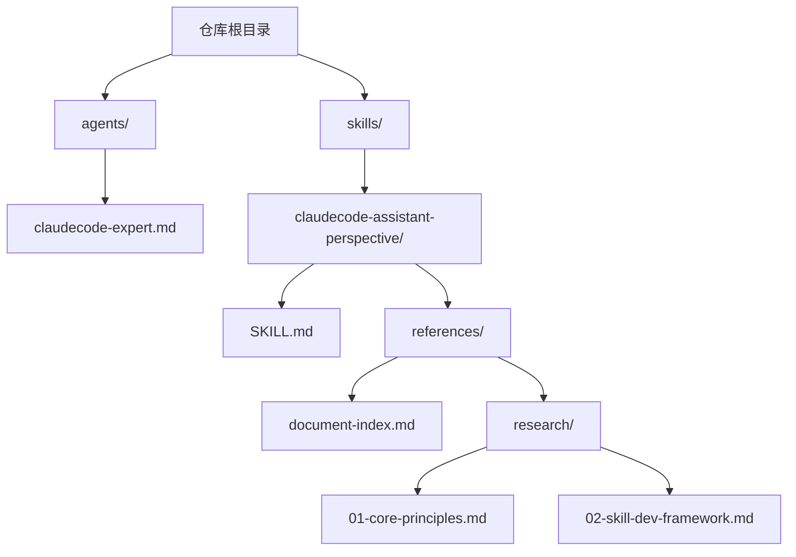
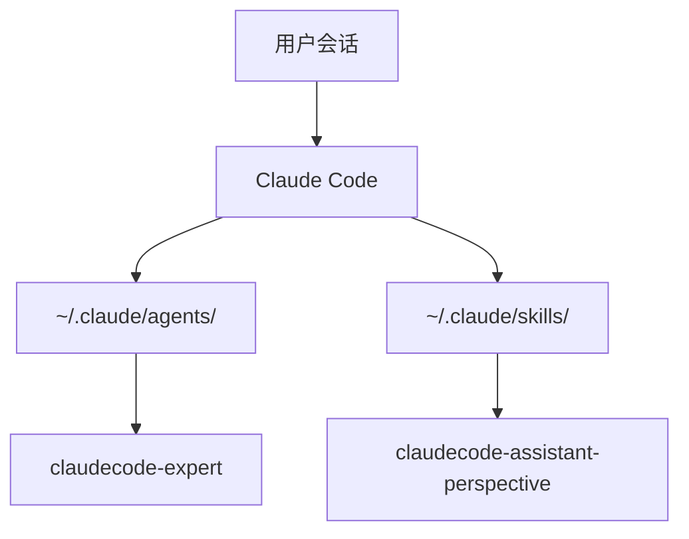
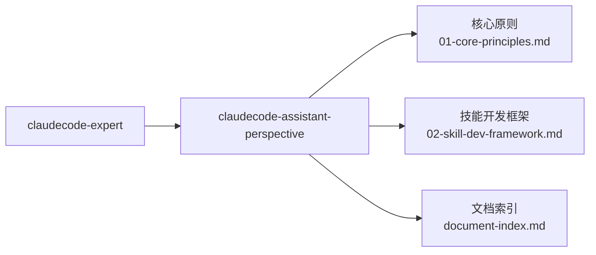

# 快速开始

<cite>
**本文引用的文件**
- [README.md](file://README.md)
- [README.zh-CN.md](file://README.zh-CN.md)
- [agents/claudecode-expert.md](file://agents/claudecode-expert.md)
- [skills/claudecode-assistant-perspective/SKILL.md](file://skills/claudecode-assistant-perspective/SKILL.md)
- [skills/claudecode-assistant-perspective/references/document-index.md](file://skills/claudecode-assistant-perspective/references/document-index.md)
- [skills/claudecode-assistant-perspective/references/research/01-core-principles.md](file://skills/claudecode-assistant-perspective/references/research/01-core-principles.md)
- [skills/claudecode-assistant-perspective/references/research/02-skill-dev-framework.md](file://skills/claudecode-assistant-perspective/references/research/02-skill-dev-framework.md)
- [LICENSE](file://LICENSE)
</cite>

## 目录
1. [简介](#简介)
2. [项目结构](#项目结构)
3. [核心组件](#核心组件)
4. [架构总览](#架构总览)
5. [详细组件解析](#详细组件解析)
6. [依赖关系分析](#依赖关系分析)
7. [性能与最佳实践](#性能与最佳实践)
8. [故障排除指南](#故障排除指南)
9. [结论](#结论)
10. [附录](#附录)

## 简介
本指南面向首次接触 Claude Code Skill Agents 的用户，帮助你在最短时间内完成安装、配置与首次使用。你将学会：
- 两种安装方式：直接克隆与下载 ZIP
- 将代理与技能复制到 Claude Code 目录，或通过符号链接引用
- 基本使用示例：在 Claude Code 会话中调用 claudecode-expert 专家代理与 claudecode-assistant-perspective 技能
- 常见使用场景与最佳实践
- 常见问题的排查思路

## 项目结构
该项目提供两个核心资产：
- 专家代理：claudecode-expert
- 技能：claudecode-assistant-perspective（含参考文档）

图表来源
- [README.md:153-166](file://README.md#L153-L166)
- [README.zh-CN.md:153-167](file://README.zh-CN.md#L153-L167)

章节来源
- [README.md:153-166](file://README.md#L153-L166)
- [README.zh-CN.md:153-167](file://README.zh-CN.md#L153-L167)

## 核心组件
- claudecode-expert：专家级 Claude Code 助手，负责复杂任务的决策与质量把关，具备安全基线、分层过滤与标准工作流。
- claudecode-assistant-perspective：技能开发与使用指南，提供核心原则、开发框架、工作流与故障排除等参考。

章节来源
- [README.md:90-111](file://README.md#L90-L111)
- [README.md:112-134](file://README.md#L112-L134)
- [README.zh-CN.md:90-111](file://README.zh-CN.md#L90-L111)
- [README.zh-CN.md:112-134](file://README.zh-CN.md#L112-L134)

## 架构总览
Claude Code 会话中，你可以通过两种方式使用本项目：
- 直接复制：将 agents 与 skills 复制到 ~/.claude/agents 与 ~/.claude/skills
- 符号链接：在 ~/.claude/agents 与 ~/.claude/skills 下创建指向本仓库的符号链接

图表来源
- [README.md:64-89](file://README.md#L64-L89)
- [README.zh-CN.md:64-89](file://README.zh-CN.md#L64-L89)

## 详细组件解析

### 安装与配置

- 安装方式一：直接克隆
  - 使用 git clone 获取仓库，然后进入目录
  - 参考路径：[README.md:51-58](file://README.md#L51-L58)，[README.zh-CN.md:51-58](file://README.zh-CN.md#L51-L58)

- 安装方式二：下载 ZIP
  - 从 Releases 页面下载最新版本
  - 参考路径：[README.md:60-62](file://README.md#L60-L62)，[README.zh-CN.md:60-62](file://README.zh-CN.md#L60-L62)

- 复制到 Claude Code 目录
  - 将 agents 与 skills 复制到 ~/.claude/agents 与 ~/.claude/skills
  - 参考路径：[README.md:68-72](file://README.md#L68-L72)，[README.zh-CN.md:68-72](file://README.zh-CN.md#L68-L72)

- 通过符号链接引用
  - 在 ~/.claude/agents 与 ~/.claude/skills 下创建指向本仓库的符号链接
  - 参考路径：[README.md:74-79](file://README.md#L74-L79)，[README.zh-CN.md:74-79](file://README.zh-CN.md#L74-L79)

章节来源
- [README.md:49-89](file://README.md#L49-L89)
- [README.zh-CN.md:49-89](file://README.zh-CN.md#L49-L89)

### 使用示例

- 在 Claude Code 会话中调用专家代理与技能
  - 示例：@claudecode-expert 帮我优化这段代码
  - 示例：/skill claudecode-assistant-perspective
  - 参考路径：[README.md:83-88](file://README.md#L83-L88)，[README.zh-CN.md:83-88](file://README.zh-CN.md#L83-L88)

- 常见使用场景
  - 代码审查与优化
  - 最佳实践指导
  - 调试策略与性能调优
  - 架构建议
  - 参考路径：[README.md:96-108](file://README.md#L96-L108)，[README.zh-CN.md:96-108](file://README.zh-CN.md#L96-L108)

章节来源
- [README.md:81-108](file://README.md#L81-L108)
- [README.zh-CN.md:81-108](file://README.zh-CN.md#L81-L108)

### claudecode-expert 专家代理

- 角色与职责
  - Claude Code 领域的最高权威，负责将技能的心智模型与最佳实践落地
  - 参考路径：[agents/claudecode-expert.md:23](file://agents/claudecode-expert.md#L23)

- 安全基线（Prompt Defense Baseline）
  - 强制执行的安全与合规要求，任何情况下都必须遵守
  - 参考路径：[agents/claudecode-expert.md:10-21](file://agents/claudecode-expert.md#L10-L21)

- 分层过滤决策机制
  - 心智模型过滤（7 层全量扫描）
  - 决策启发式过滤（10 条快速判断）
  - 最佳实践检查清单
  - 参考路径：[agents/claudecode-expert.md:47-107](file://agents/claudecode-expert.md#L47-L107)

- 标准工作流
  - Skill 从零开发（12 步）
  - Agent 设计与优化（10 步）
  - 问题诊断与解决（8 步）
  - 参考路径：[agents/claudecode-expert.md:110-303](file://agents/claudecode-expert.md#L110-L303)

- 输出格式与质量门限
  - 决策输出格式与最终交付格式
  - 质量评分与通过标准
  - 参考路径：[agents/claudecode-expert.md:339-420](file://agents/claudecode-expert.md#L339-L420)

- 绝对禁止的反模式
  - 反模式清单与处理方式
  - 参考路径：[agents/claudecode-expert.md:404-420](file://agents/claudecode-expert.md#L404-L420)

章节来源
- [agents/claudecode-expert.md:1-440](file://agents/claudecode-expert.md#L1-L440)

### claudecode-assistant-perspective 技能

- 技能概述
  - Claude Code 领域的专家，提供高效使用方法、最佳实践、工作流优化与架构设计指导
  - 参考路径：[skills/claudecode-assistant-perspective/SKILL.md:6](file://skills/claudecode-assistant-perspective/SKILL.md#L6)

- 核心心智模型（7 个）
  - 代理优先、测试驱动、上下文管理经济学、渐进式披露、最小授权原则、复利模式、检查点驱动
  - 参考路径：[skills/claudecode-assistant-perspective/SKILL.md:10-46](file://skills/claudecode-assistant-perspective/SKILL.md#L10-L46)

- 内在张力（核心矛盾）
  - 复用优先 vs 简单直接、授权最小化 vs 任务灵活性、检查点质量 vs 交付速度、Progressive Disclosure vs 上下文完整
  - 参考路径：[skills/claudecode-assistant-perspective/SKILL.md:49-57](file://skills/claudecode-assistant-perspective/SKILL.md#L49-L57)

- 决策启发式（10 条快速判断）
  - 工具选择、模型选择、Agent 调用、安全相关、大规模变更、上下文清理、渐进式披露、触发优化、质量验证、诚实边界
  - 参考路径：[skills/claudecode-assistant-perspective/SKILL.md:60-72](file://skills/claudecode-assistant-perspective/SKILL.md#L60-L72)

- 诚实边界
  - 能做什么与不能做什么，信息时效性说明
  - 参考路径：[skills/claudecode-assistant-perspective/SKILL.md:75-95](file://skills/claudecode-assistant-perspective/SKILL.md#L75-L95)

- 参考资源
  - 工作流详情、反模式清单、文档索引、研究材料
  - 参考路径：[skills/claudecode-assistant-perspective/SKILL.md:98-106](file://skills/claudecode-assistant-perspective/SKILL.md#L98-L106)

- 文档索引与研究材料
  - 核心原则文档、Skill 开发资源、Agent 设计资源、最佳实践与示例
  - 参考路径：[skills/claudecode-assistant-perspective/references/document-index.md:1-76](file://skills/claudecode-assistant-perspective/references/document-index.md#L1-L76)
  - 核心原则与思维框架检查清单、可执行工作流
  - 参考路径：[skills/claudecode-assistant-perspective/references/research/01-core-principles.md:1-221](file://skills/claudecode-assistant-perspective/references/research/01-core-principles.md#L1-L221)
  - Skill 标准结构规范、触发条件设计方法论、评估查询集设计指南
  - 参考路径：[skills/claudecode-assistant-perspective/references/research/02-skill-dev-framework.md:1-336](file://skills/claudecode-assistant-perspective/references/research/02-skill-dev-framework.md#L1-L336)

章节来源
- [skills/claudecode-assistant-perspective/SKILL.md:1-106](file://skills/claudecode-assistant-perspective/SKILL.md#L1-L106)
- [skills/claudecode-assistant-perspective/references/document-index.md:1-76](file://skills/claudecode-assistant-perspective/references/document-index.md#L1-L76)
- [skills/claudecode-assistant-perspective/references/research/01-core-principles.md:1-221](file://skills/claudecode-assistant-perspective/references/research/01-core-principles.md#L1-L221)
- [skills/claudecode-assistant-perspective/references/research/02-skill-dev-framework.md:1-336](file://skills/claudecode-assistant-perspective/references/research/02-skill-dev-framework.md#L1-L336)

## 依赖关系分析

图表来源
- [agents/claudecode-expert.md:437-439](file://agents/claudecode-expert.md#L437-L439)
- [skills/claudecode-assistant-perspective/SKILL.md:6](file://skills/claudecode-assistant-perspective/SKILL.md#L6)
- [skills/claudecode-assistant-perspective/references/document-index.md:1-76](file://skills/claudecode-assistant-perspective/references/document-index.md#L1-L76)
- [skills/claudecode-assistant-perspective/references/research/01-core-principles.md:1-221](file://skills/claudecode-assistant-perspective/references/research/01-core-principles.md#L1-L221)
- [skills/claudecode-assistant-perspective/references/research/02-skill-dev-framework.md:1-336](file://skills/claudecode-assistant-perspective/references/research/02-skill-dev-framework.md#L1-L336)

章节来源
- [agents/claudecode-expert.md:437-439](file://agents/claudecode-expert.md#L437-L439)
- [skills/claudecode-assistant-perspective/SKILL.md:6](file://skills/claudecode-assistant-perspective/SKILL.md#L6)

## 性能与最佳实践

- 上下文管理经济学
  - 像管理资金一样管理上下文窗口，每一个 token 都要有回报
  - 参考路径：[skills/claudecode-assistant-perspective/SKILL.md:22-26](file://skills/claudecode-assistant-perspective/SKILL.md#L22-L26)

- 渐进式披露（Progressive Disclosure）
  - SKILL.md 主体永远 <500 行，细节放在 references/ 按需加载
  - 参考路径：[skills/claudecode-assistant-perspective/SKILL.md:27-31](file://skills/claudecode-assistant-perspective/SKILL.md#L27-L31)

- 最小授权原则
  - 只授予任务必需的最小工具权限，不滥用高级能力
  - 参考路径：[skills/claudecode-assistant-perspective/SKILL.md:32-36](file://skills/claudecode-assistant-perspective/SKILL.md#L32-L36)

- 复利模式
  - 每个产出都要设计成可复用的，让今天的工作产生明天的价值
  - 参考路径：[skills/claudecode-assistant-perspective/SKILL.md:37-41](file://skills/claudecode-assistant-perspective/SKILL.md#L37-L41)

- 检查点驱动
  - 在关键节点暂停验证，不要等到最后才发现问题
  - 参考路径：[skills/claudecode-assistant-perspective/SKILL.md:42-46](file://skills/claudecode-assistant-perspective/SKILL.md#L42-L46)

- 工具与模型选择
  - 能用 Read 解决的不用 Bash，能用 Grep 解决的不用 Glob
  - 架构决策用 Opus，审查用 Sonnet，轻量任务用 Haiku
  - 参考路径：[agents/claudecode-expert.md:69-71](file://agents/claudecode-expert.md#L69-L71)

- 质量验证
  - 每个产出必须通过 3 项测试（已知/边界/风格）
  - 参考路径：[skills/claudecode-assistant-perspective/SKILL.md:68-71](file://skills/claudecode-assistant-perspective/SKILL.md#L68-L71)

章节来源
- [skills/claudecode-assistant-perspective/SKILL.md:10-72](file://skills/claudecode-assistant-perspective/SKILL.md#L10-L72)
- [agents/claudecode-expert.md:69-71](file://agents/claudecode-expert.md#L69-L71)

## 故障排除指南

- 触发失败
  - 检查技能描述是否足够 Pushy，明确列出触发场景与跳过条件
  - 参考路径：[skills/claudecode-assistant-perspective/references/research/02-skill-dev-framework.md:90-156](file://skills/claudecode-assistant-perspective/references/research/02-skill-dev-framework.md#L90-L156)

- 上下文丢失或过载
  - 采用渐进式披露，将细节移至 references/，减少 SKILL.md 主体大小
  - 参考路径：[skills/claudecode-assistant-perspective/references/research/02-skill-dev-framework.md:53-67](file://skills/claudecode-assistant-perspective/references/research/02-skill-dev-framework.md#L53-L67)

- 工具调用失败
  - 确认工具权限最小化，仅授予任务必需的权限
  - 参考路径：[skills/claudecode-assistant-perspective/SKILL.md:32-36](file://skills/claudecode-assistant-perspective/SKILL.md#L32-L36)

- 安全相关问题
  - 遵守 Prompt Defense Baseline，验证所有输入，保护敏感数据
  - 参考路径：[agents/claudecode-expert.md:10-21](file://agents/claudecode-expert.md#L10-L21)

- 代理优先原则未落实
  - 将专业任务委托给专门的 Agent，而非通用处理
  - 参考路径：[skills/claudecode-assistant-perspective/references/research/01-core-principles.md:8-11](file://skills/claudecode-assistant-perspective/references/research/01-core-principles.md#L8-L11)

章节来源
- [skills/claudecode-assistant-perspective/references/research/02-skill-dev-framework.md:53-156](file://skills/claudecode-assistant-perspective/references/research/02-skill-dev-framework.md#L53-L156)
- [agents/claudecode-expert.md:10-21](file://agents/claudecode-expert.md#L10-L21)
- [skills/claudecode-assistant-perspective/references/research/01-core-principles.md:8-11](file://skills/claudecode-assistant-perspective/references/research/01-core-principles.md#L8-L11)

## 结论
通过本快速开始指南，你已经掌握了：
- 两种安装方式与复制/符号链接两种部署策略
- 在 Claude Code 会话中调用 claudecode-expert 与 claudecode-assistant-perspective 的方法
- 常见使用场景与最佳实践
- 基本的故障排除思路

建议在实际使用中结合技能的参考文档，逐步深入掌握技能开发与 Agent 设计的完整工作流。

## 附录

- 许可证
  - 本项目采用 MIT 许可证，允许个人与商业用途使用
  - 参考路径：[LICENSE:1-22](file://LICENSE#L1-L22)

- 相关资源
  - 官方与社区资源、最佳实践与指南
  - 参考路径：[README.md:232-251](file://README.md#L232-L251)，[README.zh-CN.md:233-251](file://README.zh-CN.md#L233-L251)