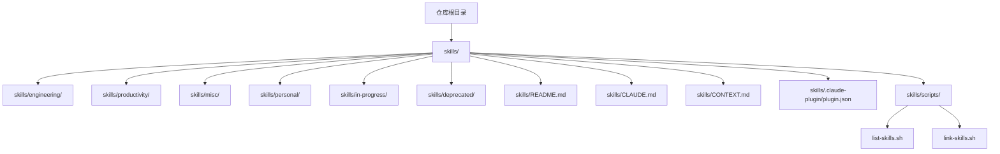
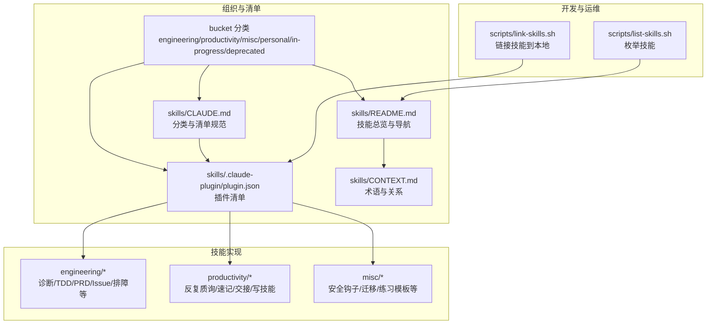
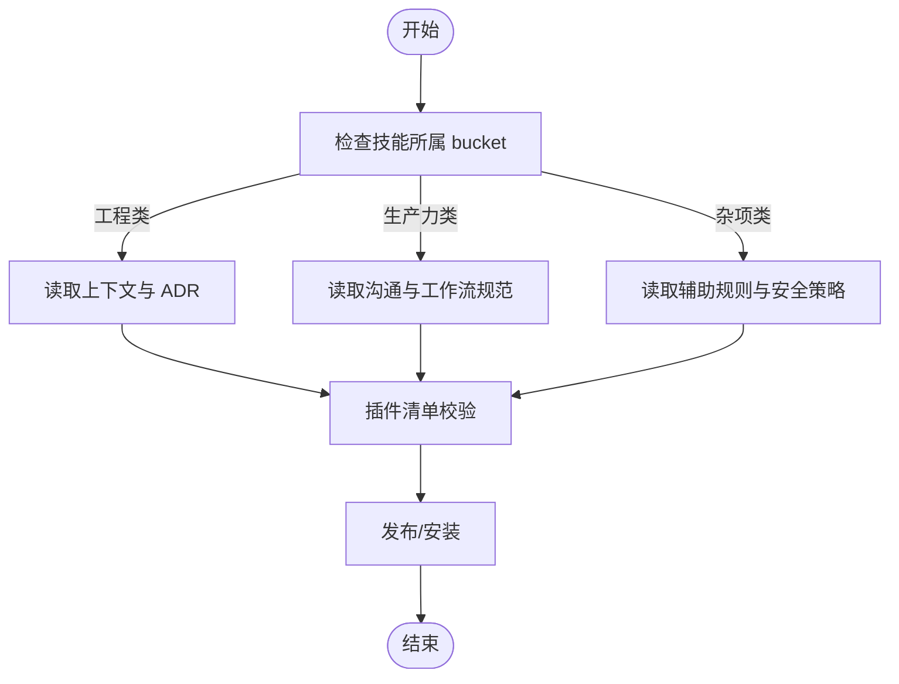
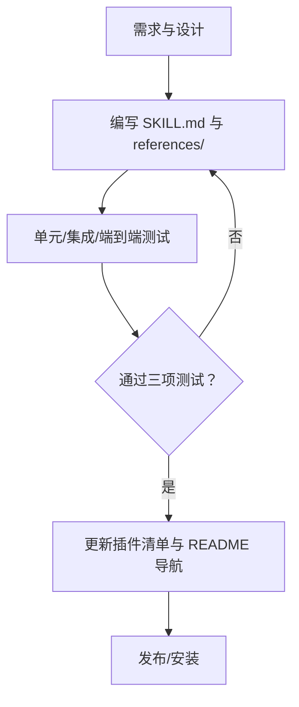
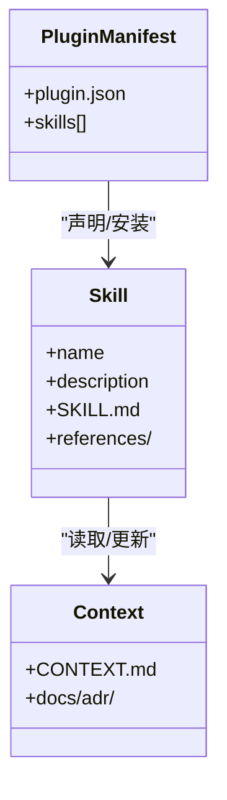
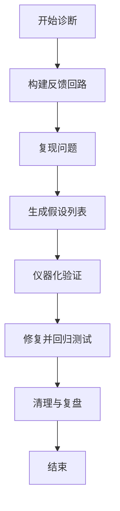
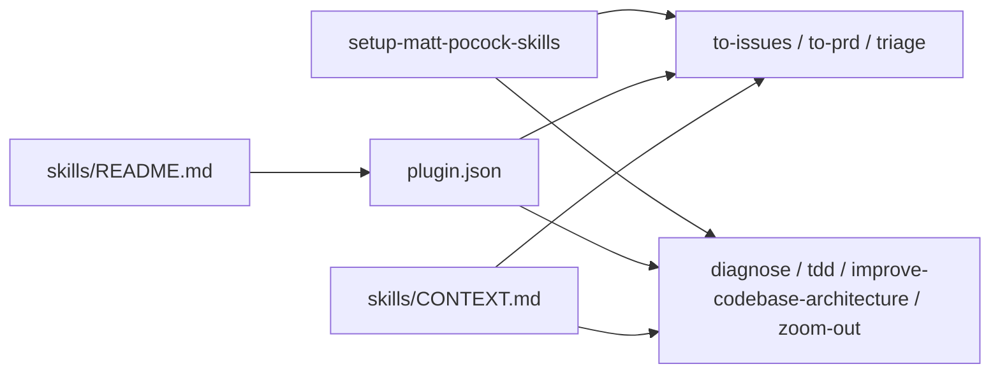

# 技能仓库管理

<cite>
**本文引用的文件**
- [skills/README.md](file://skills/skills/README.md)
- [skills/CLAUDE.md](file://skills/skills/CLAUDE.md)
- [skills/CONTEXT.md](file://skills/skills/CONTEXT.md)
- [.claude-plugin/plugin.json](file://skills/skills/.claude-plugin/plugin.json)
- [list-skills.sh](file://skills/skills/scripts/list-skills.sh)
- [link-skills.sh](file://skills/skills/scripts/link-skills.sh)
- [0001-explicit-setup-pointer-only-for-hard-dependencies.md](file://skills/skills/docs/adr/0001-explicit-setup-pointer-only-for-hard-dependencies.md)
- [diagnose/SKILL.md](file://skills/skills/skills/engineering/diagnose/SKILL.md)
- [grill-me/SKILL.md](file://skills/skills/skills/productivity/grill-me/SKILL.md)
- [setup-matt-pocock-skills/SKILL.md](file://skills/skills/skills/engineering/setup-matt-pocock-skills/SKILL.md)
- [grill-with-docs/SKILL.md](file://skills/skills/skills/engineering/grill-with-docs/SKILL.md)
- [git-guardrails-claude-code/SKILL.md](file://skills/skills/skills/misc/git-guardrails-claude-code/SKILL.md)
- [andrej-karpathy-skills/README.md](file://skills/andrej-karpathy-skills/README.md)
- [claudecode-assistant-perspective/SKILL.md](file://skills/claudecode-assistant-perspective/SKILL.md)
</cite>

## 目录
1. [简介](#简介)
2. [项目结构](#项目结构)
3. [核心组件](#核心组件)
4. [架构总览](#架构总览)
5. [详细组件分析](#详细组件分析)
6. [依赖关系分析](#依赖关系分析)
7. [性能考量](#性能考量)
8. [故障排查指南](#故障排查指南)
9. [结论](#结论)
10. [附录](#附录)

## 简介
本文件为“技能仓库管理”的综合文档，面向技能开发者与使用者，系统阐述技能仓库的组织结构、分类体系与版本管理机制，解释技能开发流程、质量检查与发布规范，提供技能模板与开发规范（文件结构、命名约定、文档要求），详述技能安装配置、更新维护与性能优化方法，并给出测试验证、调试方法、扩展与自定义开发指导，以及贡献指南与社区协作规范。

## 项目结构
技能仓库采用“多桶式”目录组织，顶层以 bucket 归类工程类、生产力类、杂项类等技能，并在每个 bucket 下提供技能清单与说明。仓库还包含统一的插件清单与上下文说明，便于在不同平台（如 Claude）中进行安装与使用。



图示来源
- [skills/README.md:1-177](file://skills/skills/README.md#L1-L177)
- [skills/CLAUDE.md:1-15](file://skills/skills/CLAUDE.md#L1-L15)
- [skills/CONTEXT.md:1-27](file://skills/skills/CONTEXT.md#L1-L27)
- [.claude-plugin/plugin.json:1-20](file://skills/skills/.claude-plugin/plugin.json#L1-L20)
- [list-skills.sh:1-8](file://skills/skills/scripts/list-skills.sh#L1-L8)
- [link-skills.sh:1-39](file://skills/skills/scripts/link-skills.sh#L1-L39)

章节来源
- [skills/README.md:1-177](file://skills/skills/README.md#L1-L177)
- [skills/CLAUDE.md:1-15](file://skills/skills/CLAUDE.md#L1-L15)
- [skills/CONTEXT.md:1-27](file://skills/skills/CONTEXT.md#L1-L27)
- [.claude-plugin/plugin.json:1-20](file://skills/skills/.claude-plugin/plugin.json#L1-L20)
- [list-skills.sh:1-8](file://skills/skills/scripts/list-skills.sh#L1-L8)
- [link-skills.sh:1-39](file://skills/skills/scripts/link-skills.sh#L1-L39)

## 核心组件
- 技能分类与清单
  - 工程类技能：围绕代码开发与工程实践，如诊断、重构、TDD、PRD/Issue生成、排障等。
  - 生产力类技能：非代码工作流工具，如“反复质询”“速记”“交接文档”“写技能”等。
  - 杂项与个人/进行中/废弃：按生命周期与可见性划分。
- 插件清单与安装入口
  - 通过统一的插件清单声明可被平台加载的技能集合，确保安装与发现的一致性。
- 上下文与语言规范
  - 通过上下文文档定义术语、关系与歧义消解，保证跨技能一致性。
- 开发脚本
  - 列出仓库内所有技能、链接到本地 Claude 使用环境，辅助开发与调试。

章节来源
- [skills/CLAUDE.md:1-15](file://skills/skills/CLAUDE.md#L1-L15)
- [.claude-plugin/plugin.json:1-20](file://skills/skills/.claude-plugin/plugin.json#L1-L20)
- [skills/CONTEXT.md:1-27](file://skills/skills/CONTEXT.md#L1-L27)
- [list-skills.sh:1-8](file://skills/skills/scripts/list-skills.sh#L1-L8)
- [link-skills.sh:1-39](file://skills/skills/scripts/link-skills.sh#L1-L39)

## 架构总览
技能仓库的运行与管理由“组织结构—清单—上下文—脚本—技能实现”构成的闭环支持：



图示来源
- [skills/README.md:1-177](file://skills/skills/README.md#L1-L177)
- [skills/CLAUDE.md:1-15](file://skills/skills/CLAUDE.md#L1-L15)
- [skills/CONTEXT.md:1-27](file://skills/skills/CONTEXT.md#L1-L27)
- [.claude-plugin/plugin.json:1-20](file://skills/skills/.claude-plugin/plugin.json#L1-L20)
- [list-skills.sh:1-8](file://skills/skills/scripts/list-skills.sh#L1-L8)
- [link-skills.sh:1-39](file://skills/skills/scripts/link-skills.sh#L1-L39)

## 详细组件分析

### 组件A：技能分类与版本管理机制
- 分类体系
  - 工程类：日常代码工作，强调反馈回路、测试驱动与架构改善。
  - 生产力类：非代码工作流，强调沟通对齐与知识沉淀。
  - 杂项类：辅助工具，如安全钩子、迁移脚本、练习模板等。
  - 生命周期类：个人、进行中、废弃，用于标识可见性与可用性。
- 版本与清单
  - 通过插件清单集中声明技能路径，确保安装与发现一致。
  - 顶层 README 提供技能导航与入口，每个技能均指向其 SKILL.md。
- 依赖与上下文
  - 工程类技能通常依赖“设置技能”提供的上下文（问题跟踪器、标签词汇、领域文档布局），并通过 ADR 与 CONTEXT.md 保持一致性。



图示来源
- [skills/CLAUDE.md:1-15](file://skills/skills/CLAUDE.md#L1-L15)
- [skills/README.md:143-177](file://skills/skills/README.md#L143-L177)
- [.claude-plugin/plugin.json:1-20](file://skills/skills/.claude-plugin/plugin.json#L1-L20)

章节来源
- [skills/CLAUDE.md:1-15](file://skills/skills/CLAUDE.md#L1-L15)
- [skills/README.md:143-177](file://skills/skills/README.md#L143-L177)
- [.claude-plugin/plugin.json:1-20](file://skills/skills/.claude-plugin/plugin.json#L1-L20)

### 组件B：技能开发流程与质量检查
- 开发流程
  - 设计阶段：明确触发条件、描述与跳过条件，遵循渐进式披露，主体控制在合理长度。
  - 实现阶段：编写 SKILL.md，必要时配套 references/ 文档与脚本。
  - 质量阶段：通过“已知/边界/风格”三项测试，确保行为稳定与可复现。
- 质量检查标准
  - 可验证的成功标准：将命令式任务转化为可验证的目标循环。
  - 诚实边界：明确能力范围与局限，避免承诺无法实现的功能。
  - 安全与最小授权：仅授予任务所需的最小工具权限。
- 发布规范
  - 工程类/生产力类/杂项类技能需在顶层 README 与插件清单中登记。
  - 个人/进行中/废弃类技能不在公开清单中出现。



图示来源
- [claudecode-assistant-perspective/SKILL.md:60-72](file://skills/claudecode-assistant-perspective/SKILL.md#L60-L72)
- [skills/README.md:143-177](file://skills/skills/README.md#L143-L177)
- [skills/CLAUDE.md:10-14](file://skills/skills/CLAUDE.md#L10-L14)

章节来源
- [claudecode-assistant-perspective/SKILL.md:60-72](file://skills/claudecode-assistant-perspective/SKILL.md#L60-L72)
- [skills/README.md:143-177](file://skills/skills/README.md#L143-L177)
- [skills/CLAUDE.md:10-14](file://skills/skills/CLAUDE.md#L10-L14)

### 组件C：技能模板与开发规范
- 文件结构
  - 每个技能以 SKILL.md 为核心，必要时在 references/ 下提供深度文档与格式规范。
  - 杂项类技能可包含脚本与配置示例。
- 命名约定
  - 技能名称与目录名一致，使用清晰语义化命名。
  - 插件清单中的路径应与实际目录结构一致。
- 文档要求
  - SKILL.md 包含元数据（名称、描述），正文不超过合理长度，细节下沉至 references/。
  - 工程类技能需与上下文文档（CONTEXT.md、ADR）协同，避免歧义。



图示来源
- [grill-with-docs/SKILL.md:1-89](file://skills/skills/skills/engineering/grill-with-docs/SKILL.md#L1-L89)
- [skills/CONTEXT.md:1-27](file://skills/skills/CONTEXT.md#L1-L27)
- [.claude-plugin/plugin.json:1-20](file://skills/skills/.claude-plugin/plugin.json#L1-L20)

章节来源
- [grill-with-docs/SKILL.md:1-89](file://skills/skills/skills/engineering/grill-with-docs/SKILL.md#L1-L89)
- [skills/CONTEXT.md:1-27](file://skills/skills/CONTEXT.md#L1-L27)
- [.claude-plugin/plugin.json:1-20](file://skills/skills/.claude-plugin/plugin.json#L1-L20)

### 组件D：安装配置、更新维护与性能优化
- 安装配置
  - 通过插件清单集中声明技能路径，确保平台可发现与加载。
  - 使用链接脚本将仓库内的技能链接到本地 Claude 使用环境，便于本地调试。
- 更新维护
  - 通过脚本列出仓库内所有技能，便于批量维护与审计。
  - 对于工程类硬依赖技能，需先运行“设置技能”以提供上下文。
- 性能优化
  - 控制 SKILL.md 主体长度，细节下沉至 references/，减少上下文开销。
  - 在调试与诊断中建立快速、确定性的反馈回路，提升定位效率。

```mermaid
sequenceDiagram
participant Dev as "开发者"
participant Repo as "技能仓库"
participant Link as "link-skills.sh"
participant CLI as "本地 Claude CLI"
Dev->>Repo : 运行 link-skills.sh
Repo-->>Link : 解析 skills/ 目录
Link->>CLI : 创建符号链接到 ~/.claude/skills
CLI-->>Dev : 可见并使用技能
```

图示来源
- [link-skills.sh:1-39](file://skills/skills/scripts/link-skills.sh#L1-L39)

章节来源
- [link-skills.sh:1-39](file://skills/skills/scripts/link-skills.sh#L1-L39)
- [list-skills.sh:1-8](file://skills/skills/scripts/list-skills.sh#L1-L8)
- [0001-explicit-setup-pointer-only-for-hard-dependencies.md:1-11](file://skills/skills/docs/adr/0001-explicit-setup-pointer-only-for-hard-dependencies.md#L1-L11)

### 组件E：测试验证与调试方法
- 测试验证
  - 将任务转化为可验证的成功标准，优先使用单元/集成/端到端测试作为反馈回路。
  - 对于非确定性问题，提高重现率与并行化，确保可调试性。
- 调试方法
  - 严格遵循诊断六步法：构建反馈回路 → 复现 → 假设 → 仪器化 → 修复 → 回归测试。
  - 在仪器化阶段，每次仅改变一个变量，使用带前缀的日志便于清理。



图示来源
- [diagnose/SKILL.md:1-118](file://skills/skills/skills/engineering/diagnose/SKILL.md#L1-L118)

章节来源
- [diagnose/SKILL.md:1-118](file://skills/skills/skills/engineering/diagnose/SKILL.md#L1-L118)

### 组件F：扩展与自定义开发指导
- 扩展技能
  - 新增技能时，遵循现有目录结构与命名约定，完善 SKILL.md 与 references/。
  - 对于工程类技能，确保与上下文文档协同，避免歧义。
- 自定义开发
  - 可基于“反复质询”“速记”“交接”等技能范式扩展新的工作流。
  - 安全钩子类技能可定制危险命令拦截策略，满足团队安全基线。

章节来源
- [grill-me/SKILL.md:1-11](file://skills/skills/skills/productivity/grill-me/SKILL.md#L1-L11)
- [git-guardrails-claude-code/SKILL.md:1-96](file://skills/skills/skills/misc/git-guardrails-claude-code/SKILL.md#L1-L96)

### 组件G：贡献指南与社区协作规范
- 贡献流程
  - 在个人/进行中/废弃类之外的技能，需在顶层 README 与插件清单中登记。
  - 工程类硬依赖技能需先运行“设置技能”，确保上下文一致。
- 协作规范
  - 诚实边界：明确能力范围与局限，避免承诺无法实现的功能。
  - 最小授权：仅授予任务所需的最小工具权限。
  - 复利模式：每个产出设计为可复用，让今天的工作产生明天的价值。

章节来源
- [skills/CLAUDE.md:10-14](file://skills/skills/CLAUDE.md#L10-L14)
- [0001-explicit-setup-pointer-only-for-hard-dependencies.md:1-11](file://skills/skills/docs/adr/0001-explicit-setup-pointer-only-for-hard-dependencies.md#L1-L11)
- [claudecode-assistant-perspective/SKILL.md:75-95](file://skills/claudecode-assistant-perspective/SKILL.md#L75-L95)

## 依赖关系分析
技能之间的依赖主要体现在“上下文依赖”与“安装依赖”两个层面：
- 上下文依赖：工程类硬依赖技能（如 PRD/Issue/排障）依赖“设置技能”提供的上下文；软依赖技能（如诊断/TDD/架构改善）可降级使用。
- 安装依赖：插件清单集中声明技能路径，确保平台可发现与加载。



图示来源
- [.claude-plugin/plugin.json:1-20](file://skills/skills/.claude-plugin/plugin.json#L1-L20)
- [skills/README.md:143-177](file://skills/skills/README.md#L143-L177)
- [skills/CONTEXT.md:1-27](file://skills/skills/CONTEXT.md#L1-L27)
- [0001-explicit-setup-pointer-only-for-hard-dependencies.md:1-11](file://skills/skills/docs/adr/0001-explicit-setup-pointer-only-for-hard-dependencies.md#L1-L11)

章节来源
- [.claude-plugin/plugin.json:1-20](file://skills/skills/.claude-plugin/plugin.json#L1-L20)
- [skills/README.md:143-177](file://skills/skills/README.md#L143-L177)
- [skills/CONTEXT.md:1-27](file://skills/skills/CONTEXT.md#L1-L27)
- [0001-explicit-setup-pointer-only-for-hard-dependencies.md:1-11](file://skills/skills/docs/adr/0001-explicit-setup-pointer-only-for-hard-dependencies.md#L1-L11)

## 性能考量
- 上下文窗口管理：遵循渐进式披露，将细节下沉至 references/，减少不必要的 token 消耗。
- 反馈回路效率：优先建立快速、确定性的反馈回路，缩短定位时间。
- 权限与安全：最小授权原则，避免不必要的高权限操作，降低风险与开销。
- 结构化工作流：通过标准化流程（如诊断六步法）提升可重复性与稳定性。

## 故障排查指南
- 常见问题
  - 技能未出现在平台：检查插件清单路径是否与实际目录一致，确认已在顶层 README 与清单中登记。
  - 工程类技能上下文缺失：运行“设置技能”，生成并更新上下文文档。
  - 安全钩子未生效：确认钩子脚本已复制到正确位置并具备执行权限，检查设置文件合并是否正确。
- 排障步骤
  - 核对清单与路径一致性。
  - 验证上下文文档存在且内容正确。
  - 使用脚本列出与链接技能，确认本地可用性。

章节来源
- [.claude-plugin/plugin.json:1-20](file://skills/skills/.claude-plugin/plugin.json#L1-L20)
- [link-skills.sh:1-39](file://skills/skills/scripts/link-skills.sh#L1-L39)
- [git-guardrails-claude-code/SKILL.md:37-82](file://skills/skills/skills/misc/git-guardrails-claude-code/SKILL.md#L37-L82)

## 结论
本技能仓库通过清晰的分类体系、统一的清单与上下文规范、完善的开发与测试流程，实现了技能的可维护、可扩展与可复用。遵循本文档的开发规范与协作准则，可显著提升技能质量与团队效率，并为后续扩展与社区贡献奠定坚实基础。

## 附录
- 相关参考
  - 基于 Karpathy 观察的四原则，强调“先思考再编码”“简洁优先”“手术式变更”“目标驱动执行”。
  - 专家视角技能，提供工作流、反模式、文档索引等参考资料。

章节来源
- [andrej-karpathy-skills/README.md:1-172](file://skills/andrej-karpathy-skills/README.md#L1-L172)
- [claudecode-assistant-perspective/SKILL.md:98-106](file://skills/claudecode-assistant-perspective/SKILL.md#L98-L106)