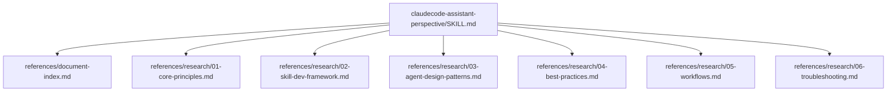
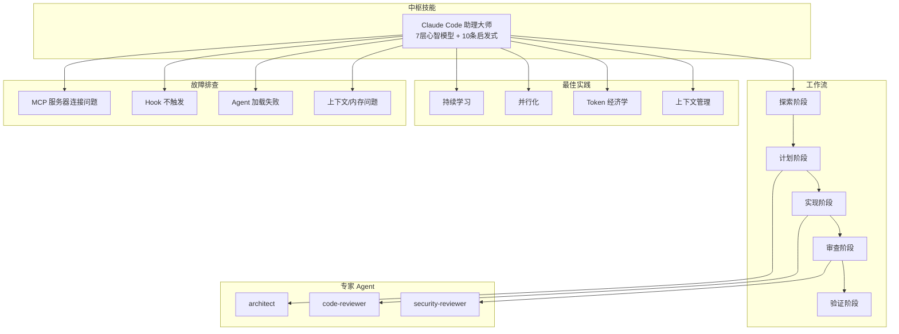
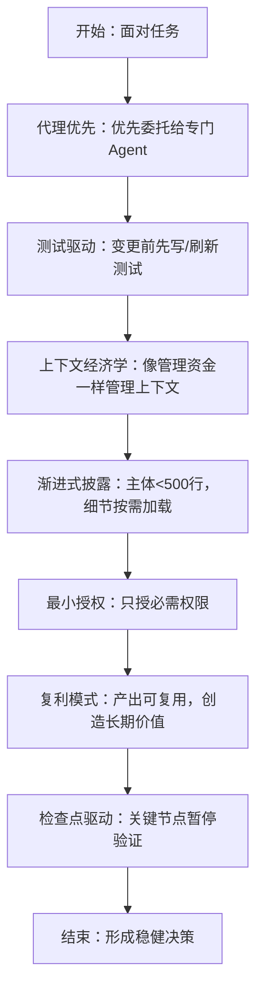
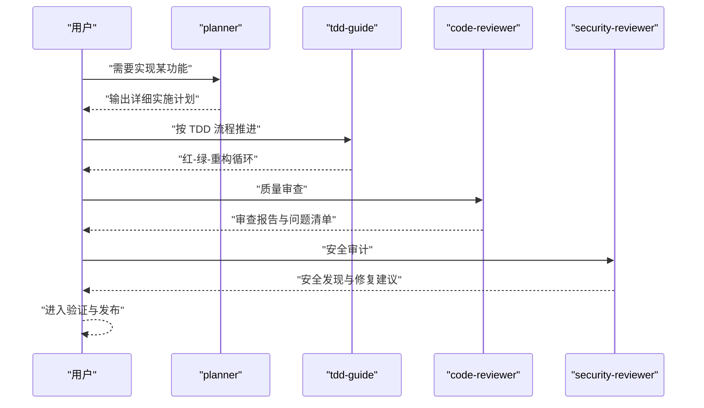
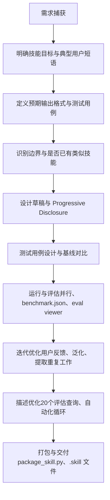
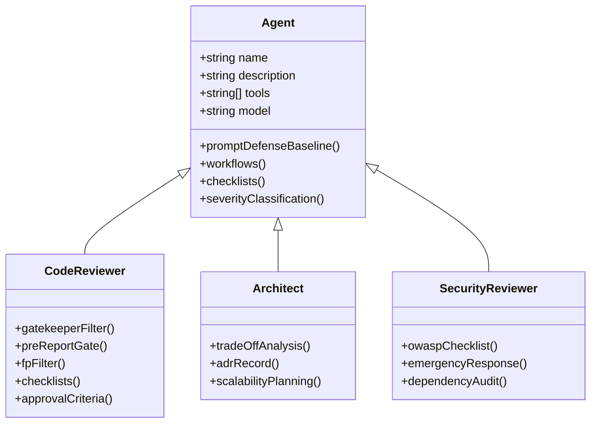
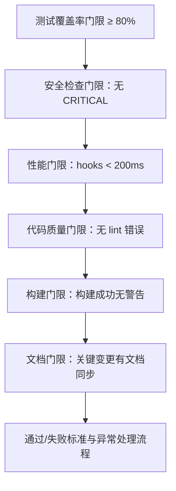
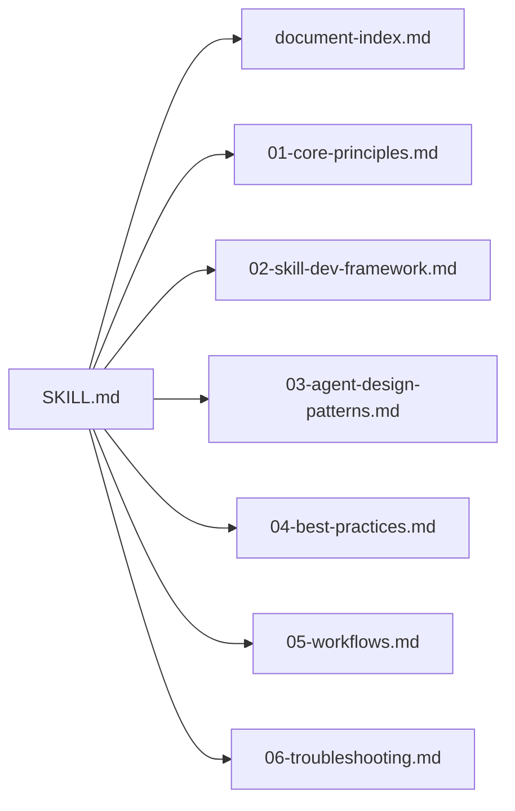

# 技能开发系统

<cite>
**本文引用的文件**
- [SKILL.md](file://skills/claudecode-assistant-perspective/SKILL.md)
- [document-index.md](file://skills/claudecode-assistant-perspective/references/document-index.md)
- [01-core-principles.md](file://skills/claudecode-assistant-perspective/references/research/01-core-principles.md)
- [02-skill-dev-framework.md](file://skills/claudecode-assistant-perspective/references/research/02-skill-dev-framework.md)
- [03-agent-design-patterns.md](file://skills/claudecode-assistant-perspective/references/research/03-agent-design-patterns.md)
- [04-best-practices.md](file://skills/claudecode-assistant-perspective/references/research/04-best-practices.md)
- [05-workflows.md](file://skills/claudecode-assistant-perspective/references/research/05-workflows.md)
- [06-troubleshooting.md](file://skills/claudecode-assistant-perspective/references/research/06-troubleshooting.md)
</cite>

## 目录
1. [简介](#简介)
2. [项目结构](#项目结构)
3. [核心组件](#核心组件)
4. [架构总览](#架构总览)
5. [详细组件分析](#详细组件分析)
6. [依赖分析](#依赖分析)
7. [性能考量](#性能考量)
8. [故障排查指南](#故障排查指南)
9. [结论](#结论)
10. [附录](#附录)

## 简介
本文件面向“技能开发系统”的使用者与贡献者，系统化阐述 Claude Code 领域的“专家级”技能开发方法论与工程实践。围绕“Claude Code 助理大师”这一核心技能，本文从以下维度展开：
- 7 层心智模型：代理优先、测试驱动、上下文管理经济学、渐进式披露、最小授权、复利模式、检查点驱动
- 内在张力：在复用与简单、授权与灵活、质量与速度、披露与完整之间进行权衡
- 决策启发式：10 条快速判断准则，指导工具/模型/Agent/权限/触发/测试等关键决策
- 工程技能类别：TDD、诊断、架构改善等的开发框架与实现模式
- 生产力技能：Grill 会话、交接等场景下的使用与最佳实践
- 技能模板与开发规范：结构设计、参数定义、生命周期管理
- 测试、调试与部署：完整流程与检查清单
- 技能组合与扩展：如何将多个技能协同工作并可持续演进

## 项目结构
该仓库包含多个技能与 Agent 的实现与参考文档。其中，“claudecode-assistant-perspective”技能作为中枢，提供核心心智模型、工作流与最佳实践的统一入口，并通过 references 目录组织深入资料。

图表来源
- [SKILL.md:1-106](file://skills/claudecode-assistant-perspective/SKILL.md#L1-L106)
- [document-index.md:1-76](file://skills/claudecode-assistant-perspective/references/document-index.md#L1-L76)
- [01-core-principles.md:1-221](file://skills/claudecode-assistant-perspective/references/research/01-core-principles.md#L1-L221)
- [02-skill-dev-framework.md:1-336](file://skills/claudecode-assistant-perspective/references/research/02-skill-dev-framework.md#L1-L336)
- [03-agent-design-patterns.md:1-372](file://skills/claudecode-assistant-perspective/references/research/03-agent-design-patterns.md#L1-L372)
- [04-best-practices.md:1-201](file://skills/claudecode-assistant-perspective/references/research/04-best-practices.md#L1-L201)
- [05-workflows.md:1-434](file://skills/claudecode-assistant-perspective/references/research/05-workflows.md#L1-L434)
- [06-troubleshooting.md:1-375](file://skills/claudecode-assistant-perspective/references/research/06-troubleshooting.md#L1-L375)

章节来源
- [SKILL.md:1-106](file://skills/claudecode-assistant-perspective/SKILL.md#L1-L106)
- [document-index.md:1-76](file://skills/claudecode-assistant-perspective/references/document-index.md#L1-L76)

## 核心组件
- 心智模型（7 层）
  - 代理优先：将专业任务委托给专门 Agent，避免通用处理
  - 测试驱动：变更前先写/刷新测试，信任测试而非直觉
  - 上下文管理经济学：像管理资金一样管理上下文，每个 token 都要有回报
  - 渐进式披露：SKILL.md 主体 <500 行，细节按需加载
  - 最小授权：只授予任务必需的最小工具权限
  - 复利模式：每个产出设计为可复用，让今天的工作产生明天的价值
  - 检查点驱动：在关键节点暂停验证，避免最后才发现问题
- 内在张力（4 组矛盾）
  - 复用 vs 简单
  - 授权最小化 vs 任务灵活性
  - 检查点质量 vs 交付速度
  - 渐进式披露 vs 上下文完整
- 决策启发式（10 条）
  - 工具选择、模型选择、Agent 调用、安全相关、大规模变更、上下文清理、渐进式披露、触发优化、质量验证、诚实边界

章节来源
- [SKILL.md:10-72](file://skills/claudecode-assistant-perspective/SKILL.md#L10-L72)

## 架构总览
“Claude Code 助理大师”作为中枢技能，串联以下能力：
- 心智模型与启发式：为所有技能与 Agent 的设计与调用提供统一框架
- 工作流：提供“探索→计划→实现→审查→验证”的五阶段顺序编排
- Agent 设计：以“三层过滤 + 检查表驱动”的代码审查、架构设计、安全审查等专家 Agent 为核心
- 最佳实践：上下文管理、Token 经济学、并行化、持续学习与复利效应
- 故障排查：覆盖上下文/内存、Agent 加载、工作流挂起、工具调用、Hook、插件、包管理器、性能、Skill 触发、Worktree、MCP 服务器、子 Agent 等问题

图表来源
- [05-workflows.md:5-73](file://skills/claudecode-assistant-perspective/references/research/05-workflows.md#L5-L73)
- [03-agent-design-patterns.md:1-372](file://skills/claudecode-assistant-perspective/references/research/03-agent-design-patterns.md#L1-L372)
- [04-best-practices.md:1-201](file://skills/claudecode-assistant-perspective/references/research/04-best-practices.md#L1-L201)
- [06-troubleshooting.md:1-375](file://skills/claudecode-assistant-perspective/references/research/06-troubleshooting.md#L1-L375)

## 详细组件分析

### 心智模型与启发式
- 心智模型：强调“代理优先、测试驱动、上下文经济学、渐进式披露、最小授权、复利、检查点驱动”，并通过正反示例与局限性说明，帮助在复杂场景中做出稳健决策
- 决策启发式：提供工具/模型/Agent/权限/触发/测试等领域的快速判断，降低认知负担，提升一致性

图表来源
- [SKILL.md:10-72](file://skills/claudecode-assistant-perspective/SKILL.md#L10-L72)

章节来源
- [SKILL.md:10-72](file://skills/claudecode-assistant-perspective/SKILL.md#L10-L72)

### 工程技能类别：TDD、诊断、架构改善
- TDD 开发框架：红-绿-重构循环，结合 planner、tdd-guide、code-reviewer、security-reviewer 的顺序编排，确保测试先行与质量门限
- 诊断工作流：问题分类、信息收集、假设验证、根因分析、修复方案、预防措施，覆盖构建错误、性能问题、功能异常、配置问题、权限问题、工具故障等
- 架构改善：通过 architect 的权衡分析与 ADR 记录，系统化评估技术债、可扩展性与安全影响

图表来源
- [05-workflows.md:7-73](file://skills/claudecode-assistant-perspective/references/research/05-workflows.md#L7-L73)

章节来源
- [05-workflows.md:7-73](file://skills/claudecode-assistant-perspective/references/research/05-workflows.md#L7-L73)

### 生产力技能：Grill 会话、交接
- Grill 会话：通过“上下文管理经济学”与“Token 经济学”，在有限上下文内最大化产出；结合“策略性清理/手动压缩/中间结果文件化”等最佳实践，避免上下文过长与信息丢失
- 交接：利用“渐进式披露”与“检查点驱动”，将复杂任务拆分为阶段性文件与报告，便于后续会话或他人接手

章节来源
- [04-best-practices.md:5-99](file://skills/claudecode-assistant-perspective/references/research/04-best-practices.md#L5-L99)

### 技能模板与开发规范
- 标准结构：SKILL.md + references/ + scripts/ + assets/ + evals/ + agents/；references 按需加载，主体 <500 行
- Frontmatter 规范：name、description（Pushy 模式，明确 TRIGGER/SKIP）、license、compatibility
- 触发优化：20 个评估查询（should-trigger/should-not-trigger），自动化优化循环，避免过拟合
- 内容组织：解释“为什么”、祈使语气、无意外原则、子命令表、阅读指南
- 资源利用：重复工作提取到 scripts/，大型文档放入 references/，模板资源放入 assets/

图表来源
- [02-skill-dev-framework.md:173-250](file://skills/claudecode-assistant-perspective/references/research/02-skill-dev-framework.md#L173-L250)

章节来源
- [02-skill-dev-framework.md:5-250](file://skills/claudecode-assistant-perspective/references/research/02-skill-dev-framework.md#L5-L250)

### Agent 设计模式
- Frontmatter 规范：name、description（含触发时机与强制性要求）、tools（最小授权）、model（Opus/Sonnet/Haiku）
- 三层过滤与检查表驱动：信心门限 → 预报告门 → 误阳性排除；分层检查（安全/质量/框架/性能/规范）
- 严重性分级：CRITICAL/HIGH/MEDIUM/LOW，配套批准标准与零发现有效输出
- 典型 Agent：code-reviewer（三层过滤 + 检查表）、architect（权衡分析 + ADR）、security-reviewer（OWASP 检查 + 紧急响应）

图表来源
- [03-agent-design-patterns.md:5-304](file://skills/claudecode-assistant-perspective/references/research/03-agent-design-patterns.md#L5-L304)

章节来源
- [03-agent-design-patterns.md:5-304](file://skills/claudecode-assistant-perspective/references/research/03-agent-design-patterns.md#L5-L304)

### 工作流与检查点设计
- 顺序多代理编排：探索→计划→实现→审查→验证，每个阶段设定质量门限
- 检查点设计：测试覆盖率、安全检查、性能、代码质量、构建、文档等门限；自动评估脚本与回滚机制
- Git 工作树并行：主分支稳定、创建工作树、独立测试、合并审查、清理工作树

图表来源
- [05-workflows.md:336-400](file://skills/claudecode-assistant-perspective/references/research/05-workflows.md#L336-L400)

章节来源
- [05-workflows.md:336-400](file://skills/claudecode-assistant-perspective/references/research/05-workflows.md#L336-L400)

### 上下文管理与 Token 经济学
- 策略性清理与手动压缩：在上下文使用率约 50% 时进行压缩；使用 /clear 与中间结果文件化
- 动态上下文注入：CLI 标志注入、角色化别名、优先级控制
- 子代理架构优化：传递目标上下文而非仅查询；顺序阶段协调器（研究→计划→实现→审查→验证）
- 成本优化检查清单：CLI + 技能替代常驻 MCP、mgrep 替代 grep、模块化代码库、子代理使用最便宜足够模型、中间结果文件化、手动压缩

章节来源
- [04-best-practices.md:5-99](file://skills/claudecode-assistant-perspective/references/research/04-best-practices.md#L5-L99)

### 故障排查与安全防护
- 常见问题分类与诊断：上下文/内存问题、Agent 加载失败、工作流挂起、工具调用失败、Hook 不触发、安全防护误报、插件不加载、包管理器检测失败、性能问题、Skill 触发问题、Worktree 问题、MCP 服务器连接问题、子 Agent 问题
- 安全防护：危险命令阻塞、硬编码密钥检测、Prompt 注入防护（6 条基线）、敏感数据处理规范
- 调试工具箱：会话摘要生成、上下文窗口监控、工具调用日志分析、子 Agent 输出验证、触发匹配度测试
- 版本兼容性：从 1.x 升级到 2.0/2.1 的关键变更与检查清单
- 紧急响应流程：立即停止、隔离影响、根因分析、修复验证、预防措施

章节来源
- [06-troubleshooting.md:5-355](file://skills/claudecode-assistant-perspective/references/research/06-troubleshooting.md#L5-L355)

## 依赖分析
中枢技能“Claude Code 助理大师”与以下文档/模块存在直接依赖关系：
- 心智模型与启发式 → 工作流与 Agent 设计 → 技能开发框架 → 最佳实践 → 故障排查
- references/document-index.md 提供核心文档索引，串联 everything-claude-code、claude-code-best-practice、cookbooks 等资源

图表来源
- [SKILL.md:1-106](file://skills/claudecode-assistant-perspective/SKILL.md#L1-L106)
- [document-index.md:1-76](file://skills/claudecode-assistant-perspective/references/document-index.md#L1-L76)
- [01-core-principles.md:1-221](file://skills/claudecode-assistant-perspective/references/research/01-core-principles.md#L1-L221)
- [02-skill-dev-framework.md:1-336](file://skills/claudecode-assistant-perspective/references/research/02-skill-dev-framework.md#L1-L336)
- [03-agent-design-patterns.md:1-372](file://skills/claudecode-assistant-perspective/references/research/03-agent-design-patterns.md#L1-L372)
- [04-best-practices.md:1-201](file://skills/claudecode-assistant-perspective/references/research/04-best-practices.md#L1-L201)
- [05-workflows.md:1-434](file://skills/claudecode-assistant-perspective/references/research/05-workflows.md#L1-L434)
- [06-troubleshooting.md:1-375](file://skills/claudecode-assistant-perspective/references/research/06-troubleshooting.md#L1-L375)

章节来源
- [document-index.md:1-76](file://skills/claudecode-assistant-perspective/references/document-index.md#L1-L76)

## 性能考量
- 模型选择：90% 编码任务默认 Sonnet；首次失败、5+ 文件、架构决策、安全关键代码升级至 Opus
- Token 经济学：mgrep 平均减少 ~50% token；中间结果文件化；手动压缩优于自动压缩
- 并行化：最小可行并行化原则；Git 工作树模式；多实例任务划分
- 持续学习：Stop 钩子学习流程；可复用模式积累；复利效应设计

章节来源
- [04-best-practices.md:38-173](file://skills/claudecode-assistant-perspective/references/research/04-best-practices.md#L38-L173)

## 故障排查指南
- 快速诊断：使用 /context all 查看 token 估算；检查 Skill 名称与参数正则匹配；验证 skillOverrides 设置
- 上下文问题：/compact、Rewind“Summarize up to here”、/clear；归档过大的 observations.jsonl
- Hook 调试：检查 settings.json 中的 hook 注册；验证 hook 语法与脚本可执行权限；手动测试 hook
- 子 Agent：检查 x-claude-code-agent-id/parent-agent-id 头部；验证工具与权限继承；模型选择符合预期
- 版本兼容：对照 2.0.x/2.1.x 关键变更；必要时升级到修复版本（如 2.1.136+）

章节来源
- [06-troubleshooting.md:78-355](file://skills/claudecode-assistant-perspective/references/research/06-troubleshooting.md#L78-L355)

## 结论
“Claude Code 助理大师”以 7 层心智模型与 10 条启发式为纲，结合系统化工作流、Agent 设计模式、最佳实践与故障排查体系，构建了可复用、可测试、可演进的技能开发与应用闭环。通过 Progressive Disclosure、最小授权、检查点驱动与复利模式，既能应对复杂工程挑战，又能保持长期可维护性与可扩展性。

## 附录
- 参考资源索引：核心原则、Skill 开发资源、Agent 设计资源、最佳实践与示例、开发检查清单
- 版本兼容性：从 1.x 升级到 2.0/2.1 的关键变更与检查清单

章节来源
- [document-index.md:1-76](file://skills/claudecode-assistant-perspective/references/document-index.md#L1-L76)