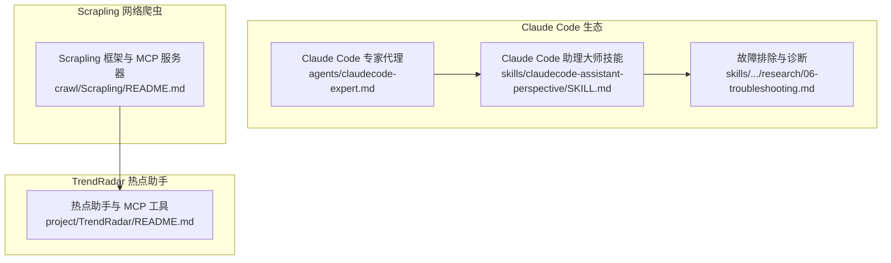
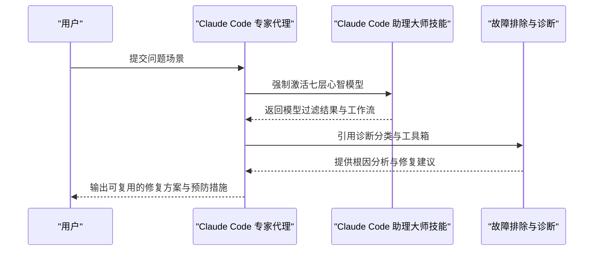
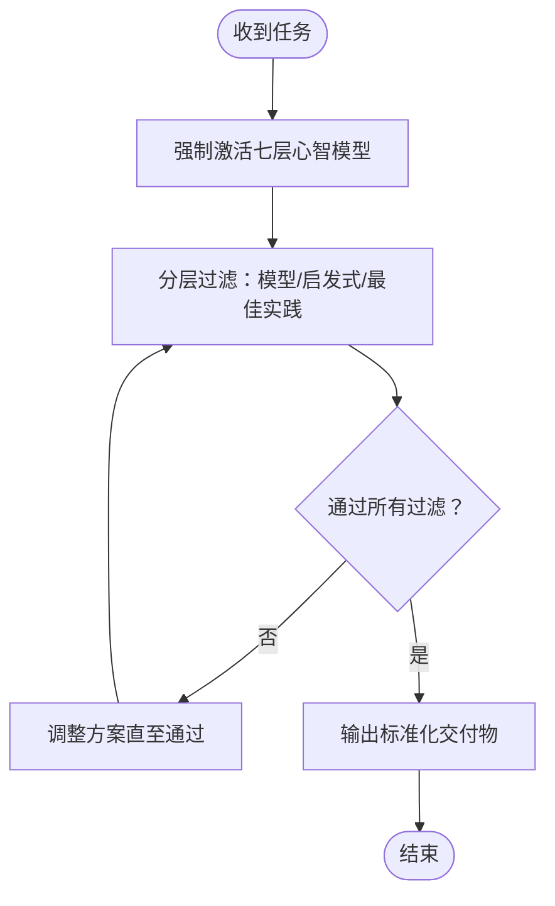
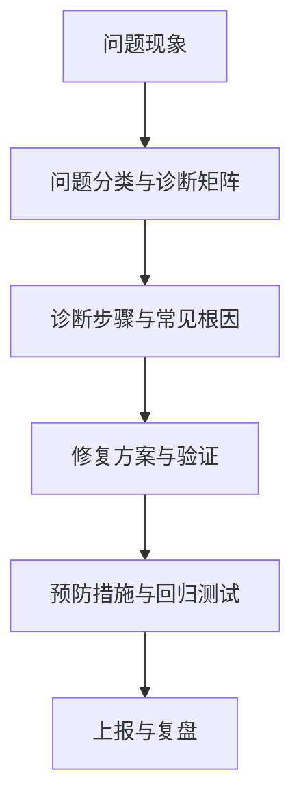
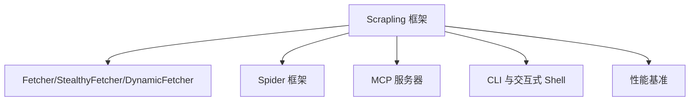
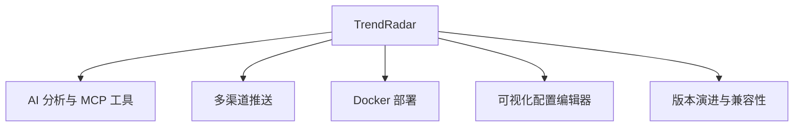
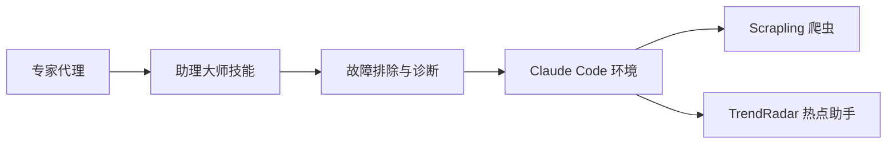

# 故障排除和常见问题

<cite>
**本文引用的文件**
- [README.md](file://README.md)
- [README.zh-CN.md](file://README.zh-CN.md)
- [claudecode-expert.md](file://agents/claudecode-expert.md)
- [SKILL.md](file://skills/claudecode-assistant-perspective/SKILL.md)
- [06-troubleshooting.md](file://skills/claudecode-assistant-perspective/references/research/06-troubleshooting.md)
- [README.md](file://crawl/Scrapling/README.md)
- [README.md](file://project/TrendRadar/README.md)
</cite>

## 目录
1. [简介](#简介)
2. [项目结构](#项目结构)
3. [核心组件](#核心组件)
4. [架构总览](#架构总览)
5. [详细组件分析](#详细组件分析)
6. [依赖关系分析](#依赖关系分析)
7. [性能注意事项](#性能注意事项)
8. [故障排除指南](#故障排除指南)
9. [结论](#结论)
10. [附录](#附录)

## 简介
本文件面向使用 Claude Code 技能代理与相关生态（包括 Claude Code 专家代理、Claude Code 助理大师技能、Scrapling 网络爬虫框架、TrendRadar 热点助手等）的用户与开发者，提供系统化的故障排除与常见问题解答。内容涵盖安装配置、使用过程中的诊断方法、性能问题排查与优化、网络连接问题、技能代理调用与参数问题、系统集成问题，以及社区支持与问题反馈渠道。

## 项目结构
该仓库包含三类核心资产：
- Claude Code 专家代理与技能：提供安装、使用、工作流与问题诊断的权威指引
- Scrapling 网络爬虫框架：提供高性能抓取、反反爬、MCP 服务器与 CLI 工具
- TrendRadar 热点助手：提供 AI 分析、多渠道推送、MCP 工具与 Docker 部署

**图表来源**
- [claudecode-expert.md](file://agents/claudecode-expert.md)
- [SKILL.md](file://skills/claudecode-assistant-perspective/SKILL.md)
- [06-troubleshooting.md](file://skills/claudecode-assistant-perspective/references/research/06-troubleshooting.md)
- [README.md](file://crawl/Scrapling/README.md)
- [README.md](file://project/TrendRadar/README.md)

**章节来源**
- [README.md](file://README.md)
- [README.zh-CN.md](file://README.zh-CN.md)

## 核心组件
- Claude Code 专家代理：提供“代理优先”“测试驱动”“上下文管理”“渐进式披露”“最小授权”“复利模式”“检查点驱动”的七层心智模型过滤，以及触发前强制激活流程，确保高质量交付与可复用产出。
- Claude Code 助理大师技能：定义核心心智模型、内在张力、决策启发式与诚实边界，提供工作流、反模式与资源索引。
- 故障排除与诊断：系统化的问题分类、安全防护、调试工具箱、版本兼容与紧急响应流程，覆盖上下文/内存、Agent 加载、工作流挂起、工具调用、Hook 触发、插件加载、包管理器检测、性能、MCP 服务器连接、子 Agent 等问题。
- Scrapling：提供 HTTP/Stealthy/Dynamic Fetcher、Spider 框架、Session 管理、代理轮换、DNS 泄漏防护、MCP 服务器、CLI 与交互式 Shell、性能基准等。
- TrendRadar：提供 AI 分析、多渠道推送、MCP 工具、Docker 部署、可视化配置编辑器、版本演进与兼容性说明。

**章节来源**
- [claudecode-expert.md](file://agents/claudecode-expert.md)
- [SKILL.md](file://skills/claudecode-assistant-perspective/SKILL.md)
- [06-troubleshooting.md](file://skills/claudecode-assistant-perspective/references/research/06-troubleshooting.md)
- [README.md](file://crawl/Scrapling/README.md)
- [README.md](file://project/TrendRadar/README.md)

## 架构总览
下图展示了 Claude Code 专家代理与技能在问题诊断中的作用，以及与故障排除文档的协同关系。

**图表来源**
- [claudecode-expert.md](file://agents/claudecode-expert.md)
- [SKILL.md](file://skills/claudecode-assistant-perspective/SKILL.md)
- [06-troubleshooting.md](file://skills/claudecode-assistant-perspective/references/research/06-troubleshooting.md)

## 详细组件分析

### Claude Code 专家代理与技能
- 专家代理的强制激活流程确保在任何实际工作之前先加载“助理大师技能”的七层心智模型，随后进行分层过滤与最佳实践检查，最终输出标准化交付物。
- 助理大师技能提供核心心智模型、内在张力、决策启发式与诚实边界，帮助用户在使用 Claude Code 时做出高质量决策。

**图表来源**
- [claudecode-expert.md](file://agents/claudecode-expert.md)
- [SKILL.md](file://skills/claudecode-assistant-perspective/SKILL.md)

**章节来源**
- [claudecode-expert.md](file://agents/claudecode-expert.md)
- [SKILL.md](file://skills/claudecode-assistant-perspective/SKILL.md)

### 故障排除与诊断（系统化问题分类）
- 问题分类：涵盖上下文/内存、Agent 加载失败、工作流挂起、工具调用失败、Hook 不触发、安全防护误报、插件不加载、包管理器检测失败、性能问题、Skill 触发问题、Worktree 问题、MCP 服务器连接问题、子 Agent 问题等。
- 安全防护：危险命令阻塞机制、硬编码密钥检测、Prompt 注入防护基线、敏感数据处理规范。
- 调试工具箱：会话摘要生成、上下文窗口监控、工具调用日志分析、子 Agent 输出验证、触发匹配度测试。
- 版本兼容：从 2.0 升级到 2.1 的关键变更与兼容性检查清单。
- 紧急响应：停止、隔离影响、根因分析、修复验证、预防措施与上报渠道。

**图表来源**
- [06-troubleshooting.md](file://skills/claudecode-assistant-perspective/references/research/06-troubleshooting.md)

**章节来源**
- [06-troubleshooting.md](file://skills/claudecode-assistant-perspective/references/research/06-troubleshooting.md)

### Scrapling 网络爬虫框架
- 功能亮点：Spiders 爬虫框架、高级网站抓取、自适应解析、AI 集成（MCP 服务器）、高性能与内存效率、CLI 与交互式 Shell、Docker 镜像。
- 安装与可选依赖：Fetchers、Shell、AI 等特性安装方式与浏览器依赖安装。
- 性能基准：与主流库的文本提取与元素相似性搜索性能对比。

**图表来源**
- [README.md](file://crawl/Scrapling/README.md)

**章节来源**
- [README.md](file://crawl/Scrapling/README.md)

### TrendRadar 热点助手
- 功能：AI 智能分析、多渠道推送（飞书、钉钉、企业微信、Telegram、ntfy、Bark、Slack、邮件等）、MCP 工具、Docker 部署、可视化配置编辑器。
- 版本演进：包含 MCP 功能、AI 分析、存储后端、Web 服务器、多账号推送、正则关键词语法、RSS 订阅、多模型适配等。
- 配置与部署：支持环境变量覆盖、Docker Compose、GitHub Actions、可视化编辑器等。

**图表来源**
- [README.md](file://project/TrendRadar/README.md)

**章节来源**
- [README.md](file://project/TrendRadar/README.md)

## 依赖关系分析
- Claude Code 专家代理依赖“助理大师技能”的心智模型与工作流，形成“先模型、后执行”的结构化流程。
- 故障排除文档为上述代理与技能提供系统化的诊断与修复路径，覆盖安装、配置、使用、性能与网络等全链路问题。
- Scrapling 与 TrendRadar 作为外部生态组件，通过 MCP 服务器与 Claude Code 集成，形成“抓取/分析/推送”的闭环。

**图表来源**
- [claudecode-expert.md](file://agents/claudecode-expert.md)
- [SKILL.md](file://skills/claudecode-assistant-perspective/SKILL.md)
- [06-troubleshooting.md](file://skills/claudecode-assistant-perspective/references/research/06-troubleshooting.md)
- [README.md](file://crawl/Scrapling/README.md)
- [README.md](file://project/TrendRadar/README.md)

**章节来源**
- [claudecode-expert.md](file://agents/claudecode-expert.md)
- [SKILL.md](file://skills/claudecode-assistant-perspective/SKILL.md)
- [06-troubleshooting.md](file://skills/claudecode-assistant-perspective/references/research/06-troubleshooting.md)
- [README.md](file://crawl/Scrapling/README.md)
- [README.md](file://project/TrendRadar/README.md)

## 性能注意事项
- 上下文与内存：及时清理会话历史、避免一次性加载超大文件、使用“压缩/清空/新建会话”等手段控制上下文窗口。
- 工具与 Hook：减少不必要的 Hook 数量与执行频率，避免阻塞与资源竞争。
- 网络与代理：在 Scrapling 中启用代理轮换与 DNS 泄漏防护，降低被反爬与网络不稳定带来的性能损耗。
- MCP 服务器：合理配置工具数量与并发，避免令牌刷新冲突与连接抖动。
- TrendRadar：控制推送频率与消息分批，避免渠道超限与重复推送。

[本节为通用指导，无需特定文件引用]

## 故障排除指南

### 安装与配置问题
- 依赖冲突与版本不兼容
  - 现象：安装后功能不可用、插件不加载、包管理器检测失败
  - 诊断：检查 Claude Code 版本与插件兼容性、确认包管理器配置、清理缓存后重装
  - 修复：使用诊断命令与修复命令、备份并重建缓存、设置正确的包管理器环境变量
- 权限问题
  - 现象：Hook 不执行、工具调用失败、权限被拒绝
  - 诊断：检查脚本可执行权限、PATH 环境变量、文件权限
  - 修复：赋予脚本执行权限、修正 PATH、确保用户对目标目录具有写权限
- 环境不兼容
  - 现象：不同系统/Python 版本导致的行为差异
  - 诊断：确认 Python 版本与系统依赖、Docker 镜像一致性
  - 修复：使用官方镜像、锁定依赖版本、在 CI 中统一环境

**章节来源**
- [06-troubleshooting.md](file://skills/claudecode-assistant-perspective/references/research/06-troubleshooting.md)

### 使用过程中的问题诊断
- 日志分析
  - 使用诊断命令收集版本信息与环境变量、启用调试日志、运行 doctor/repair
  - 检查观察文件大小与内容、定位上下文膨胀与历史累积问题
- 错误代码解读
  - 常见错误：权限拒绝、模块未找到、进程启动失败、Windows 行尾问题
  - 修复：修正 Hook 权限、安装依赖、转换行尾格式
- 调试技巧
  - 启用调试模式、设置超时、检查网络连通性、使用上下文压缩与清空
  - 子 Agent 调试：检查头部、工具继承与模型选择

**章节来源**
- [06-troubleshooting.md](file://skills/claudecode-assistant-perspective/references/research/06-troubleshooting.md)

### 性能问题排查与优化
- 内存泄漏与上下文膨胀
  - 诊断：观察文件过大、会话历史过长
  - 修复：归档/清空观察文件、使用压缩/清空/新建会话
- CPU 占用过高
  - 诊断：Hook 过多、工具执行阻塞、网络超时重试
  - 修复：禁用未用 Hook、优化工具调用、调整超时与重试策略
- 网络延迟
  - 诊断：代理配置不当、DNS 泄漏、TLS/HTTP3 选择
  - 修复：启用代理轮换、DNS-over-HTTPS、选择合适协议

**章节来源**
- [06-troubleshooting.md](file://skills/claudecode-assistant-perspective/references/research/06-troubleshooting.md)
- [README.md](file://crawl/Scrapling/README.md)

### 网络连接问题
- 代理配置
  - 使用 Scrapling 的代理轮换与会话管理，避免被反爬
  - 在 TrendRadar 中合理配置推送渠道与分批策略，避免超限
- 防火墙设置
  - 检查出站端口与域名放行，确保 MCP 服务器与 AI 分析服务可达
- DNS 解析问题
  - 启用 DNS-over-HTTPS，避免 DNS 泄漏与污染

**章节来源**
- [README.md](file://crawl/Scrapling/README.md)
- [README.md](file://project/TrendRadar/README.md)

### 技能代理使用问题
- 调用失败
  - 检查 Skill 名称匹配、参数名是否包含正则元字符、skillOverrides 配置
  - 使用通配符形式与正确的参数命名
- 参数错误
  - 避免参数名包含特殊字符、确保 skillOverrides 未隐藏技能
- 结果异常
  - 使用触发匹配度测试、检查上下文窗口与观察文件、启用调试日志

**章节来源**
- [06-troubleshooting.md](file://skills/claudecode-assistant-perspective/references/research/06-troubleshooting.md)

### 系统集成问题
- 插件加载
  - 检查 Marketplace 缓存、版本兼容性、插件文件完整性
  - 使用 doctor/repair 与缓存重建
- API 调用
  - 检查工具权限、Hook 注册与语法、脚本可执行性
- 数据同步
  - 检查存储后端配置、远程同步工具、日期标准化与时区设置

**章节来源**
- [06-troubleshooting.md](file://skills/claudecode-assistant-perspective/references/research/06-troubleshooting.md)
- [README.md](file://project/TrendRadar/README.md)

### 社区支持与问题反馈
- GitHub Issues：提交具体问题，附带日志与重现步骤
- 讨论区：在 Discussions 中交流经验与建议
- 安全问题：通过安全渠道上报，避免公开披露

**章节来源**
- [README.md](file://README.md)
- [README.zh-CN.md](file://README.zh-CN.md)

## 结论
通过“专家代理 + 助理技能 + 故障排除文档”的组合，用户可以在安装、使用、性能与网络等全链路上获得系统化的问题诊断与修复路径。结合 Scrapling 与 TrendRadar 的生态能力，可进一步实现从数据抓取、AI 分析到多渠道推送的一体化解决方案。建议在日常工作中建立“问题分类—诊断—修复—预防—复盘”的闭环流程，持续提升稳定性与效率。

[本节为总结性内容，无需特定文件引用]

## 附录

### 常用诊断命令速查
- 诊断与修复：版本信息、Doctor/Repair、日志级别
- 上下文监控：观察文件大小、最近观察、项目哈希
- Hook 调试：注册检查、手动测试、可执行性
- 子 Agent：会话列表、头部与权限验证
- 触发匹配：上下文估算、参数正则匹配、skillOverrides

**章节来源**
- [06-troubleshooting.md](file://skills/claudecode-assistant-perspective/references/research/06-troubleshooting.md)