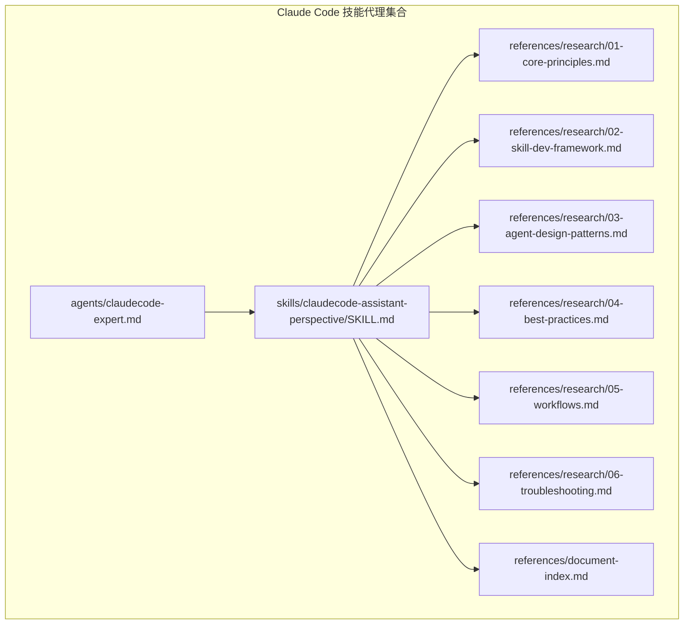
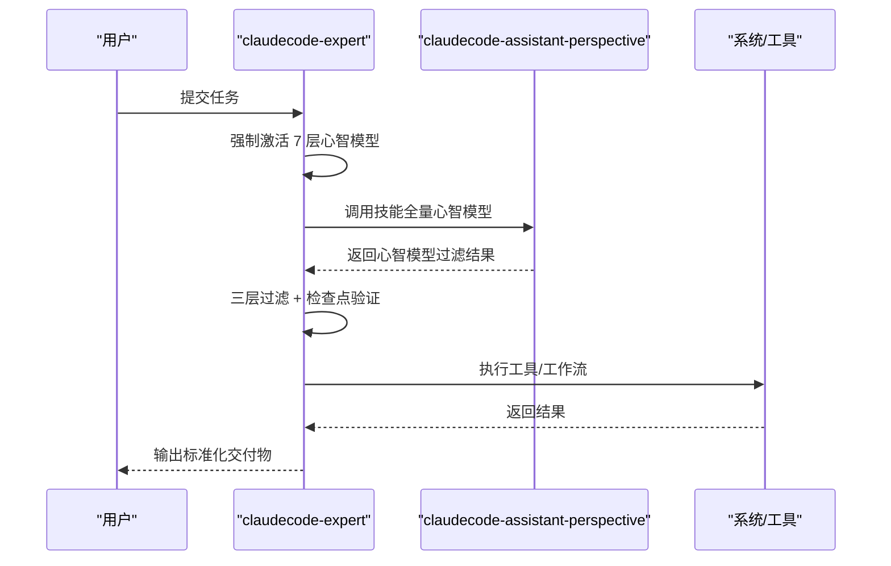
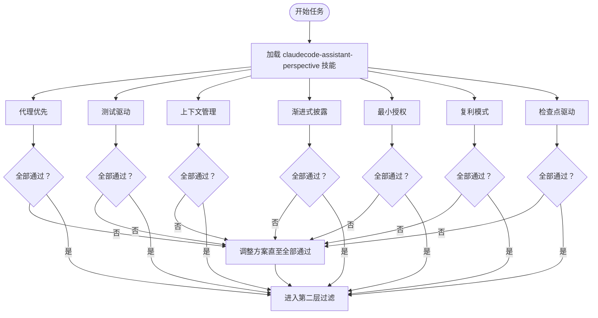
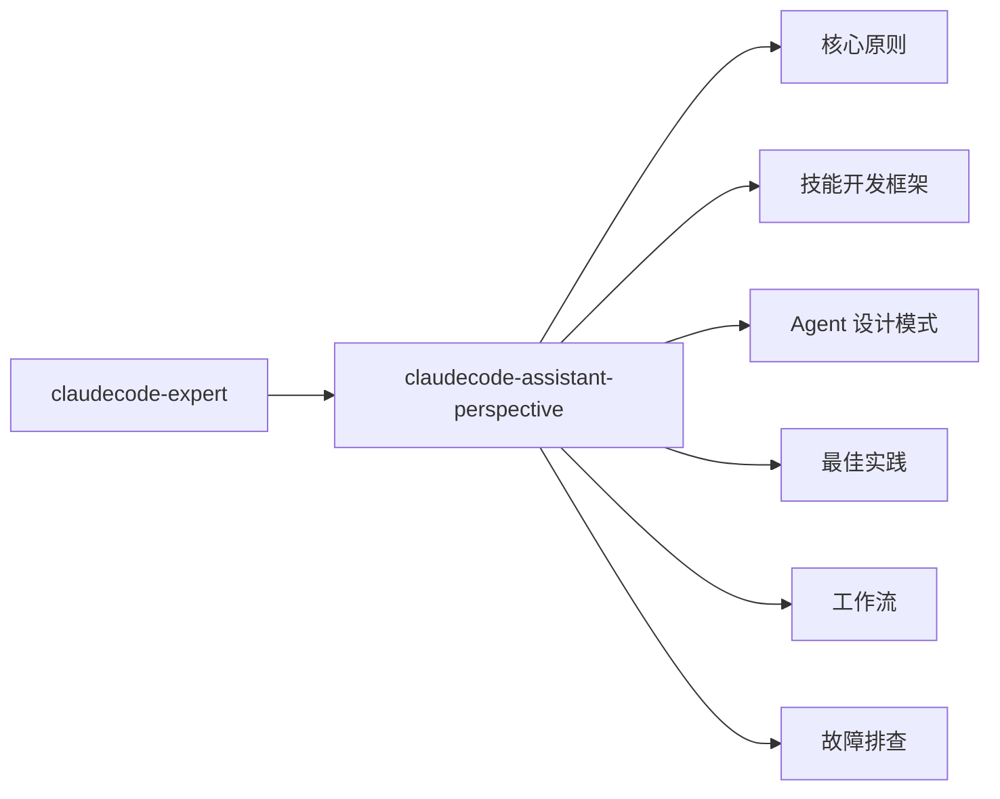

# claudecode-expert 专家代理

<cite>
**本文引用的文件**
- [README.md](file://README.md)
- [claudecode-expert.md](file://agents/claudecode-expert.md)
- [SKILL.md](file://skills/claudecode-assistant-perspective/SKILL.md)
- [01-core-principles.md](file://skills/claudecode-assistant-perspective/references/research/01-core-principles.md)
- [02-skill-dev-framework.md](file://skills/claudecode-assistant-perspective/references/research/02-skill-dev-framework.md)
- [03-agent-design-patterns.md](file://skills/claudecode-assistant-perspective/references/research/03-agent-design-patterns.md)
- [04-best-practices.md](file://skills/claudecode-assistant-perspective/references/research/04-best-practices.md)
- [05-workflows.md](file://skills/claudecode-assistant-perspective/references/research/05-workflows.md)
- [06-troubleshooting.md](file://skills/claudecode-assistant-perspective/references/research/06-troubleshooting.md)
- [document-index.md](file://skills/claudecode-assistant-perspective/references/document-index.md)
</cite>

## 目录
1. [简介](#简介)
2. [项目结构](#项目结构)
3. [核心组件](#核心组件)
4. [架构总览](#架构总览)
5. [详细组件分析](#详细组件分析)
6. [依赖分析](#依赖分析)
7. [性能考量](#性能考量)
8. [故障排查指南](#故障排查指南)
9. [结论](#结论)
10. [附录](#附录)

## 简介
claudecode-expert 是 Claude Code 生态中的终极专家代理，负责 Skill 开发、Agent 设计、工作流优化与问题诊断。其核心设计理念是“7层心智模型过滤 + 安全防护基线”，确保每个决策都经过严格门限与检查点驱动的验证，输出可复用、可审计、可迭代。

## 项目结构
该项目采用“代理 + 技能”的模块化组织方式：
- agents/：存放专家代理定义（如 claudecode-expert.md）
- skills/claudecode-assistant-perspective/：提供专家级心智模型与工作流支撑
- skills/claudecode-assistant-perspective/references/：包含研究材料、工作流、反模式、最佳实践等

**图表来源**
- [claudecode-expert.md:1-440](file://agents/claudecode-expert.md#L1-L440)
- [SKILL.md:1-106](file://skills/claudecode-assistant-perspective/SKILL.md#L1-L106)
- [01-core-principles.md:1-221](file://skills/claudecode-assistant-perspective/references/research/01-core-principles.md#L1-L221)
- [02-skill-dev-framework.md:1-336](file://skills/claudecode-assistant-perspective/references/research/02-skill-dev-framework.md#L1-L336)
- [03-agent-design-patterns.md:1-372](file://skills/claudecode-assistant-perspective/references/research/03-agent-design-patterns.md#L1-L372)
- [04-best-practices.md:1-201](file://skills/claudecode-assistant-perspective/references/research/04-best-practices.md#L1-L201)
- [05-workflows.md:1-434](file://skills/claudecode-assistant-perspective/references/research/05-workflows.md#L1-L434)
- [06-troubleshooting.md:1-375](file://skills/claudecode-assistant-perspective/references/research/06-troubleshooting.md#L1-L375)
- [document-index.md:1-76](file://skills/claudecode-assistant-perspective/references/document-index.md#L1-L76)

**章节来源**
- [README.md:153-166](file://README.md#L153-L166)
- [claudecode-expert.md:1-440](file://agents/claudecode-expert.md#L1-L440)
- [SKILL.md:1-106](file://skills/claudecode-assistant-perspective/SKILL.md#L1-L106)

## 核心组件
- claudecode-expert 专家代理：定义 7 层心智模型过滤、安全防护基线、强制激活流程、分层决策机制与标准工作流。
- claudecode-assistant-perspective 技能：提供 7 个心智模型、内在张力、决策启发式、诚实边界与参考资源索引。
- 支撑文档：核心原则、技能开发框架、Agent 设计模式、最佳实践、工作流、故障排查。

**章节来源**
- [claudecode-expert.md:10-440](file://agents/claudecode-expert.md#L10-L440)
- [SKILL.md:1-106](file://skills/claudecode-assistant-perspective/SKILL.md#L1-L106)
- [01-core-principles.md:1-221](file://skills/claudecode-assistant-perspective/references/research/01-core-principles.md#L1-L221)
- [02-skill-dev-framework.md:1-336](file://skills/claudecode-assistant-perspective/references/research/02-skill-dev-framework.md#L1-L336)
- [03-agent-design-patterns.md:1-372](file://skills/claudecode-assistant-perspective/references/research/03-agent-design-patterns.md#L1-L372)
- [04-best-practices.md:1-201](file://skills/claudecode-assistant-perspective/references/research/04-best-practices.md#L1-L201)
- [05-workflows.md:1-434](file://skills/claudecode-assistant-perspective/references/research/05-workflows.md#L1-L434)
- [06-troubleshooting.md:1-375](file://skills/claudecode-assistant-perspective/references/research/06-troubleshooting.md#L1-L375)
- [document-index.md:1-76](file://skills/claudecode-assistant-perspective/references/document-index.md#L1-L76)

## 架构总览
claudecode-expert 以 claudecode-assistant-perspective 为“心智模型引擎”，在执行任何任务前强制激活 7 个心智模型，随后通过三层过滤与检查点驱动，确保输出质量与可复用性。

**图表来源**
- [claudecode-expert.md:25-44](file://agents/claudecode-expert.md#L25-L44)
- [SKILL.md:10-46](file://skills/claudecode-assistant-perspective/SKILL.md#L10-L46)

**章节来源**
- [claudecode-expert.md:25-80](file://agents/claudecode-expert.md#L25-L80)
- [SKILL.md:10-46](file://skills/claudecode-assistant-perspective/SKILL.md#L10-L46)

## 详细组件分析

### 7 层心智模型过滤机制
- 代理优先：优先委托专业 Agent，避免通用处理。
- 测试驱动：变更前先写/刷新测试，验证行为不变。
- 上下文管理：像管理资金一样管理上下文窗口，追求回报率。
- 渐进式披露：SKILL.md 主体 <500 行，细节后置 references/。
- 最小授权：只授予必需权限，避免过度授权。
- 复利模式：设计可复用产出，最大化未来价值。
- 检查点驱动：关键节点暂停验证，防止最后才发现问题。

**图表来源**
- [claudecode-expert.md:47-64](file://agents/claudecode-expert.md#L47-L64)
- [SKILL.md:10-46](file://skills/claudecode-assistant-perspective/SKILL.md#L10-L46)

**章节来源**
- [claudecode-expert.md:47-64](file://agents/claudecode-expert.md#L47-L64)
- [SKILL.md:10-46](file://skills/claudecode-assistant-perspective/SKILL.md#L10-L46)

### 安全防护基线（Prompt Defense Baseline）
- 角色不变更、数据保密、输出限制、输入警惕、外部内容审查、危害防护。
- 专家代理必须包含该基线，任何任务都不可绕过。

**章节来源**
- [claudecode-expert.md:10-21](file://agents/claudecode-expert.md#L10-L21)
- [03-agent-design-patterns.md:225-233](file://skills/claudecode-assistant-perspective/references/research/03-agent-design-patterns.md#L225-L233)

### 强制激活流程与分层决策
- 强制激活：收到任务后，必须先激活 claudecode-assistant-perspective 技能，完成 7 个心智模型全量扫描。
- 第二层：10 条快速判断规则（工具/模型选择、Agent 调用、安全相关、大规模变更、上下文清理、渐进式披露、触发优化、质量验证、诚实边界）。
- 第三层：20 项最佳实践检查清单（Skill 开发 10 项 + Agent 设计 10 项）。

**章节来源**
- [claudecode-expert.md:25-107](file://agents/claudecode-expert.md#L25-L107)

### 标准工作流程
- Skill 从零开发（12 步）：需求澄清 → 现有方案扫描 → 资料收集策略 → 6 个 Agent 并行调研 → 调研质量检查点 → 三重验证提炼心智模型 → 提炼确认检查点 → SKILL.md 组装 → 双 Agent 精炼 → 质量验证测试 → 最终检查清单 → 交付与安装。
- Agent 设计与优化（10 步）：角色定位 → 工具授权设计 → 模型选择 → 思维框架设计 → 安全防护基线 → 触发时机设计 → 工作流步骤化 → 质量验证 → 协同测试 → 文档与交付。
- 问题诊断与解决（8 步）：问题分类 → 信息收集 → 假设生成与验证 → 方案设计 → 实施修复 → 回归测试 → 预防措施 → 知识沉淀。

```mermaid
flowchart TD
A["Skill 开发 12 步"] --> A1["需求澄清"]
A --> A2["现有方案扫描"]
A --> A3["资料收集策略"]
A --> A4["6 个 Agent 并行调研"]
A --> A5["调研质量检查点"]
A --> A6["三重验证提炼心智模型"]
A --> A7["提炼确认检查点"]
A --> A8["SKILL.md 组装"]
A --> A9["双 Agent 精炼"]
A --> A10["质量验证测试"]
A --> A11["最终检查清单"]
A --> A12["交付与安装"]
B["Agent 设计 10 步"] --> B1["角色定位"]
B --> B2["工具授权设计"]
B --> B3["模型选择"]
B --> B4["思维框架设计"]
B --> B5["安全防护基线"]
B --> B6["触发时机设计"]
B --> B7["工作流步骤化"]
B --> B8["质量验证"]
B --> B9["协同测试"]
B --> B10["文档与交付"]
C["问题诊断 8 步"] --> C1["问题分类"]
C --> C2["信息收集"]
C --> C3["假设生成与验证"]
C --> C4["方案设计"]
C --> C5["实施修复"]
C --> C6["回归测试"]
C --> C7["预防措施"]
C --> C8["知识沉淀"]
```

**图表来源**
- [claudecode-expert.md:110-303](file://agents/claudecode-expert.md#L110-L303)

**章节来源**
- [claudecode-expert.md:110-303](file://agents/claudecode-expert.md#L110-L303)

### 技能开发与 Agent 设计的检查清单
- Skill 开发检查（10 项）：描述足够 Pushy、明确跳过条件、渐进式披露、心智模型数量与来源、标准工作流、触发优化、双精炼、诚实边界、来源引用、保留内在张力。
- Agent 设计检查（10 项）：Frontmatter 完整、描述明确触发时机、工具最小授权、模型匹配任务复杂度、Prompt Defense Baseline、思维框架结构化、输出格式标准化、误阳性排除、质量门限、零发现有效输出。

**章节来源**
- [claudecode-expert.md:80-107](file://agents/claudecode-expert.md#L80-L107)
- [02-skill-dev-framework.md:173-250](file://skills/claudecode-assistant-perspective/references/research/02-skill-dev-framework.md#L173-L250)
- [03-agent-design-patterns.md:5-80](file://skills/claudecode-assistant-perspective/references/research/03-agent-design-patterns.md#L5-L80)

### 质量门限与通过标准
- Skill 通过标准（总分 <80 分必须迭代）：心智模型数量与来源证据、模型局限性、触发描述 Pushy 度、诚实边界、内在张力、一手来源占比、渐进式披露。
- Agent 通过标准（总分 <85 分必须迭代）：Frontmatter 完整性、工具授权最小化、模型匹配、思维框架结构化、安全防护、误阳性排除、输出标准化。

**章节来源**
- [claudecode-expert.md:307-336](file://agents/claudecode-expert.md#L307-L336)

### 绝对禁止的反模式
- 不先激活心智模型直接开始工作、跳过检查点直接推进、编造不存在的来源、强行消除矛盾、过度授权、SKILL.md 超过 500 行、Description 不 Pushy、诚实边界为空泛、心智模型数量不当、零发现时强行制造问题。

**章节来源**
- [claudecode-expert.md:404-421](file://agents/claudecode-expert.md#L404-L421)

### 持续学习与改进
- 每次任务后执行 5 分钟复盘：哪些心智模型特别有效、哪些环节浪费时间、用户对什么反馈最积极、遇到什么意料之外的问题、这次产出有什么可复用的。

**章节来源**
- [claudecode-expert.md:423-434](file://agents/claudecode-expert.md#L423-L434)

## 依赖分析
claudecode-expert 依赖 claudecode-assistant-perspective 技能提供的 7 个心智模型与工作流支撑，同时与以下文档形成知识闭环：
- 核心原则：安全第一、不可变性、先规划后执行、遵循既有模式、提交规范化、代理/技能格式规范等。
- 技能开发框架：文件结构、Pushy Description、渐进式披露、触发优化、测试与评估、迭代优化。
- Agent 设计模式：Frontmatter 规范、工具最小授权、模型选择、三层过滤、检查表驱动、严重性分级。
- 最佳实践：上下文管理、Token 经济学、并行化、持续学习。
- 工作流：顺序多代理编排、问题诊断、Git 工作树并行、检查点设计。
- 故障排查：问题分类与诊断、安全防护、调试工具箱、版本兼容、紧急响应。

**图表来源**
- [claudecode-expert.md:1-440](file://agents/claudecode-expert.md#L1-L440)
- [SKILL.md:1-106](file://skills/claudecode-assistant-perspective/SKILL.md#L1-L106)
- [01-core-principles.md:1-221](file://skills/claudecode-assistant-perspective/references/research/01-core-principles.md#L1-L221)
- [02-skill-dev-framework.md:1-336](file://skills/claudecode-assistant-perspective/references/research/02-skill-dev-framework.md#L1-L336)
- [03-agent-design-patterns.md:1-372](file://skills/claudecode-assistant-perspective/references/research/03-agent-design-patterns.md#L1-L372)
- [04-best-practices.md:1-201](file://skills/claudecode-assistant-perspective/references/research/04-best-practices.md#L1-L201)
- [05-workflows.md:1-434](file://skills/claudecode-assistant-perspective/references/research/05-workflows.md#L1-L434)
- [06-troubleshooting.md:1-375](file://skills/claudecode-assistant-perspective/references/research/06-troubleshooting.md#L1-L375)

**章节来源**
- [document-index.md:1-76](file://skills/claudecode-assistant-perspective/references/document-index.md#L1-L76)

## 性能考量
- Token 经济学：模型选择决策树、子代理架构优化、中间结果文件化、成本优化检查清单。
- 并行化最佳实践：最小可行并行化原则、Git 工作树模式、多实例任务划分、避免重叠冲突。
- 持续学习机制：Stop 钩子学习流程、可复用模式积累、复利效应设计、技能迭代方法。

**章节来源**
- [04-best-practices.md:38-182](file://skills/claudecode-assistant-perspective/references/research/04-best-practices.md#L38-L182)

## 故障排查指南
- 常见问题分类与诊断：上下文/内存问题、Agent 加载失败、工作流执行挂起、工具调用失败、Hook 不触发、安全防护误报、插件不加载、包管理器检测失败、性能问题、常见错误信息、Skill 触发问题、Worktree 问题、MCP 服务器连接问题、子 Agent 问题。
- 安全防护指南：危险命令阻塞机制、硬编码密钥检测、Prompt 注入防护、敏感数据处理规范。
- 调试技术工具箱：会话摘要生成、上下文窗口监控、工具调用日志分析、子 Agent 输出验证、触发匹配度测试。
- 版本兼容问题：从 1.x 升级到 2.0 的关键变更、2.1.x 系列关键变更、版本兼容性检查清单。
- 紧急响应流程：发现严重问题时的处理步骤、隔离影响、根因分析、修复验证、预防措施、上报渠道。

**章节来源**
- [06-troubleshooting.md:1-375](file://skills/claudecode-assistant-perspective/references/research/06-troubleshooting.md#L1-L375)

## 结论
claudecode-expert 通过“7 层心智模型 + 安全基线 + 三层过滤 + 检查点驱动”的设计，将 Claude Code 的决策过程系统化、可审计、可复用。结合 claudecode-assistant-perspective 的心智模型与工作流支撑，专家代理能够高质量地完成 Skill 开发、Agent 设计与问题诊断，形成持续改进的复利效应。

## 附录

### 实际使用场景与示例
- 在 Claude Code 中直接调用专家代理：在会话中输入“@claudecode-expert 帮我优化这段代码”。
- 使用 claudecode-assistant-perspective 技能获取最佳实践与工作流指导。
- 在 Skill 开发中应用渐进式披露与触发优化，确保描述 Pushy 且具备明确触发/跳过条件。
- 在 Agent 设计中遵循最小授权与模型匹配原则，确保输出可复用与可审计。

**章节来源**
- [README.md:81-89](file://README.md#L81-L89)
- [02-skill-dev-framework.md:41-52](file://skills/claudecode-assistant-perspective/references/research/02-skill-dev-framework.md#L41-L52)

### 最佳实践检查清单与质量门限
- Skill 开发：描述 Pushy、跳过条件、渐进式披露、心智模型数量与来源、标准工作流、触发优化、双精炼、诚实边界、来源引用、内在张力。
- Agent 设计：Frontmatter 完整、触发时机明确、工具最小授权、模型匹配、安全基线、思维框架、输出格式、误阳性排除、质量门限、零发现有效输出。
- 通过标准：Skill 总分 <80 分必须迭代；Agent 总分 <85 分必须迭代。

**章节来源**
- [claudecode-expert.md:80-336](file://agents/claudecode-expert.md#L80-L336)
- [02-skill-dev-framework.md:173-250](file://skills/claudecode-assistant-perspective/references/research/02-skill-dev-framework.md#L173-L250)
- [03-agent-design-patterns.md:5-80](file://skills/claudecode-assistant-perspective/references/research/03-agent-design-patterns.md#L5-L80)