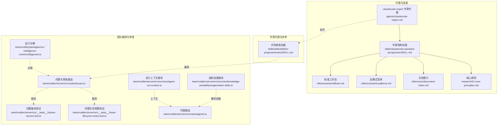
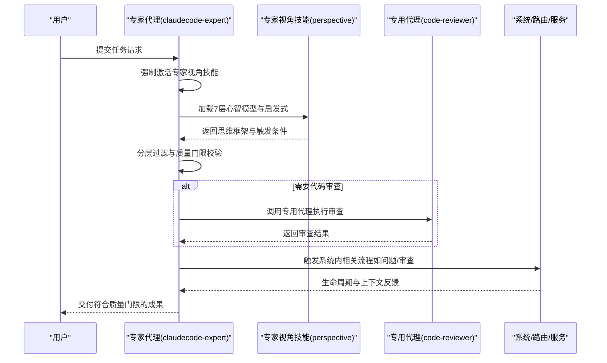
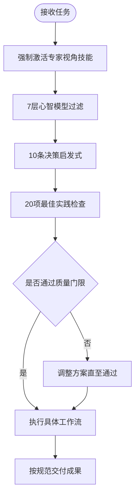
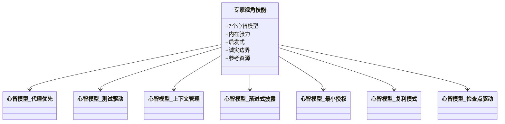
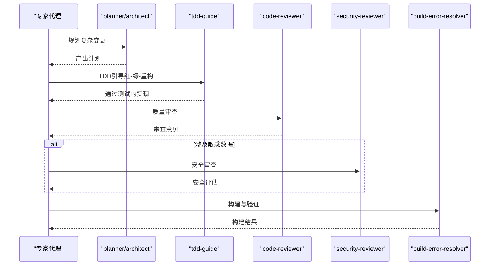
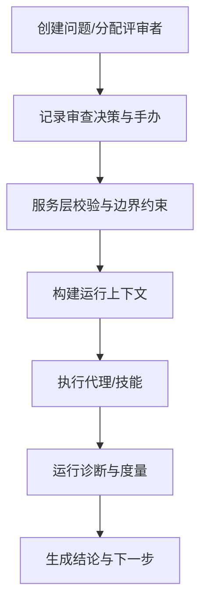
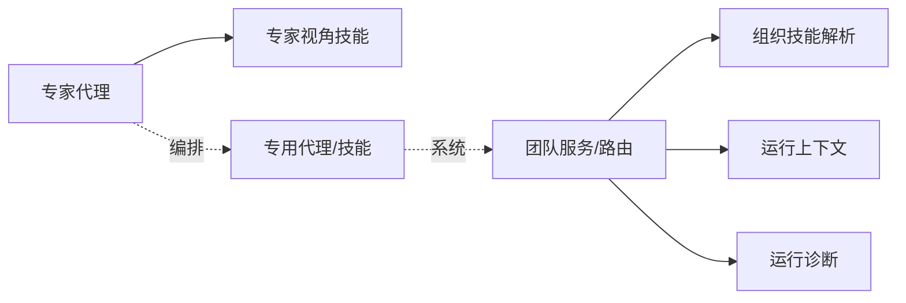

# 核心代理系统

<cite>
**本文引用的文件**
- [README.md](file://README.md)
- [README.zh-CN.md](file://README.zh-CN.md)
- [agents/claudecode-expert.md](file://agents/claudecode-expert.md)
- [skills/claudecode-assistant-perspective/SKILL.md](file://skills/claudecode-assistant-perspective/SKILL.md)
- [skills/claudecode-assistant-perspective/references/workflows.md](file://skills/claudecode-assistant-perspective/references/workflows.md)
- [skills/claudecode-assistant-perspective/references/anti-patterns.md](file://skills/claudecode-assistant-perspective/references/anti-patterns.md)
- [skills/claudecode-assistant-perspective/references/document-index.md](file://skills/claudecode-assistant-perspective/references/document-index.md)
- [skills/claudecode-assistant-perspective/references/research/01-core-principles.md](file://skills/claudecode-assistant-perspective/references/research/01-core-principles.md)
- [skills/skills/skills/in-progress/review/SKILL.md](file://skills/skills/skills/in-progress/review/SKILL.md)
- [team/rudder/server/src/routes/issues.ts](file://team/rudder/server/src/routes/issues.ts)
- [team/rudder/server/src/__tests__/issues-service.test.ts](file://team/rudder/server/src/__tests__/issues-service.test.ts)
- [team/rudder/server/src/__tests__/issue-lifecycle-routes.test.ts](file://team/rudder/server/src/__tests__/issue-lifecycle-routes.test.ts)
- [team/rudder/server/src/services/knowledge-portability/organization-skills.ts](file://team/rudder/server/src/services/knowledge-portability/organization-skills.ts)
- [team/rudder/server/src/routes/agents.ts](file://team/rudder/server/src/routes/agents.ts)
- [team/rudder/server/src/services/agent-run-context.ts](file://team/rudder/server/src/services/agent-run-context.ts)
- [team/rudder/packages/run-intelligence-core/src/diagnosis.ts](file://team/rudder/packages/run-intelligence-core/src/diagnosis.ts)
- [team/rudder/server/resources/bundled-skills/rudder-create-agent/SKILL.md](file://team/rudder/server/resources/bundled-skills/rudder-create-agent/SKILL.md)
- [skills/skills/README.md](file://skills/skills/README.md)
</cite>

## 目录
1. [简介](#简介)
2. [项目结构](#项目结构)
3. [核心组件](#核心组件)
4. [架构总览](#架构总览)
5. [详细组件分析](#详细组件分析)
6. [依赖分析](#依赖分析)
7. [性能考量](#性能考量)
8. [故障排除指南](#故障排除指南)
9. [结论](#结论)
10. [附录](#附录)

## 简介
本文件面向 Claude Code Skill Agents 的核心代理系统，重点围绕 claudecode-expert 专家代理的设计理念、安全防护基线与心智模型过滤机制展开，系统阐述其工作流程、能力范围与适用场景，并介绍与专用代理 code-reviewer/architect/security-reviewer 的协作模式与组合策略。同时提供扩展机制与自定义开发指南、性能优化建议与故障排除方法，帮助读者在实际项目中高效、安全、可复用地使用该代理体系。

## 项目结构
该项目采用“代理 + 技能”的模块化设计，核心文件包括：
- 专家代理定义：agents/claudecode-expert.md
- 专家代理的“心智模型”与“工作流”支撑技能：skills/claudecode-assistant-perspective/*
- 专用代理与工作流参考：skills/skills/skills/in-progress/review/SKILL.md 等
- 团队侧的代理与技能编排、审查与问题生命周期：team/rudder/server/* 与 packages/*

图示来源
- [agents/claudecode-expert.md:1-440](file://agents/claudecode-expert.md#L1-L440)
- [skills/claudecode-assistant-perspective/SKILL.md:1-106](file://skills/claudecode-assistant-perspective/SKILL.md#L1-L106)
- [skills/claudecode-assistant-perspective/references/workflows.md:1-94](file://skills/claudecode-assistant-perspective/references/workflows.md#L1-L94)
- [skills/claudecode-assistant-perspective/references/anti-patterns.md:1-29](file://skills/claudecode-assistant-perspective/references/anti-patterns.md#L1-L29)
- [skills/claudecode-assistant-perspective/references/document-index.md:1-76](file://skills/claudecode-assistant-perspective/references/document-index.md#L1-L76)
- [skills/claudecode-assistant-perspective/references/research/01-core-principles.md:1-221](file://skills/claudecode-assistant-perspective/references/research/01-core-principles.md#L1-L221)
- [skills/skills/skills/in-progress/review/SKILL.md:1-32](file://skills/skills/skills/in-progress/review/SKILL.md#L1-L32)
- [team/rudder/server/src/routes/issues.ts:1274-1317](file://team/rudder/server/src/routes/issues.ts#L1274-L1317)
- [team/rudder/server/src/__tests__/issues-service.test.ts:381-726](file://team/rudder/server/src/__tests__/issues-service.test.ts#L381-L726)
- [team/rudder/server/src/__tests__/issue-lifecycle-routes.test.ts:793-820](file://team/rudder/server/src/__tests__/issue-lifecycle-routes.test.ts#L793-L820)
- [team/rudder/server/src/services/knowledge-portability/organization-skills.ts:2104-2136](file://team/rudder/server/src/services/knowledge-portability/organization-skills.ts#L2104-L2136)
- [team/rudder/server/src/routes/agents.ts:667-715](file://team/rudder/server/src/routes/agents.ts#L667-L715)
- [team/rudder/server/src/services/agent-run-context.ts:385-417](file://team/rudder/server/src/services/agent-run-context.ts#L385-L417)
- [team/rudder/packages/run-intelligence-core/src/diagnosis.ts:309-349](file://team/rudder/packages/run-intelligence-core/src/diagnosis.ts#L309-L349)

章节来源
- [README.md:15-166](file://README.md#L15-L166)
- [README.zh-CN.md:112-167](file://README.zh-CN.md#L112-L167)

## 核心组件
- 专家代理 claudecode-expert：提供“7层心智模型过滤 + 10条决策启发式 + 20项最佳实践检查”的三阶决策与质量控制体系，强制在任何实际工作前先激活专家视角技能，确保每个产出达到质量门槛。
- 专家视角技能 claudecode-assistant-perspective：承载7个心智模型、内在张力、启发式与诚实边界，作为专家代理的“思维框架”与“触发条件”来源。
- 专用代理与技能：如 code-reviewer、security-reviewer、planner、tdd-guide、build-error-resolver 等，用于在专家代理的编排下执行特定领域的任务。
- 团队侧编排与审查：通过问题与审查生命周期、组织技能解析、运行上下文与诊断能力，支撑代理在真实系统中的落地与治理。

章节来源
- [agents/claudecode-expert.md:10-440](file://agents/claudecode-expert.md#L10-L440)
- [skills/claudecode-assistant-perspective/SKILL.md:1-106](file://skills/claudecode-assistant-perspective/SKILL.md#L1-L106)
- [skills/claudecode-assistant-perspective/references/workflows.md:1-94](file://skills/claudecode-assistant-perspective/references/workflows.md#L1-L94)
- [skills/claudecode-assistant-perspective/references/anti-patterns.md:1-29](file://skills/claudecode-assistant-perspective/references/anti-patterns.md#L1-L29)
- [skills/claudecode-assistant-perspective/references/document-index.md:1-76](file://skills/claudecode-assistant-perspective/references/document-index.md#L1-L76)
- [skills/claudecode-assistant-perspective/references/research/01-core-principles.md:1-221](file://skills/claudecode-assistant-perspective/references/research/01-core-principles.md#L1-L221)

## 架构总览
专家代理通过“强制激活 + 分层过滤 + 质量门限”的闭环，将专用代理与技能有机编排，形成“规划-实现-审查-验证”的流水线，并在团队侧提供问题与审查的生命周期管理、技能解析与运行上下文支持，以及运行诊断能力。

图示来源
- [agents/claudecode-expert.md:25-440](file://agents/claudecode-expert.md#L25-L440)
- [skills/claudecode-assistant-perspective/SKILL.md:10-72](file://skills/claudecode-assistant-perspective/SKILL.md#L10-L72)
- [skills/skills/skills/in-progress/review/SKILL.md:1-32](file://skills/skills/skills/in-progress/review/SKILL.md#L1-L32)
- [team/rudder/server/src/routes/issues.ts:1274-1317](file://team/rudder/server/src/routes/issues.ts#L1274-L1317)

## 详细组件分析

### 专家代理 claudecode-expert
- 设计理念
  - “7层心智模型过滤 + 10条启发式 + 20项最佳实践检查”的三阶质量控制。
  - 强制在任何实际工作前激活专家视角技能，确保思维框架与触发条件一致。
- 安全防护基线
  - 角色不变更、数据保密、输出限制、输入警惕、外部内容审查、危害防护。
- 工作流程
  - 技能从零开发、Agent设计与优化、问题诊断与解决三大流程，配套质量门限与通过标准。
- 输出规范
  - 决策输出与最终交付格式，包含验证结果、质量评分与使用说明。

图示来源
- [agents/claudecode-expert.md:25-107](file://agents/claudecode-expert.md#L25-L107)
- [agents/claudecode-expert.md:307-401](file://agents/claudecode-expert.md#L307-L401)

章节来源
- [agents/claudecode-expert.md:10-440](file://agents/claudecode-expert.md#L10-L440)

### 专家视角技能 claudecode-assistant-perspective
- 核心心智模型（7个）
  - 代理优先、测试驱动、上下文管理经济学、渐进式披露、最小授权、复利模式、检查点驱动。
- 内在张力与启发式
  - 展示复用与直接、授权与灵活、质量与速度、披露与完整之间的权衡。
- 诚实边界
  - 明确能做什么、不能做什么与信息时效性。
- 参考资源
  - 工作流、反模式、文档索引与研究材料。

图示来源
- [skills/claudecode-assistant-perspective/SKILL.md:10-72](file://skills/claudecode-assistant-perspective/SKILL.md#L10-L72)
- [skills/claudecode-assistant-perspective/references/workflows.md:1-94](file://skills/claudecode-assistant-perspective/references/workflows.md#L1-L94)
- [skills/claudecode-assistant-perspective/references/anti-patterns.md:1-29](file://skills/claudecode-assistant-perspective/references/anti-patterns.md#L1-L29)
- [skills/claudecode-assistant-perspective/references/document-index.md:1-76](file://skills/claudecode-assistant-perspective/references/document-index.md#L1-L76)
- [skills/claudecode-assistant-perspective/references/research/01-core-principles.md:1-221](file://skills/claudecode-assistant-perspective/references/research/01-core-principles.md#L1-L221)

章节来源
- [skills/claudecode-assistant-perspective/SKILL.md:1-106](file://skills/claudecode-assistant-perspective/SKILL.md#L1-L106)

### 专用代理与协作模式
- code-reviewer：在代码变更后必须过审查，确保质量与安全。
- security-reviewer：处理敏感数据时必须过安全审查。
- planner/architect：负责规划与架构设计，配合 TDD 与构建验证。
- review 技能：并行审查 Standards 与 Spec，聚合子代理结果。

图示来源
- [skills/skills/skills/in-progress/review/SKILL.md:1-32](file://skills/skills/skills/in-progress/review/SKILL.md#L1-L32)
- [skills/claudecode-assistant-perspective/references/workflows.md:39-54](file://skills/claudecode-assistant-perspective/references/workflows.md#L39-L54)
- [skills/claudecode-assistant-perspective/references/research/01-core-principles.md:164-186](file://skills/claudecode-assistant-perspective/references/research/01-core-principles.md#L164-L186)

章节来源
- [skills/skills/skills/in-progress/review/SKILL.md:1-32](file://skills/skills/skills/in-progress/review/SKILL.md#L1-L32)
- [skills/claudecode-assistant-perspective/references/workflows.md:1-94](file://skills/claudecode-assistant-perspective/references/workflows.md#L1-L94)
- [skills/claudecode-assistant-perspective/references/research/01-core-principles.md:1-221](file://skills/claudecode-assistant-perspective/references/research/01-core-principles.md#L1-L221)

### 团队编排与审查生命周期
- 问题与审查路由：记录审查决策、人类介入与后续动作。
- 服务测试：验证评审者归属、跨组织限制与手把手干预。
- 组织技能解析：为代理构建技能快照，解析期望技能选择。
- 运行上下文：构建代理执行所需的场景上下文。
- 运行诊断：自动诊断运行失败、错误与性能问题。

图示来源
- [team/rudder/server/src/routes/issues.ts:1274-1317](file://team/rudder/server/src/routes/issues.ts#L1274-L1317)
- [team/rudder/server/src/__tests__/issues-service.test.ts:381-726](file://team/rudder/server/src/__tests__/issues-service.test.ts#L381-L726)
- [team/rudder/server/src/__tests__/issue-lifecycle-routes.test.ts:793-820](file://team/rudder/server/src/__tests__/issue-lifecycle-routes.test.ts#L793-L820)
- [team/rudder/server/src/services/knowledge-portability/organization-skills.ts:2104-2136](file://team/rudder/server/src/services/knowledge-portability/organization-skills.ts#L2104-L2136)
- [team/rudder/server/src/routes/agents.ts:667-715](file://team/rudder/server/src/routes/agents.ts#L667-L715)
- [team/rudder/server/src/services/agent-run-context.ts:385-417](file://team/rudder/server/src/services/agent-run-context.ts#L385-L417)
- [team/rudder/packages/run-intelligence-core/src/diagnosis.ts:309-349](file://team/rudder/packages/run-intelligence-core/src/diagnosis.ts#L309-L349)

章节来源
- [team/rudder/server/src/routes/issues.ts:1274-1317](file://team/rudder/server/src/routes/issues.ts#L1274-L1317)
- [team/rudder/server/src/__tests__/issues-service.test.ts:381-726](file://team/rudder/server/src/__tests__/issues-service.test.ts#L381-L726)
- [team/rudder/server/src/__tests__/issue-lifecycle-routes.test.ts:793-820](file://team/rudder/server/src/__tests__/issue-lifecycle-routes.test.ts#L793-L820)
- [team/rudder/server/src/services/knowledge-portability/organization-skills.ts:2104-2136](file://team/rudder/server/src/services/knowledge-portability/organization-skills.ts#L2104-L2136)
- [team/rudder/server/src/routes/agents.ts:667-715](file://team/rudder/server/src/routes/agents.ts#L667-L715)
- [team/rudder/server/src/services/agent-run-context.ts:385-417](file://team/rudder/server/src/services/agent-run-context.ts#L385-L417)
- [team/rudder/packages/run-intelligence-core/src/diagnosis.ts:309-349](file://team/rudder/packages/run-intelligence-core/src/diagnosis.ts#L309-L349)

## 依赖分析
- 专家代理依赖专家视角技能提供思维框架与触发条件。
- 专家代理在工作流中编排专用代理（审查、安全、规划、构建）。
- 团队侧服务依赖组织技能解析与运行上下文，支撑代理在真实系统中的执行与治理。
- 运行诊断为代理执行提供可观测性与可恢复性。

图示来源
- [agents/claudecode-expert.md:25-440](file://agents/claudecode-expert.md#L25-L440)
- [skills/claudecode-assistant-perspective/SKILL.md:10-72](file://skills/claudecode-assistant-perspective/SKILL.md#L10-L72)
- [team/rudder/server/src/services/knowledge-portability/organization-skills.ts:2104-2136](file://team/rudder/server/src/services/knowledge-portability/organization-skills.ts#L2104-L2136)
- [team/rudder/server/src/services/agent-run-context.ts:385-417](file://team/rudder/server/src/services/agent-run-context.ts#L385-L417)
- [team/rudder/packages/run-intelligence-core/src/diagnosis.ts:309-349](file://team/rudder/packages/run-intelligence-core/src/diagnosis.ts#L309-L349)

章节来源
- [agents/claudecode-expert.md:10-440](file://agents/claudecode-expert.md#L10-L440)
- [skills/claudecode-assistant-perspective/SKILL.md:1-106](file://skills/claudecode-assistant-perspective/SKILL.md#L1-L106)
- [team/rudder/server/src/services/knowledge-portability/organization-skills.ts:2104-2136](file://team/rudder/server/src/services/knowledge-portability/organization-skills.ts#L2104-L2136)
- [team/rudder/server/src/services/agent-run-context.ts:385-417](file://team/rudder/server/src/services/agent-run-context.ts#L385-L417)
- [team/rudder/packages/run-intelligence-core/src/diagnosis.ts:309-349](file://team/rudder/packages/run-intelligence-core/src/diagnosis.ts#L309-L349)

## 性能考量
- Token 使用与上下文管理：通过“上下文管理经济学”与“渐进式披露”，减少不必要的上下文占用，提升推理效率。
- 模型选择匹配任务复杂度：架构决策用 Opus，审查用 Sonnet，轻量任务用 Haiku，避免模型过度与不足。
- 并行与最小可行：在审查与验证阶段采用并行子代理，缩短反馈周期；最小可行修复与检查点驱动降低返工成本。
- 运行诊断与可观测性：通过运行诊断度量与分类，快速定位瓶颈与失败根因，减少无效尝试。

## 故障排除指南
- 触发失败
  - 检查专家视角技能的描述是否足够 Pushy，包含触发/跳过条件。
  - 使用评估查询集验证触发匹配度。
- 行为异常
  - 会话摘要与工具调用日志分析，逐项验证假设，定位根因。
  - 对子代理输出进行交叉验证，避免盲信。
- 安全误报
  - 审查触发规则与白名单，确保安全基线不过度收紧。
- 评审与手办
  - 审查决策记录与人类介入流程，确保跨组织与成员状态合规。
- 运行问题
  - 使用运行诊断自动分类错误与性能问题，给出下一步修复建议。

章节来源
- [skills/claudecode-assistant-perspective/references/workflows.md:56-94](file://skills/claudecode-assistant-perspective/references/workflows.md#L56-L94)
- [skills/claudecode-assistant-perspective/references/anti-patterns.md:1-29](file://skills/claudecode-assistant-perspective/references/anti-patterns.md#L1-L29)
- [team/rudder/server/src/routes/issues.ts:1274-1317](file://team/rudder/server/src/routes/issues.ts#L1274-L1317)
- [team/rudder/packages/run-intelligence-core/src/diagnosis.ts:309-349](file://team/rudder/packages/run-intelligence-core/src/diagnosis.ts#L309-L349)

## 结论
claudecode-expert 专家代理以“7层心智模型 + 启发式 + 最佳实践检查”为核心，结合专家视角技能与专用代理编排，形成从规划、实现、审查到验证的完整流水线。团队侧的服务与诊断能力进一步强化了系统的可治理性与可运维性。通过质量门限与检查点驱动，确保产出稳定、可复用且可追溯。

## 附录

### 使用方法与示例场景
- 专家代理调用
  - 在 Claude Code 会话中使用 @claudecode-expert 触发专家代理。
  - 示例场景：代码优化、最佳实践指导、架构建议、问题诊断。
- 专家视角技能
  - 作为专家代理的前置思维框架，确保每次决策都经过系统化过滤。
- 专用代理组合
  - 大规模变更：planner → tdd-guide → code-reviewer → build-error-resolver。
  - 安全相关：security-reviewer → code-reviewer → build-error-resolver。

章节来源
- [README.md:81-88](file://README.md#L81-L88)
- [skills/claudecode-assistant-perspective/SKILL.md:1-106](file://skills/claudecode-assistant-perspective/SKILL.md#L1-L106)
- [skills/claudecode-assistant-perspective/references/workflows.md:1-94](file://skills/claudecode-assistant-perspective/references/workflows.md#L1-L94)

### 扩展机制与自定义开发指南
- 新建 Skill
  - 使用模板与触发优化，确保描述足够 Pushy，包含触发/跳过条件。
  - 采用渐进式披露，主体保持简洁，细节放入 references。
- 新建 Agent
  - 遵循最小授权原则与模型匹配，加入 Prompt Defense Baseline。
  - 设计结构化思维框架与输出格式，确保可复用与误阳性排除。
- 团队侧集成
  - 使用组织技能解析与运行上下文服务，确保代理在真实环境中正确执行。
  - 通过运行诊断与问题生命周期管理，实现可观测与可恢复。

章节来源
- [skills/skills/README.md:92-116](file://skills/skills/README.md#L92-L116)
- [skills/claudecode-assistant-perspective/references/document-index.md:19-76](file://skills/claudecode-assistant-perspective/references/document-index.md#L19-L76)
- [team/rudder/server/src/services/knowledge-portability/organization-skills.ts:2104-2136](file://team/rudder/server/src/services/knowledge-portability/organization-skills.ts#L2104-L2136)
- [team/rudder/server/src/services/agent-run-context.ts:385-417](file://team/rudder/server/src/services/agent-run-context.ts#L385-L417)
- [team/rudder/server/resources/bundled-skills/rudder-create-agent/SKILL.md:113-130](file://team/rudder/server/resources/bundled-skills/rudder-create-agent/SKILL.md#L113-L130)