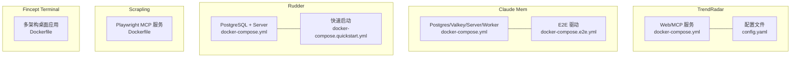
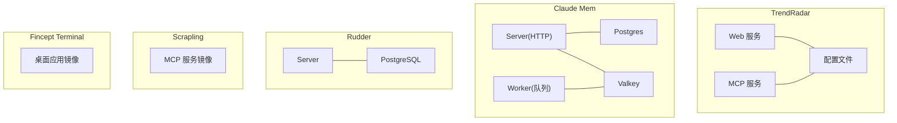
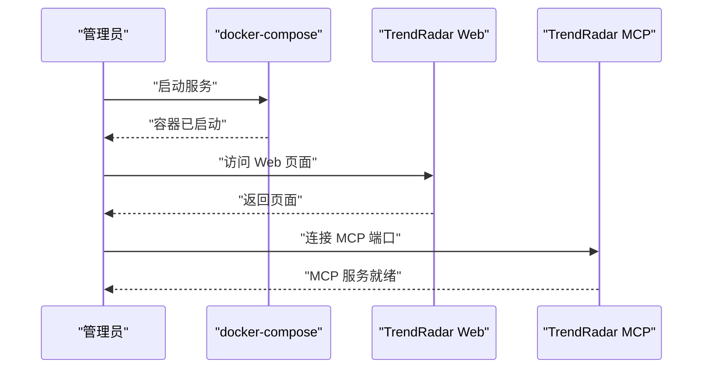
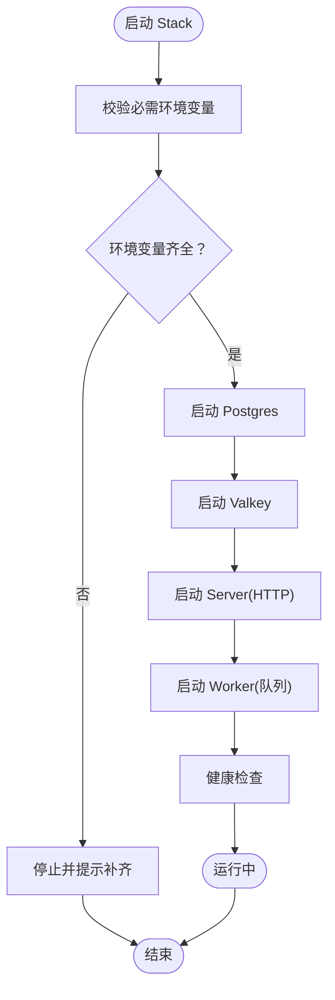
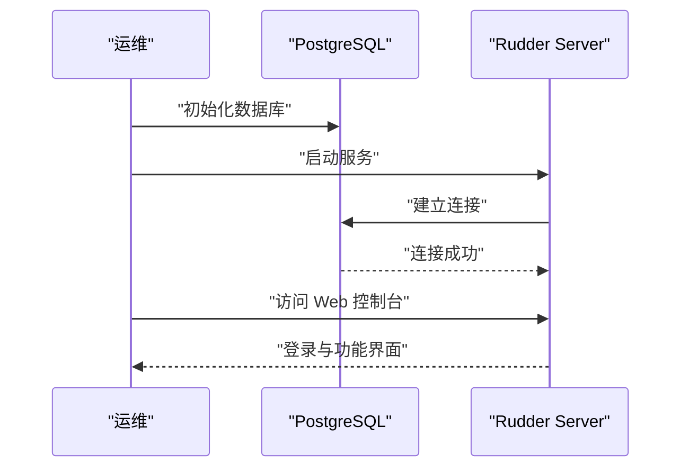
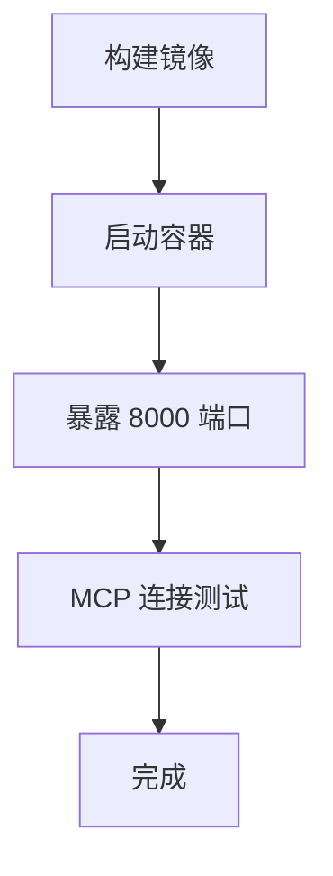
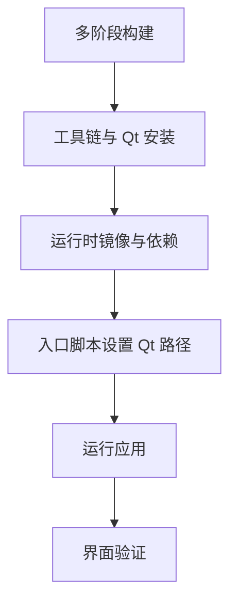
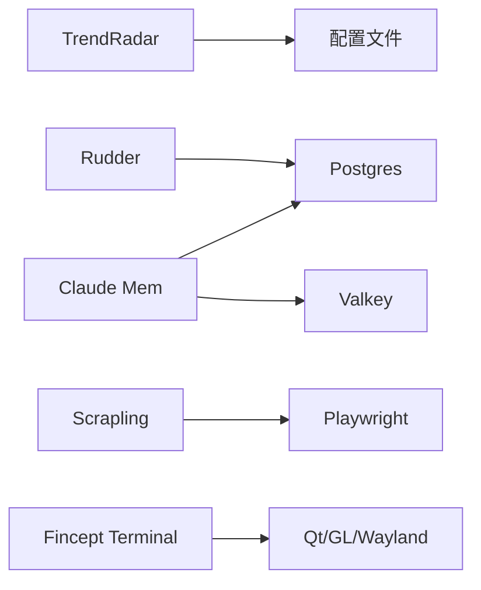

# 部署和运维

<cite>
**本文引用的文件**
- [README.md](file://README.md)
- [crawl/Scrapling/Dockerfile](file://crawl/Scrapling/Dockerfile)
- [project/TrendRadar/docker/docker-compose.yml](file://project/TrendRadar/docker/docker-compose.yml)
- [project/TrendRadar/docker/docker-compose-build.yml](file://project/TrendRadar/docker/docker-compose-build.yml)
- [team/rudder/docker/docker-compose.yml](file://team/rudder/docker/docker-compose.yml)
- [team/rudder/docker/docker-compose.quickstart.yml](file://team/rudder/docker/docker-compose.quickstart.yml)
- [skills/claude-mem/docker-compose.yml](file://skills/claude-mem/docker-compose.yml)
- [skills/claude-mem/docker-compose.e2e.yml](file://skills/claude-mem/docker-compose.e2e.yml)
- [project/FinceptTerminal/Dockerfile](file://project/FinceptTerminal/Dockerfile)
- [project/TrendRadar/config/config.yaml](file://project/TrendRadar/config/config.yaml)
- [project/valuecell/python/configs/config.yaml](file://project/valuecell/python/configs/config.yaml)
</cite>

## 目录
1. [简介](#简介)
2. [项目结构](#项目结构)
3. [核心组件](#核心组件)
4. [架构总览](#架构总览)
5. [详细组件分析](#详细组件分析)
6. [依赖关系分析](#依赖关系分析)
7. [性能考虑](#性能考虑)
8. [故障排查指南](#故障排查指南)
9. [结论](#结论)
10. [附录](#附录)

## 简介
本文件面向部署与运维团队，提供仓库中多个子系统的部署与运维实践指南。内容涵盖环境准备、安装配置、服务启动与验证、Docker 容器化部署、监控日志、备份恢复、安全加固与自动化脚本等。由于仓库包含多套系统（如 TrendRadar、Claude Mem、Rudder、Scrapling、Fincept Terminal），本文按“系统”维度分别给出可操作的步骤与最佳实践，并在必要处提供跨系统的通用建议。

## 项目结构
仓库采用多模块组织方式，主要包含以下与部署运维密切相关的子系统：
- TrendRadar：趋势监测与通知系统，提供 Web 服务与 MCP 服务，支持多种通知渠道与运行模式。
- Claude Mem：基于 Postgres/Valkey 的消息与队列后端，提供 server 与 worker 两阶段部署。
- Rudder：带认证与暴露模式的后端服务，使用 PostgreSQL 存储。
- Scrapling：基于 Playwright 的 MCP 服务容器镜像。
- Fincept Terminal：多架构桌面应用容器镜像，含多阶段构建与运行时依赖。

图表来源
- [project/TrendRadar/docker/docker-compose.yml:1-73](file://project/TrendRadar/docker/docker-compose.yml#L1-L73)
- [skills/claude-mem/docker-compose.yml:1-145](file://skills/claude-mem/docker-compose.yml#L1-L145)
- [skills/claude-mem/docker-compose.e2e.yml:1-24](file://skills/claude-mem/docker-compose.e2e.yml#L1-L24)
- [team/rudder/docker/docker-compose.yml:1-41](file://team/rudder/docker/docker-compose.yml#L1-L41)
- [team/rudder/docker/docker-compose.quickstart.yml:1-19](file://team/rudder/docker/docker-compose.quickstart.yml#L1-L19)
- [crawl/Scrapling/Dockerfile:1-41](file://crawl/Scrapling/Dockerfile#L1-L41)
- [project/FinceptTerminal/Dockerfile:1-244](file://project/FinceptTerminal/Dockerfile#L1-L244)

章节来源
- [README.md:153-166](file://README.md#L153-L166)

## 核心组件
- TrendRadar
  - Web 服务与 MCP 服务通过 docker-compose 编排，支持端口映射、挂载配置与输出目录、环境变量注入（通知渠道、邮件、S3、AI 模型等）。
  - 支持定时任务与立即执行两种运行模式。
- Claude Mem
  - 使用 Postgres、Valkey、Server、Worker 四组件协作；Server 负责 HTTP 接口，Worker 负责队列消费与生成；严格要求密钥类环境变量必须提供。
- Rudder
  - 提供数据库与服务编排，支持认证模式与暴露模式配置，快速启动示例用于本地开发。
- Scrapling
  - 基于 Playwright 的 MCP 服务镜像，预装浏览器依赖，暴露 8000 端口。
- Fincept Terminal
  - 多阶段构建，支持跨架构打包，运行时包含 Qt、GL、Wayland 等依赖，适合桌面应用容器化。

章节来源
- [project/TrendRadar/docker/docker-compose.yml:1-73](file://project/TrendRadar/docker/docker-compose.yml#L1-L73)
- [skills/claude-mem/docker-compose.yml:1-145](file://skills/claude-mem/docker-compose.yml#L1-L145)
- [team/rudder/docker/docker-compose.yml:1-41](file://team/rudder/docker/docker-compose.yml#L1-L41)
- [crawl/Scrapling/Dockerfile:1-41](file://crawl/Scrapling/Dockerfile#L1-L41)
- [project/FinceptTerminal/Dockerfile:1-244](file://project/FinceptTerminal/Dockerfile#L1-L244)

## 架构总览
下图展示各子系统的关键组件与交互关系，便于理解部署拓扑与数据流。

图表来源
- [project/TrendRadar/docker/docker-compose.yml:1-73](file://project/TrendRadar/docker/docker-compose.yml#L1-L73)
- [skills/claude-mem/docker-compose.yml:1-145](file://skills/claude-mem/docker-compose.yml#L1-L145)
- [team/rudder/docker/docker-compose.yml:1-41](file://team/rudder/docker/docker-compose.yml#L1-L41)
- [crawl/Scrapling/Dockerfile:1-41](file://crawl/Scrapling/Dockerfile#L1-L41)
- [project/FinceptTerminal/Dockerfile:1-244](file://project/FinceptTerminal/Dockerfile#L1-L244)

## 详细组件分析

### TrendRadar 部署与运维
- 环境要求
  - 操作系统：Linux/macOS/Windows（Docker Desktop 或原生 Linux）。
  - 硬件资源：根据业务负载调整 CPU/内存；持久化卷用于配置与输出目录。
  - 网络配置：映射 Web 端口与 MCP 端口，注意仅内网暴露或通过反向代理。
- 安装配置
  - 使用 docker-compose 启动服务，挂载配置与输出目录，设置环境变量（通知渠道、邮件、S3、AI 模型等）。
  - 可通过 docker-compose-build.yml 在本地构建镜像后再运行。
- 服务启动与验证
  - 启动后检查容器健康状态与端口映射；访问 Web 页面与 MCP 端点进行功能验证。
- 日志与监控
  - 容器日志查看与轮转；结合外部日志系统集中采集。
- 备份与恢复
  - 备份配置目录与输出目录；定期快照数据库。
- 安全加固
  - 限制端口暴露范围；启用反向代理与访问控制；敏感配置放入只读卷或环境文件。

图表来源
- [project/TrendRadar/docker/docker-compose.yml:1-73](file://project/TrendRadar/docker/docker-compose.yml#L1-L73)

章节来源
- [project/TrendRadar/docker/docker-compose.yml:1-73](file://project/TrendRadar/docker/docker-compose.yml#L1-L73)
- [project/TrendRadar/docker/docker-compose-build.yml:1-77](file://project/TrendRadar/docker/docker-compose-build.yml#L1-L77)
- [project/TrendRadar/config/config.yaml](file://project/TrendRadar/config/config.yaml)

### Claude Mem 部署与运维
- 环境要求
  - 必须提供数据库用户、密码、库名等关键环境变量；Redis 地址与模式需正确配置。
  - Server 与 Worker 分离部署，避免 HTTP 延迟受生成任务影响。
- 安装配置
  - 使用 docker-compose 启动 Postgres、Valkey、Server、Worker；通过环境变量配置认证模式、队列引擎、数据库连接等。
  - 可通过 scale 扩展 Worker 数量以提升并发生成能力。
- 服务启动与验证
  - 关注健康检查状态；通过 Server 的健康检查端点确认可用性。
- 日志与监控
  - 记录 Server/Worker 的请求与队列处理情况；对 Redis/Postgres 性能指标进行观测。
- 备份与恢复
  - 定期备份 Postgres 数据与 Valkey 数据；Worker 的临时数据随容器生命周期管理。
- 安全加固
  - 不在公网暴露该栈；使用强口令与最小权限账户；限制容器间通信。

图表来源
- [skills/claude-mem/docker-compose.yml:1-145](file://skills/claude-mem/docker-compose.yml#L1-L145)

章节来源
- [skills/claude-mem/docker-compose.yml:1-145](file://skills/claude-mem/docker-compose.yml#L1-L145)
- [skills/claude-mem/docker-compose.e2e.yml:1-24](file://skills/claude-mem/docker-compose.e2e.yml#L1-L24)

### Rudder 部署与运维
- 环境要求
  - PostgreSQL 17；服务监听 3100 端口；支持认证模式与暴露模式配置。
- 安装配置
  - 使用 docker-compose 启动数据库与服务；设置数据库 URL、端口、UI 开关、部署模式与公开地址等。
  - quickstart 示例用于本地快速体验，建议生产环境使用完整编排文件。
- 服务启动与验证
  - 等待数据库健康检查通过；访问服务页面确认登录与基本功能。
- 日志与监控
  - 容器日志与数据库日志双通道采集；关注连接数与慢查询。
- 备份与恢复
  - 定期导出数据库；确保数据卷持久化。
- 安全加固
  - 强制认证模式；限制外网访问；使用反向代理与 TLS。

图表来源
- [team/rudder/docker/docker-compose.yml:1-41](file://team/rudder/docker/docker-compose.yml#L1-L41)
- [team/rudder/docker/docker-compose.quickstart.yml:1-19](file://team/rudder/docker/docker-compose.quickstart.yml#L1-L19)

章节来源
- [team/rudder/docker/docker-compose.yml:1-41](file://team/rudder/docker/docker-compose.yml#L1-L41)
- [team/rudder/docker/docker-compose.quickstart.yml:1-19](file://team/rudder/docker/docker-compose.quickstart.yml#L1-L19)

### Scrapling 部署与运维
- 环境要求
  - 容器内预装 Playwright 依赖与浏览器；暴露 8000 端口用于 MCP 传输。
- 安装配置
  - 使用提供的 Dockerfile 构建镜像；通过入口命令运行服务。
- 服务启动与验证
  - 启动后访问 MCP 端口，确认服务响应。
- 日志与监控
  - 容器日志记录请求与错误；结合外部日志系统。
- 备份与恢复
  - 无持久化状态，无需备份。
- 安全加固
  - 限制端口暴露；配合反向代理与访问控制。

图表来源
- [crawl/Scrapling/Dockerfile:1-41](file://crawl/Scrapling/Dockerfile#L1-L41)

章节来源
- [crawl/Scrapling/Dockerfile:1-41](file://crawl/Scrapling/Dockerfile#L1-L41)

### Fincept Terminal 部署与运维
- 环境要求
  - 需要 X11/Wayland 显示栈；多架构支持（amd64/arm64）。
- 安装配置
  - 使用多阶段 Dockerfile 构建；运行时通过入口脚本自动设置 Qt 相关路径。
- 服务启动与验证
  - 在宿主机开启显示共享后运行容器，验证界面正常加载。
- 日志与监控
  - 容器日志与应用日志；关注渲染与多媒体相关错误。
- 备份与恢复
  - 应用数据由宿主管理，容器为一次性运行。
- 安全加固
  - 限制显示权限；仅在可信网络中使用。

图表来源
- [project/FinceptTerminal/Dockerfile:1-244](file://project/FinceptTerminal/Dockerfile#L1-L244)

章节来源
- [project/FinceptTerminal/Dockerfile:1-244](file://project/FinceptTerminal/Dockerfile#L1-L244)

## 依赖关系分析
- 组件耦合
  - TrendRadar 依赖配置文件与通知后端；Claude Mem 依赖数据库与队列；Rudder 依赖数据库；Scrapling 依赖 Playwright；Fincept Terminal 依赖显示栈。
- 外部依赖
  - PostgreSQL、Valkey、Playwright、Qt/GL/Wayland 等。
- 部署耦合度
  - Claude Mem 的 Server/Worker 分离降低耦合；Rudder 与 TrendRadar 为独立服务；Scrapling 与 Fincept Terminal 为单容器服务。

图表来源
- [project/TrendRadar/docker/docker-compose.yml:1-73](file://project/TrendRadar/docker/docker-compose.yml#L1-L73)
- [skills/claude-mem/docker-compose.yml:1-145](file://skills/claude-mem/docker-compose.yml#L1-L145)
- [team/rudder/docker/docker-compose.yml:1-41](file://team/rudder/docker/docker-compose.yml#L1-L41)
- [crawl/Scrapling/Dockerfile:1-41](file://crawl/Scrapling/Dockerfile#L1-L41)
- [project/FinceptTerminal/Dockerfile:1-244](file://project/FinceptTerminal/Dockerfile#L1-L244)

## 性能考虑
- 资源规划
  - 根据并发与数据量评估 CPU/内存/磁盘；为数据库与队列预留充足资源。
- 镜像与缓存
  - 利用 Docker 层缓存与构建缓存（如 uv、apt 缓存）减少构建时间。
- 运行优化
  - TrendRadar 的定时任务与立即执行模式需结合业务负载选择；Claude Mem 的 Worker 数量可动态扩展。
- 监控指标
  - 数据库连接数、队列长度、HTTP 响应时间、容器资源占用。

## 故障排查指南
- 容器无法启动
  - 检查必需环境变量是否缺失（如 Claude Mem 的数据库凭据）；查看容器日志定位错误。
- 端口冲突
  - 修改 docker-compose 中的端口映射；或在宿主机释放冲突端口。
- 网络连通性
  - 确认容器间网络可达；检查防火墙与 SELinux 设置。
- 数据库异常
  - 查看数据库健康检查与日志；确认连接字符串与凭据正确。
- 通知失败
  - 校验通知渠道的 URL、Token、模板等配置；检查网络可达性。

章节来源
- [skills/claude-mem/docker-compose.yml:1-145](file://skills/claude-mem/docker-compose.yml#L1-L145)
- [project/TrendRadar/docker/docker-compose.yml:1-73](file://project/TrendRadar/docker/docker-compose.yml#L1-L73)

## 结论
本仓库提供了多套可独立部署的系统，均具备清晰的容器化与编排方案。建议在生产环境中统一使用 docker-compose 管理，结合外部日志与监控系统，完善备份与安全策略，并通过环境变量与只读配置卷实现敏感信息的安全隔离。

## 附录
- 配置文件参考
  - TrendRadar 配置文件路径：[project/TrendRadar/config/config.yaml](file://project/TrendRadar/config/config.yaml)
  - ValueCell 配置文件路径：[project/valuecell/python/configs/config.yaml](file://project/valuecell/python/configs/config.yaml)
- 快速开始
  - TrendRadar 构建与运行：[project/TrendRadar/docker/docker-compose-build.yml:1-77](file://project/TrendRadar/docker/docker-compose-build.yml#L1-L77)
  - Rudder 快速启动：[team/rudder/docker/docker-compose.quickstart.yml:1-19](file://team/rudder/docker/docker-compose.quickstart.yml#L1-L19)
- 测试与验证
  - Claude Mem E2E：[skills/claude-mem/docker-compose.e2e.yml:1-24](file://skills/claude-mem/docker-compose.e2e.yml#L1-L24)