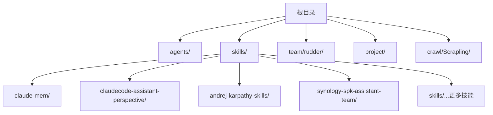
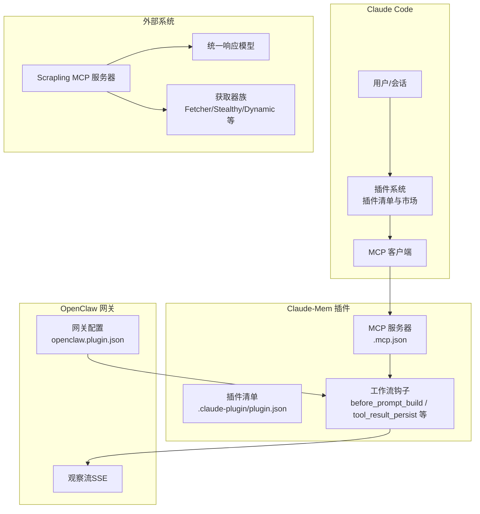
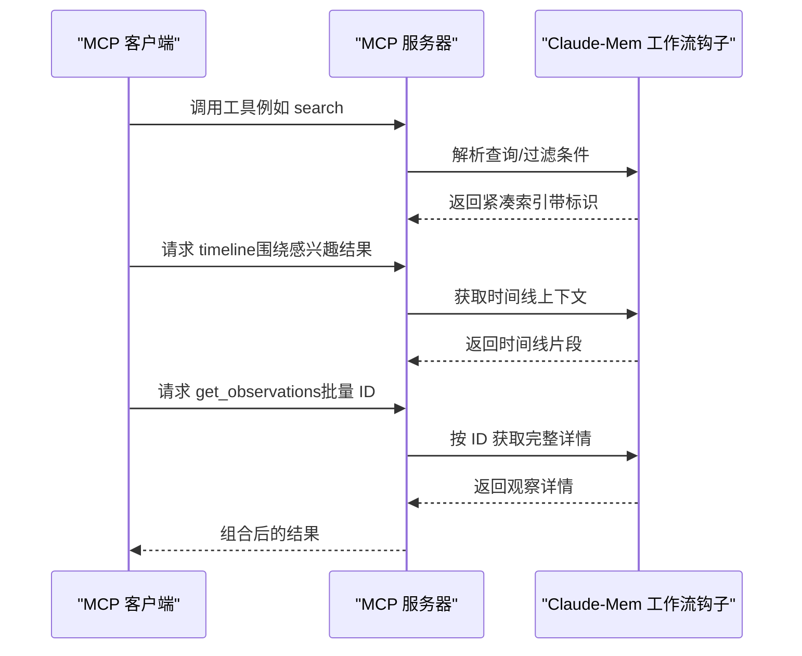
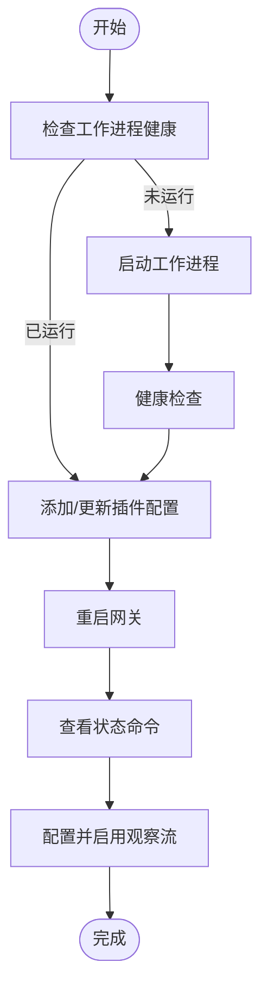
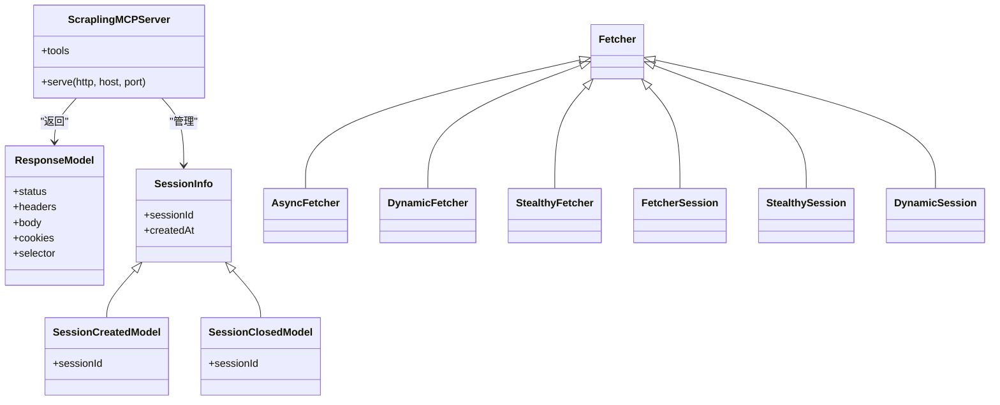
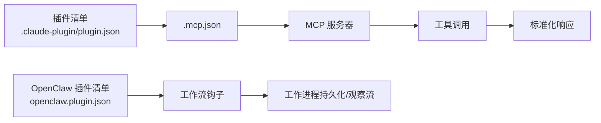

# 集成和扩展

<cite>
**本文引用的文件**
- [README.md](file://README.md)
- [技能：claude-mem 文档](file://skills/claude-mem/README.md)
- [OpenClaw 技能：claude-mem](file://skills/claude-mem/openclaw/SKILL.md)
- [.mcp.json（Claude-Mem）](file://skills/claude-mem/.mcp.json)
- [插件清单：claude-mem](file://skills/claude-mem/plugin/.claude-plugin/plugin.json)
- [OpenClaw 插件清单](file://skills/claude-mem/openclaw/openclaw.plugin.json)
- [Scrapling MCP 服务 API 参考](file://crawl/Scrapling/docs/api-reference/mcp-server.md)
- [Scrapling 响应类 API 参考](file://crawl/Scrapling/docs/api-reference/response.md)
- [Scrapling 获取器 API 参考](file://crawl/Scrapling/docs/api-reference/fetchers.md)
- [Claude Code Skill Agents 项目结构与使用说明](file://README.md)
</cite>

## 目录
1. [简介](#简介)
2. [项目结构](#项目结构)
3. [核心组件](#核心组件)
4. [架构总览](#架构总览)
5. [详细组件分析](#详细组件分析)
6. [依赖关系分析](#依赖关系分析)
7. [性能考量](#性能考量)
8. [故障排查指南](#故障排查指南)
9. [结论](#结论)
10. [附录](#附录)

## 简介
本文件面向 Claude Code Skill Agents 的集成与扩展场景，系统性介绍以下内容：
- Claude Code 插件的安装、配置与使用方法，含插件清单文件结构与关键配置项说明
- MCP 服务器的集成方式（服务器配置、客户端连接、工具调用流程）
- 浏览器扩展 OpenClaw 的集成指南与开发要点
- 各类 API 接口的使用方法（认证方式、请求格式、响应处理）
- 集成开发最佳实践与常见问题解决方案
- 扩展开发指导（插件开发框架、扩展点识别）
- 与其他系统的集成方法与数据交换格式

## 项目结构
该项目以“技能（Skills）+ 代理（Agents）”为核心组织形式，提供可复用的技能模块与示例代理，便于在 Claude Code 中直接使用或作为扩展基础。

图表来源
- [README.md:153-166](file://README.md#L153-L166)

章节来源
- [README.md:153-166](file://README.md#L153-L166)

## 核心组件
- Claude Code 插件体系
  - 插件清单文件用于声明插件元信息、关键词、版本等，确保在 Claude Code 中正确注册与展示
  - MCP 服务器通过标准协议暴露工具能力，供 Claude Code 或其他客户端调用
- OpenClaw 集成
  - 提供 OpenClaw 插件清单与配置模式，支持工作流钩子注入、观察流推送、跨会话记忆注入等
- Scrapling 网络爬取能力
  - 提供 MCP 服务器与统一响应模型，支持多种获取器（同步/异步、动态、隐身）与会话管理

章节来源
- [技能：claude-mem 文档:128-181](file://skills/claude-mem/README.md#L128-L181)
- [OpenClaw 技能：claude-mem:1-36](file://skills/claude-mem/openclaw/SKILL.md#L1-L36)
- [Scrapling MCP 服务 API 参考:1-24](file://crawl/Scrapling/docs/api-reference/mcp-server.md#L1-L24)

## 架构总览
下图展示了 Claude Code 插件、MCP 服务器与 OpenClaw 集成的整体交互：

图表来源
- [.mcp.json（Claude-Mem）:1-13](file://skills/claude-mem/.mcp.json#L1-L13)
- [插件清单：claude-mem:1-25](file://skills/claude-mem/plugin/.claude-plugin/plugin.json#L1-L25)
- [OpenClaw 插件清单:1-99](file://skills/claude-mem/openclaw/openclaw.plugin.json#L1-L99)
- [Scrapling MCP 服务 API 参考:10-23](file://crawl/Scrapling/docs/api-reference/mcp-server.md#L10-L23)

## 详细组件分析

### 组件一：Claude Code 插件安装与配置
- 安装方式
  - 直接克隆仓库并将 agents 与 skills 复制到 Claude Code 的本地目录
  - 或通过符号链接指向项目中的 agents 与 skills，便于开发时热更新
- 使用方式
  - 在 Claude Code 会话中通过命令或提示词触发技能与代理
- 插件清单文件结构与关键字段
  - 名称、版本、描述、作者、仓库地址、许可证、关键词等
  - 关键字可用于市场检索与分类
- 最佳实践
  - 保持插件清单与实际实现一致，避免版本错配
  - 使用稳定的版本号与清晰的描述，提升可发现性

章节来源
- [README.md:49-89](file://README.md#L49-L89)
- [插件清单：claude-mem:1-25](file://skills/claude-mem/plugin/.claude-plugin/plugin.json#L1-L25)

### 组件二：MCP 服务器集成（Claude-Mem）
- 启动方式
  - 通过命令行启动或在代码中直接实例化服务器并指定监听地址与端口
- 服务器配置
  - 通过 .mcp.json 指定 MCP 服务器类型、命令与参数，确保在不同运行环境下都能定位到正确的脚本入口
- 工具调用流程（以 claude-mem 为例）
  - 客户端通过 MCP 发起工具调用（如 search、timeline、get_observations）
  - 服务器按“索引-时间线-详情”的分层策略减少令牌消耗
- 数据交换格式
  - 工具输入输出遵循标准化结构，便于客户端解析与展示

图表来源
- [技能：claude-mem 文档:234-270](file://skills/claude-mem/README.md#L234-L270)
- [.mcp.json（Claude-Mem）:1-13](file://skills/claude-mem/.mcp.json#L1-L13)

章节来源
- [技能：claude-mem 文档:234-270](file://skills/claude-mem/README.md#L234-L270)
- [.mcp.json（Claude-Mem）:1-13](file://skills/claude-mem/.mcp.json#L1-L13)

### 组件三：OpenClaw 集成与开发
- 快速安装
  - 支持一键安装脚本自动完成依赖检查、插件安装、AI 提供商配置、工作进程启动与可选观察流配置
- 手动安装步骤
  - 克隆仓库、安装依赖、构建产物、启动工作进程、验证健康状态
- 插件配置
  - 包含启用开关、项目名、是否注入系统提示词、排除的代理 ID、工作进程端口与主机、观察流通道与目标等
- 观察流（SSE）
  - 连接工作进程的事件流，将新生成的观察推送到指定消息渠道（Telegram、Discord、Slack、Signal、WhatsApp、LINE 等）
- 命令参考
  - /claude_mem_status：查看工作进程健康与会话状态
  - /claude_mem_feed：查看或切换观察流状态

图表来源
- [OpenClaw 技能：claude-mem:5-36](file://skills/claude-mem/openclaw/SKILL.md#L5-L36)
- [OpenClaw 技能：claude-mem:118-147](file://skills/claude-mem/openclaw/SKILL.md#L118-L147)
- [OpenClaw 技能：claude-mem:342-373](file://skills/claude-mem/openclaw/SKILL.md#L342-L373)

章节来源
- [OpenClaw 技能：claude-mem:1-36](file://skills/claude-mem/openclaw/SKILL.md#L1-L36)
- [OpenClaw 技能：claude-mem:118-147](file://skills/claude-mem/openclaw/SKILL.md#L118-L147)
- [OpenClaw 技能：claude-mem:342-373](file://skills/claude-mem/openclaw/SKILL.md#L342-L373)

### 组件四：Scrapling MCP 服务器与 API
- 启动方式
  - 命令行：scrapling mcp
  - 编程：导入 ScraplingMCPServer 并指定 http、host、port 参数
- 统一响应模型
  - 所有工具返回标准化响应结构，便于上层客户端统一处理
- 会话模型
  - 提供会话信息、创建与关闭的模型，便于管理会话生命周期
- 获取器族
  - 支持同步、异步、动态、隐身等多种获取器，满足不同反爬需求
  - 提供对应的会话封装，简化并发与状态管理

图表来源
- [Scrapling MCP 服务 API 参考:25-55](file://crawl/Scrapling/docs/api-reference/mcp-server.md#L25-L55)
- [Scrapling 响应类 API 参考:6-19](file://crawl/Scrapling/docs/api-reference/response.md#L6-L19)
- [Scrapling 获取器 API 参考:6-64](file://crawl/Scrapling/docs/api-reference/fetchers.md#L6-L64)

章节来源
- [Scrapling MCP 服务 API 参考:10-23](file://crawl/Scrapling/docs/api-reference/mcp-server.md#L10-L23)
- [Scrapling 响应类 API 参考:6-19](file://crawl/Scrapling/docs/api-reference/response.md#L6-L19)
- [Scrapling 获取器 API 参考:6-64](file://crawl/Scrapling/docs/api-reference/fetchers.md#L6-L64)

## 依赖关系分析
- 插件清单与 MCP 服务器
  - 插件清单声明插件元信息；.mcp.json 指定 MCP 服务器的启动命令与参数，确保客户端能正确连接
- OpenClaw 插件与工作流钩子
  - 插件清单定义配置模式；工作流钩子负责在会话生命周期内注入上下文、记录观察、汇总会话
- Scrapling 与 MCP
  - Scrapling 通过 MCP 暴露统一工具接口，客户端无需关心底层网络细节

图表来源
- [插件清单：claude-mem:1-25](file://skills/claude-mem/plugin/.claude-plugin/plugin.json#L1-L25)
- [.mcp.json（Claude-Mem）:1-13](file://skills/claude-mem/.mcp.json#L1-L13)
- [OpenClaw 插件清单:1-99](file://skills/claude-mem/openclaw/openclaw.plugin.json#L1-L99)

章节来源
- [.mcp.json（Claude-Mem）:1-13](file://skills/claude-mem/.mcp.json#L1-L13)
- [OpenClaw 插件清单:1-99](file://skills/claude-mem/openclaw/openclaw.plugin.json#L1-L99)

## 性能考量
- Token 成本控制
  - MCP 工具采用三层工作流：先索引、再时间线、最后按需获取详情，显著降低令牌消耗
- 观察流延迟与重连
  - 观察流采用 SSE，具备自动重连机制（指数退避），在连接断开后尽快恢复
- 会话缓存
  - OpenClaw 插件对系统提示词注入内容进行短期缓存，减少重复拉取与计算

章节来源
- [技能：claude-mem 文档:234-270](file://skills/claude-mem/README.md#L234-L270)
- [OpenClaw 技能：claude-mem:373-415](file://skills/claude-mem/openclaw/SKILL.md#L373-L415)

## 故障排查指南
- 工作进程健康检查失败
  - 检查 Bun 是否安装且在 PATH 中；确认端口占用情况；尝试直接运行工作进程以查看错误日志
- 从 Claude Code 安装的插件无法响应
  - 检查工作进程状态与重启；确认端口与路径配置正确
- 从克隆仓库启动的工作进程无法响应
  - 确认已执行安装与构建；检查端口占用与日志输出
- 无上下文注入到系统提示词
  - 检查是否禁用了注入；确认代理 ID 不在排除列表；验证工作进程是否有观察
- 观察流显示断开或重连
  - 检查工作进程的 /stream 端点可达性；确认配置的端口与通道设置；等待自动重连
- 未知通道类型或配置缺失
  - 确保对应通道插件已在网关加载；检查通道类型与目标 ID 是否齐全

章节来源
- [OpenClaw 技能：claude-mem:416-431](file://skills/claude-mem/openclaw/SKILL.md#L416-L431)

## 结论
通过规范化的插件清单、标准化的 MCP 服务器与 OpenClaw 集成方案，Claude Code Skill Agents 能够在 Claude Code 与 OpenClaw 生态中实现稳定、可扩展的智能体与技能集成。配合 Scrapling 的 MCP 能力，开发者可以快速构建具备网络爬取与上下文记忆的复合型智能体，满足复杂业务场景下的数据采集与决策需求。

## 附录
- 使用示例与最佳实践
  - 将 agents 与 skills 复制到 Claude Code 目录或使用符号链接
  - 在 Claude Code 会话中通过命令或提示词触发技能与代理
  - 对于需要跨会话记忆的场景，优先考虑 Claude-Mem 插件与 OpenClaw 观察流
- 开发建议
  - 保持插件清单与实现一致，使用稳定版本号
  - 利用 MCP 的分层工具调用降低令牌成本
  - 对外暴露的 API 应遵循统一的数据模型与错误处理规范

章节来源
- [README.md:64-89](file://README.md#L64-L89)
- [技能：claude-mem 文档:128-181](file://skills/claude-mem/README.md#L128-L181)