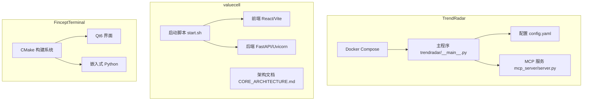
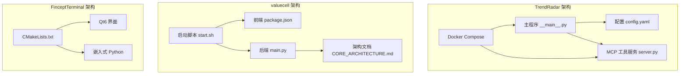
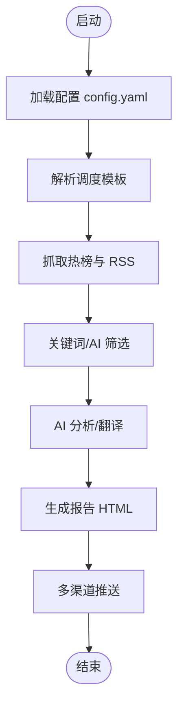
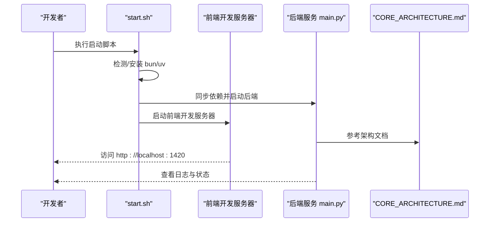
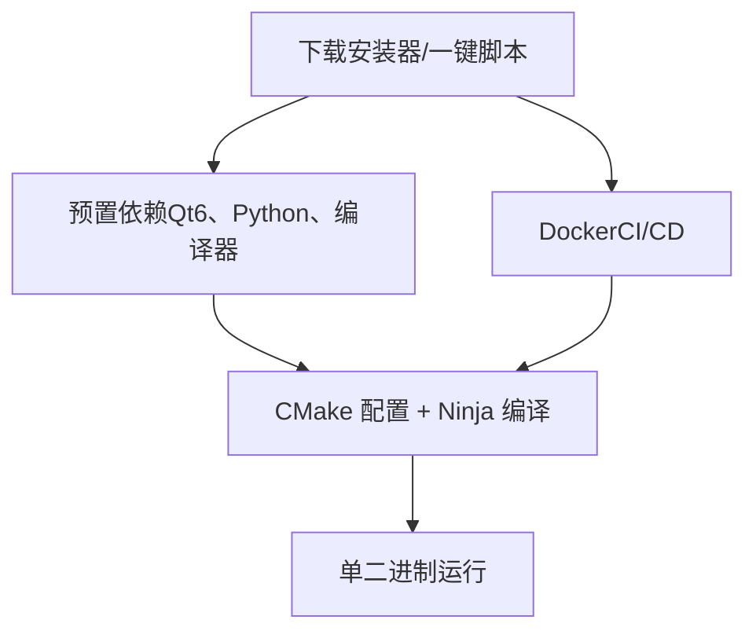
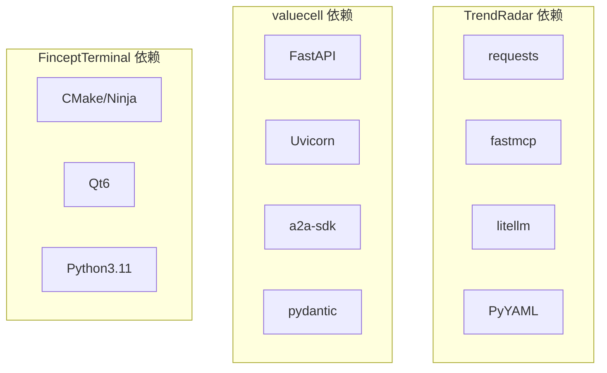

# 项目工具和应用

<cite>
**本文引用的文件**
- [TrendRadar 项目 README](file://project/TrendRadar/README.md)
- [TrendRadar 配置文件 config.yaml](file://project/TrendRadar/config/config.yaml)
- [TrendRadar 主入口 __main__.py](file://project/TrendRadar/trendradar/__main__.py)
- [TrendRadar MCP 服务端 server.py](file://project/TrendRadar/mcp_server/server.py)
- [TrendRadar Docker Compose](file://project/TrendRadar/docker/docker-compose.yml)
- [TrendRadar pyproject.toml](file://project/TrendRadar/pyproject.toml)
- [valuecell 项目 README](file://project/valuecell/README.md)
- [valuecell 前端 package.json](file://project/valuecell/frontend/package.json)
- [valuecell 后端入口 main.py](file://project/valuecell/python/valuecell/server/main.py)
- [valuecell 后端 __init__.py（环境加载）](file://project/valuecell/python/valuecell/__init__.py)
- [valuecell 启动脚本 start.sh](file://project/valuecell/start.sh)
- [valuecell 架构文档 CORE_ARCHITECTURE.md](file://project/valuecell/docs/CORE_ARCHITECTURE.md)
- [valuecell 后端 pyproject.toml](file://project/valuecell/python/pyproject.toml)
- [FinceptTerminal 项目 README](file://project/FinceptTerminal/README.md)
- [FinceptTerminal CMakeLists.txt](file://project/FinceptTerminal/fincept-qt/CMakeLists.txt)
</cite>

## 目录
1. [简介](#简介)
2. [项目结构](#项目结构)
3. [核心组件](#核心组件)
4. [架构总览](#架构总览)
5. [详细组件分析](#详细组件分析)
6. [依赖关系分析](#依赖关系分析)
7. [性能考虑](#性能考虑)
8. [故障排查指南](#故障排查指南)
9. [结论](#结论)
10. [附录](#附录)

## 简介
本文件面向项目工具与应用，系统梳理以下三个子项目的功能、架构、配置与部署要点：
- TrendRadar：热点新闻聚合与趋势监测，支持 AI 分析、多渠道推送、可视化配置与 MCP 服务。
- valuecell：多智能体金融应用平台，包含 React 前端与 Python 后端，支持多市场数据接入、交易与研究代理。
- FinceptTerminal：C++/Qt 金融终端，提供多资产分析、AI 量化实验室、100+ 数据连接器与实时交易。

## 项目结构
- TrendRadar
  - 核心包：trendradar（主程序）、mcp_server（MCP 工具服务）
  - 配置：config/（config.yaml、timeline.yaml、提示词与词表）
  - 存储：output/（HTML 报告、SQLite 数据）
  - Docker：docker-compose.yml、Dockerfile、entrypoint.sh
- valuecell
  - 前端：React + Vite + Radix UI + Tauri（frontend/）
  - 后端：FastAPI + Uvicorn（python/valuecell/server/）
  - 文档：docs/CORE_ARCHITECTURE.md（核心架构）
  - 启动：start.sh（自动安装依赖并启动前后端）
- FinceptTerminal
  - UI/渲染：Qt6（fincept-qt/）
  - 语言：C++20 + Python（嵌入式分析）
  - 构建：CMake + Ninja（CMakeLists.txt）

**图表来源**
- [TrendRadar 主入口 __main__.py:1-200](file://project/TrendRadar/trendradar/__main__.py#L1-L200)
- [TrendRadar 配置文件 config.yaml:1-597](file://project/TrendRadar/config/config.yaml#L1-L597)
- [TrendRadar MCP 服务端 server.py:1-200](file://project/TrendRadar/mcp_server/server.py#L1-L200)
- [valuecell 启动脚本 start.sh:1-187](file://project/valuecell/start.sh#L1-L187)
- [valuecell 前端 package.json:1-99](file://project/valuecell/frontend/package.json#L1-L99)
- [valuecell 后端入口 main.py:1-99](file://project/valuecell/python/valuecell/server/main.py#L1-L99)
- [FinceptTerminal CMakeLists.txt:1-200](file://project/FinceptTerminal/fincept-qt/CMakeLists.txt#L1-L200)

**章节来源**
- [TrendRadar 项目 README:1-800](file://project/TrendRadar/README.md#L1-L800)
- [valuecell 项目 README:1-281](file://project/valuecell/README.md#L1-L281)
- [FinceptTerminal 项目 README:1-326](file://project/FinceptTerminal/README.md#L1-L326)

## 核心组件
- TrendRadar
  - 数据采集：热榜平台与 RSS 源抓取，支持去重、新鲜度过滤与排序权重。
  - 报告与推送：按关键词/平台分组、增量/当日/当前模式，多渠道推送（飞书、钉钉、企业微信、Telegram、ntfy、Bark、Slack、通用 Webhook）。
  - AI 能力：AI 分析（趋势、情感、跨平台对比）、AI 翻译、AI 智能筛选（关键词/兴趣描述）。
  - MCP 服务：基于 FastMCP 的工具服务器，提供数据查询、分析、搜索、配置管理、存储同步、文章阅读与通知工具。
  - 存储：本地 SQLite 与 S3 兼容远程存储，支持拉取同步。
- valuecell
  - 前端：React + Radix UI + shadcn 组件生态，支持主题、国际化、图表（ECharts）与桌面集成（Tauri）。
  - 后端：FastAPI + Uvicorn，支持多 LLM 提供商、多市场数据、多交易所对接（OKX、Binance、Hyperliquid 等）。
  - 架构：超级代理预判、异步可重入编排器、规划器（含人机协同）、任务执行器、事件路由与持久化。
- FinceptTerminal
  - UI：Qt6 + C++20，单二进制，无浏览器运行时。
  - 数据：100+ 数据连接器（Yahoo Finance、Polygon、FRED、IMF、AkShare 等），可选替代数据（Adanos 市场情绪）。
  - 交易：16 家经纪商对接（Zerodha、IBKR、Alpaca、Tradier 等），算法交易与纸面交易引擎。
  - AI：37 个 AI 代理（巴菲特、格雷厄姆、芒格、马克、卡鲁阿纳等框架），支持多提供商（OpenAI、Anthropic、Gemini、Groq、DeepSeek、MiniMax、OpenRouter、Ollama、本地 Ollama）。

**章节来源**
- [TrendRadar 配置文件 config.yaml:1-597](file://project/TrendRadar/config/config.yaml#L1-L597)
- [TrendRadar MCP 服务端 server.py:1-200](file://project/TrendRadar/mcp_server/server.py#L1-L200)
- [valuecell 后端入口 main.py:1-99](file://project/valuecell/python/valuecell/server/main.py#L1-L99)
- [valuecell 架构文档 CORE_ARCHITECTURE.md:1-302](file://project/valuecell/docs/CORE_ARCHITECTURE.md#L1-L302)
- [FinceptTerminal 项目 README:48-60](file://project/FinceptTerminal/README.md#L48-L60)

## 架构总览
- TrendRadar
  - 主程序负责配置加载、调度、抓取、分析、翻译与推送；MCP 服务提供工具接口供外部客户端调用。
  - Docker 双容器：新闻推送服务与 MCP 服务分离，便于独立扩展与运维。
- valuecell
  - 启动脚本自动安装 bun/uv，同步后端依赖，启动前端开发服务器与后端服务，支持系统级 .env 环境变量加载。
  - 架构采用“超级代理预判 → 规划器（含人机协同）→ 任务执行器（A2A 远程代理）→ 事件路由与持久化”的流水线。
- FinceptTerminal
  - CMake 预置 Qt6、Python3.11、编译器版本校验，构建单二进制，支持 Windows/Linux/macOS。

**图表来源**
- [TrendRadar 主入口 __main__.py:1-200](file://project/TrendRadar/trendradar/__main__.py#L1-L200)
- [TrendRadar 配置文件 config.yaml:1-597](file://project/TrendRadar/config/config.yaml#L1-L597)
- [TrendRadar MCP 服务端 server.py:1-200](file://project/TrendRadar/mcp_server/server.py#L1-L200)
- [TrendRadar Docker Compose:1-73](file://project/TrendRadar/docker/docker-compose.yml#L1-L73)
- [valuecell 启动脚本 start.sh:1-187](file://project/valuecell/start.sh#L1-L187)
- [valuecell 前端 package.json:1-99](file://project/valuecell/frontend/package.json#L1-L99)
- [valuecell 后端入口 main.py:1-99](file://project/valuecell/python/valuecell/server/main.py#L1-L99)
- [valuecell 架构文档 CORE_ARCHITECTURE.md:1-302](file://project/valuecell/docs/CORE_ARCHITECTURE.md#L1-L302)
- [FinceptTerminal CMakeLists.txt:1-200](file://project/FinceptTerminal/fincept-qt/CMakeLists.txt#L1-L200)

## 详细组件分析

### TrendRadar 组件分析
- 配置体系
  - app/timezone：统一时区与时序。
  - schedule/preset：预设模板（全天候、早晚汇总、办公时间、夜猫子、自定义）。
  - platforms/rss：平台与 RSS 源开关、新鲜度过滤、分组与排序。
  - report/display/filter/ai_filter：报告模式、展示顺序、关键词/AI 筛选策略与阈值。
  - notification/channels：多渠道推送配置与多账号支持。
  - storage/backend/formats：本地/远程存储、保留策略、拉取同步。
  - ai/ai_analysis/ai_translation：统一模型配置与分析/翻译开关。
- MCP 工具服务
  - 资源：平台列表、RSS 源、可用日期、关键词。
  - 工具：数据查询、分析、搜索、配置管理、系统管理、存储同步、文章阅读、通知。
  - 日期解析：将自然语言日期解析为标准范围，保证 AI 一致性。
- 部署与运行
  - Docker 双容器：trendradar（推送）与 trendradar-mcp（工具服务），端口与环境变量可配置。
  - 本地运行：通过命令行入口与配置文件驱动。

**图表来源**
- [TrendRadar 配置文件 config.yaml:1-597](file://project/TrendRadar/config/config.yaml#L1-L597)
- [TrendRadar 主入口 __main__.py:1-200](file://project/TrendRadar/trendradar/__main__.py#L1-L200)
- [TrendRadar MCP 服务端 server.py:1-200](file://project/TrendRadar/mcp_server/server.py#L1-L200)

**章节来源**
- [TrendRadar 配置文件 config.yaml:1-597](file://project/TrendRadar/config/config.yaml#L1-L597)
- [TrendRadar 主入口 __main__.py:1-200](file://project/TrendRadar/trendradar/__main__.py#L1-L200)
- [TrendRadar MCP 服务端 server.py:1-200](file://project/TrendRadar/mcp_server/server.py#L1-L200)
- [TrendRadar Docker Compose:1-73](file://project/TrendRadar/docker/docker-compose.yml#L1-L73)

### valuecell 组件分析
- 前后端架构
  - 前端：React + Vite + Radix UI + shadcn，支持主题切换、国际化、图表与桌面集成（Tauri）。
  - 后端：FastAPI + Uvicorn，支持多 LLM 提供商、多市场数据、多交易所对接。
- 启动与环境
  - start.sh 自动检测并安装 bun/uv，同步后端依赖，启动前端开发服务器与后端服务。
  - 环境变量从系统路径加载（macOS/Linux/Windows），首次运行自动生成 .env.example。
- 核心架构
  - 超级代理预判 → 规划器（含人机协同）→ 任务执行器（A2A 远程代理）→ 事件路由与持久化。
  - 支持异步、可重入、背压与错误恢复。

**图表来源**
- [valuecell 启动脚本 start.sh:1-187](file://project/valuecell/start.sh#L1-L187)
- [valuecell 前端 package.json:1-99](file://project/valuecell/frontend/package.json#L1-L99)
- [valuecell 后端入口 main.py:1-99](file://project/valuecell/python/valuecell/server/main.py#L1-L99)
- [valuecell 架构文档 CORE_ARCHITECTURE.md:1-302](file://project/valuecell/docs/CORE_ARCHITECTURE.md#L1-L302)

**章节来源**
- [valuecell 项目 README:1-281](file://project/valuecell/README.md#L1-L281)
- [valuecell 启动脚本 start.sh:1-187](file://project/valuecell/start.sh#L1-L187)
- [valuecell 前端 package.json:1-99](file://project/valuecell/frontend/package.json#L1-L99)
- [valuecell 后端入口 main.py:1-99](file://project/valuecell/python/valuecell/server/main.py#L1-L99)
- [valuecell 架构文档 CORE_ARCHITECTURE.md:1-302](file://project/valuecell/docs/CORE_ARCHITECTURE.md#L1-L302)

### FinceptTerminal 组件分析
- 功能特性
  - 多资产分析：DCF、组合优化、风险指标（VaR、夏普比率）、衍生品定价。
  - AI 代理：37 个框架（巴菲特、格雷厄姆、芒格、马克、卡鲁阿纳等），支持多提供商。
  - 数据连接：100+ 数据源（DBnomics、Polygon、Kraken、Yahoo Finance、FRED、IMF、World Bank、AkShare 等）。
  - 实时交易：加密货币（Kraken/HyperLiquid WebSocket）、股票、算法交易、纸面交易引擎，16 家经纪商对接。
  - 量化工具：18 个量化分析模块（定价、风险、随机、波动率、固定收益）。
  - 可视化：节点编辑器自动化流水线、MCP 工具集成。
- 安装与构建
  - 预置安装器：下载安装器（推荐）或一键构建脚本。
  - Docker：仅用于 CI/CD 测试与开发环境（Linux + X11）。
  - 手动构建：CMake + Ninja，Qt6.8.3 + Python3.11.9 + 指定编译器版本。

**图表来源**
- [FinceptTerminal 项目 README:63-200](file://project/FinceptTerminal/README.md#L63-L200)
- [FinceptTerminal CMakeLists.txt:1-200](file://project/FinceptTerminal/fincept-qt/CMakeLists.txt#L1-L200)

**章节来源**
- [FinceptTerminal 项目 README:1-326](file://project/FinceptTerminal/README.md#L1-L326)
- [FinceptTerminal CMakeLists.txt:1-200](file://project/FinceptTerminal/fincept-qt/CMakeLists.txt#L1-L200)

## 依赖关系分析
- TrendRadar
  - 依赖：requests、pytz、PyYAML、fastmcp、websockets、feedparser、boto3、litellm、json-repair、tenacity。
  - 命令入口：trendradar、trendradar-mcp。
- valuecell
  - 依赖：FastAPI、Uvicorn、pydantic、a2a-sdk、yfinance、akshare、edgartools、sqlalchemy、aiosqlite、unstructured、markdown、loguru、aiofiles、crawl4ai、ccxt、baostock、func-timeout、pymysql。
  - 开发依赖：pytest、ruff、isort。
- FinceptTerminal
  - 依赖：CMake、Ninja、Qt6、Python3.11、指定编译器版本（MSVC/GCC/Apple Clang）。

**图表来源**
- [TrendRadar pyproject.toml:1-32](file://project/TrendRadar/pyproject.toml#L1-L32)
- [valuecell 后端 pyproject.toml:1-91](file://project/valuecell/python/pyproject.toml#L1-L91)

**章节来源**
- [TrendRadar pyproject.toml:1-32](file://project/TrendRadar/pyproject.toml#L1-L32)
- [valuecell 后端 pyproject.toml:1-91](file://project/valuecell/python/pyproject.toml#L1-L91)

## 性能考虑
- TrendRadar
  - 存储：本地 SQLite 与 S3 兼容远程存储，支持拉取同步，降低冷数据访问延迟。
  - 推送：分批发送与渠道字节限制控制，避免超限与失败。
  - AI：统一模型配置与重试、备用模型，控制 token 消耗（分析数量上限、是否包含 RSS/独立展示区、是否包含排名时间线）。
- valuecell
  - 异步与可重入：后台生产者在客户端断开后继续执行，响应缓冲与稳定 ID 支持重播与恢复。
  - A2A 协议：任务通过 HTTP/其他传输与远程代理通信，事件路由与持久化解耦。
- FinceptTerminal
  - 单二进制、无浏览器运行时，C++20 + Qt6，构建期启用编译缓存与 Unity 构建，提升迭代速度。

**章节来源**
- [TrendRadar 配置文件 config.yaml:498-520](file://project/TrendRadar/config/config.yaml#L498-L520)
- [valuecell 架构文档 CORE_ARCHITECTURE.md:106-154](file://project/valuecell/docs/CORE_ARCHITECTURE.md#L106-L154)
- [FinceptTerminal CMakeLists.txt:178-200](file://project/FinceptTerminal/fincept-qt/CMakeLists.txt#L178-L200)

## 故障排查指南
- TrendRadar
  - 版本检查：统一检查主程序与配置版本，提示是否需要更新。
  - 多账号配置：分号分隔多个账号，注意配对配置数量一致。
  - 推送失败：检查渠道字节限制与分批间隔，确认模板与环境变量。
  - 远程存储：S3 端点、桶名、密钥与区域配置，必要时使用虚拟主机样式。
- valuecell
  - 环境变量：系统路径 .env 自动加载，首次运行从 .env.example 复制；调试模式可开启。
  - 启动失败：确认 bun/uv 安装、依赖同步、端口占用；查看前端/后端日志。
- FinceptTerminal
  - Qt/编译器版本：严格匹配 CMake 预置版本，否则构建失败。
  - Docker：仅支持 Linux + X11，Windows/macOS 不支持。

**章节来源**
- [TrendRadar 主入口 __main__.py:95-188](file://project/TrendRadar/trendradar/__main__.py#L95-L188)
- [TrendRadar 配置文件 config.yaml:299-597](file://project/TrendRadar/config/config.yaml#L299-L597)
- [valuecell 后端 __init__.py（环境加载）:24-117](file://project/valuecell/python/valuecell/__init__.py#L24-L117)
- [valuecell 启动脚本 start.sh:1-187](file://project/valuecell/start.sh#L1-L187)
- [FinceptTerminal 项目 README:112-200](file://project/FinceptTerminal/README.md#L112-L200)

## 结论
- TrendRadar 提供一站式的热点监测与趋势分析，具备强大的 AI 分析与多渠道推送能力，MCP 服务进一步拓展了工具生态与外部集成。
- valuecell 以多智能体为核心，前后端分离，支持多 LLM 与多市场数据，适合构建社区驱动的金融智能体平台。
- FinceptTerminal 以原生性能与丰富数据连接器为特色，适合专业分析师与量化研究人员使用。

## 附录
- TrendRadar
  - 快速开始与配置详解参见项目 README；Docker 双容器部署参见 docker-compose.yml。
- valuecell
  - 快速开始与开发者指南参见 README；架构细节参见 CORE_ARCHITECTURE.md；启动脚本 start.sh。
- FinceptTerminal
  - 安装与构建选项参见 README；CMake 预置版本与依赖参见 CMakeLists.txt。

**章节来源**
- [TrendRadar 项目 README:1-800](file://project/TrendRadar/README.md#L1-L800)
- [TrendRadar Docker Compose:1-73](file://project/TrendRadar/docker/docker-compose.yml#L1-L73)
- [valuecell 项目 README:1-281](file://project/valuecell/README.md#L1-L281)
- [valuecell 架构文档 CORE_ARCHITECTURE.md:1-302](file://project/valuecell/docs/CORE_ARCHITECTURE.md#L1-L302)
- [valuecell 启动脚本 start.sh:1-187](file://project/valuecell/start.sh#L1-L187)
- [FinceptTerminal 项目 README:1-326](file://project/FinceptTerminal/README.md#L1-L326)
- [FinceptTerminal CMakeLists.txt:1-200](file://project/FinceptTerminal/fincept-qt/CMakeLists.txt#L1-L200)