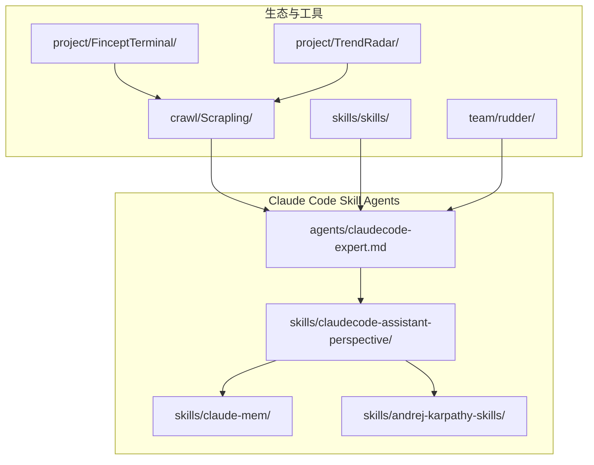
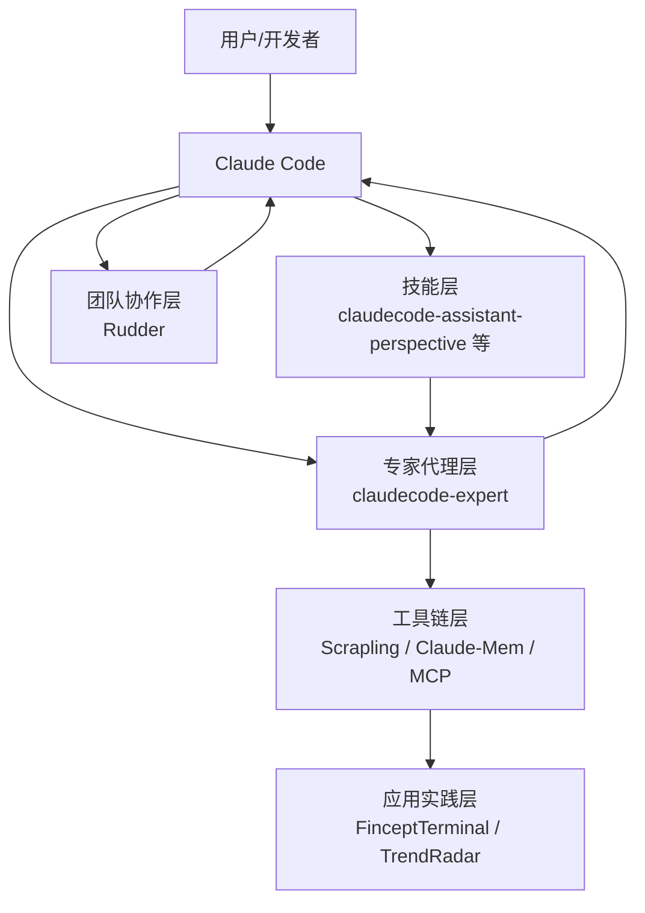
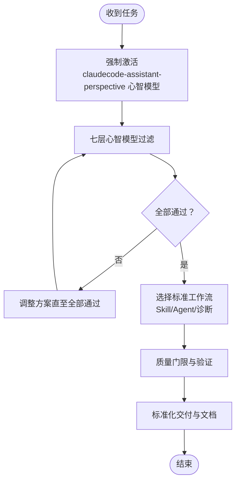
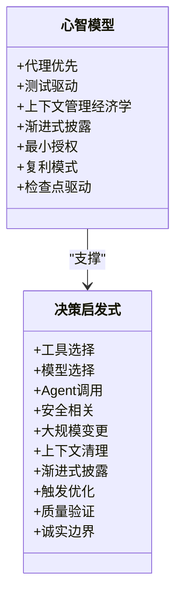
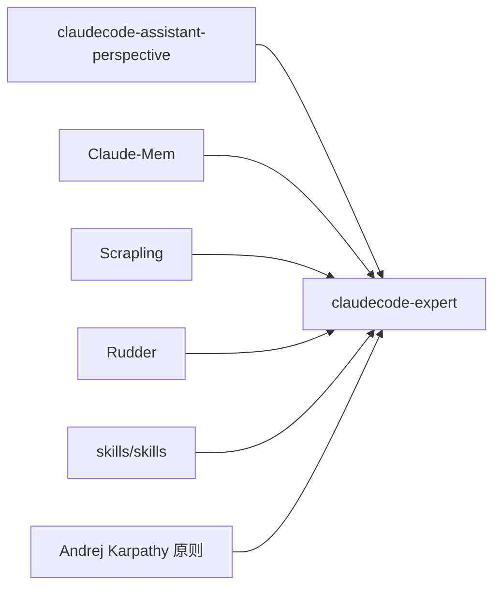

# 项目介绍

<cite>
**本文引用的文件**   
- [README.md](file://README.md)
- [README.zh-CN.md](file://README.zh-CN.md)
- [claudecode-expert.md](file://agents/claudecode-expert.md)
- [SKILL.md](file://skills/claudecode-assistant-perspective/SKILL.md)
- [document-index.md](file://skills/claudecode-assistant-perspective/references/document-index.md)
- [README.md](file://crawl/Scrapling/README.md)
- [README.md](file://skills/skills/README.md)
- [README.md](file://team/rudder/README.md)
- [README.md](file://project/FinceptTerminal/README.md)
- [README.md](file://project/TrendRadar/README.md)
- [README.md](file://skills/claude-mem/README.md)
- [README.md](file://skills/andrej-karpathy-skills/README.md)
</cite>

## 目录
1. [引言](#引言)
2. [项目结构](#项目结构)
3. [核心组件](#核心组件)
4. [架构总览](#架构总览)
5. [详细组件分析](#详细组件分析)
6. [依赖关系分析](#依赖关系分析)
7. [性能考量](#性能考量)
8. [故障排查指南](#故障排查指南)
9. [结论](#结论)
10. [附录](#附录)

## 引言
Claude Code Skill Agents 是一个面向 Claude Code 的模块化、可扩展的 AI Agent 与可复用技能集合平台。项目旨在通过“专家级 Agent + 综合技能”的组合，帮助开发者在日常开发中实现更高的效率、更强的可复用性与更好的最佳实践落地。项目不仅提供开箱即用的技能与 Agent，还强调安全防护、质量门限、渐进式披露与复利模式等工程化理念，帮助用户在 Claude Code 生态中构建可持续的知识与工作流体系。

- 核心使命：将 Claude Code 的能力发挥到理论极限，提供专家级指导与可复用模式。
- 核心愿景：成为 Claude Code 生态中最值得信赖的“技能与专家代理”集合，推动高质量、可复用、可治理的 AI 协作工作流。
- 价值定位：模块化、可组合、可治理、可复用、社区驱动、开源免费。

## 项目结构
项目采用“技能 + 专家代理”的双轴组织方式，辅以文档与索引，便于用户快速定位与复用：

- agents：专家级 Agent 定义与使用说明，如 claudecode-expert。
- skills：可复用技能集合，如 claudecode-assistant-perspective，配套 references 文档索引与研究材料。
- crawl/Scrapling：与 AI 协作的网络爬虫框架，提供 MCP 服务器与 AI 辅助抽取能力，可与 Claude Code 集成。
- skills/skills：工程师导向的实用技能集合，强调“对齐—简洁—反馈—设计”的工程化闭环。
- team/rudder：面向团队协作的 Agent 协作与运营层，提供组织、目标、任务、知识、审批与反馈的可见性与治理。
- project/FinceptTerminal：金融智能终端，展示 MCP 工具集成与 AI 量化实验室的工程化实践。
- project/TrendRadar：热点追踪助手，提供 MCP 客户端与 AI 分析推送，强调可复用与可扩展的消息分发。
- skills/claude-mem：面向 Claude Code 的持久记忆压缩系统，实现跨会话上下文延续。
- skills/andrej-karpathy-skills：基于 Karpathy 观察的四条工程原则，直接改善 Claude Code 的行为质量。

**图表来源**
- [claudecode-expert.md:1-440](file://agents/claudecode-expert.md#L1-L440)
- [SKILL.md:1-106](file://skills/claudecode-assistant-perspective/SKILL.md#L1-L106)
- [README.md:1-568](file://crawl/Scrapling/README.md#L1-L568)
- [README.md:1-177](file://skills/skills/README.md#L1-L177)
- [README.md:1-136](file://team/rudder/README.md#L1-L136)
- [README.md:1-326](file://project/FinceptTerminal/README.md#L1-L326)
- [README.md:1-800](file://project/TrendRadar/README.md#L1-L800)
- [README.md:1-200](file://skills/claude-mem/README.md#L1-L200)
- [README.md:1-172](file://skills/andrej-karpathy-skills/README.md#L1-L172)

**章节来源**
- [README.md:1-261](file://README.md#L1-L261)
- [README.zh-CN.md:1-262](file://README.zh-CN.md#L1-L262)

## 核心组件
- 专家代理 claudecode-expert：提供“7 心智模型 + 决策启发式 + 质量门限”的分层过滤与标准工作流，确保每次产出都经过严格验证与可复用设计。
- 技能 claudecode-assistant-perspective：提供 7 个核心心智模型、内在矛盾、决策启发式与诚实边界，配套文档索引与研究材料，支撑专家代理的“全量赋能”。
- Claude-Mem：持久记忆压缩系统，实现跨会话上下文延续与可检索的记忆流，配合 citations 与 web viewer，提升协作与审计能力。
- Andrej Karpathy 工程原则：四条直接改善 Claude Code 行为的原则，强调“先思考—再编码”“简洁优先”“手术式变更”“目标驱动执行”，降低过拟合与误变更风险。
- Scrapling：现代网页抓取框架，提供自适应解析、抗反爬取、MCP 服务器与 AI 协作抽取能力，可无缝对接 Claude Code 的技能与 Agent。
- 工程技能集合 skills/skills：围绕“对齐—简洁—反馈—设计”的工程闭环，提供 grilling、TDD、诊断、架构改进等可复用技能。
- Rudder：Agent 协作与运营层，提供组织、目标、任务、知识、审批与反馈的可见性与治理，适合团队长期协作。
- FinceptTerminal：金融智能终端，展示 MCP 工具集成与 AI 量化实验室的工程化实践。
- TrendRadar：热点追踪助手，提供 MCP 客户端与 AI 分析推送，强调可复用与可扩展的消息分发。

**章节来源**
- [claudecode-expert.md:1-440](file://agents/claudecode-expert.md#L1-L440)
- [SKILL.md:1-106](file://skills/claudecode-assistant-perspective/SKILL.md#L1-L106)
- [document-index.md:1-76](file://skills/claudecode-assistant-perspective/references/document-index.md#L1-L76)
- [README.md:1-200](file://skills/claude-mem/README.md#L1-L200)
- [README.md:1-172](file://skills/andrej-karpathy-skills/README.md#L1-L172)
- [README.md:1-568](file://crawl/Scrapling/README.md#L1-L568)
- [README.md:1-177](file://skills/skills/README.md#L1-L177)
- [README.md:1-136](file://team/rudder/README.md#L1-L136)
- [README.md:1-326](file://project/FinceptTerminal/README.md#L1-L326)
- [README.md:1-800](file://project/TrendRadar/README.md#L1-L800)

## 架构总览
项目整体采用“技能 + 专家代理 + 工具链 + 团队协作”的分层架构：
- 技能层：提供可复用的心智模型、工作流与检查清单，支撑 Agent 的设计与执行。
- 专家代理层：以 claudecode-expert 为代表，负责复杂任务的分层过滤、质量门限与跨 Agent 协作。
- 工具链层：Scrapling、Claude-Mem、MCP 客户端等，提供数据获取、上下文延续与 AI 协作能力。
- 团队协作层：Rudder 提供组织、目标、任务、知识、审批与反馈的治理与可见性。
- 应用实践层：FinceptTerminal、TrendRadar 等项目展示 MCP 工具集成与工程化落地。

**图表来源**
- [claudecode-expert.md:1-440](file://agents/claudecode-expert.md#L1-L440)
- [SKILL.md:1-106](file://skills/claudecode-assistant-perspective/SKILL.md#L1-L106)
- [README.md:1-568](file://crawl/Scrapling/README.md#L1-L568)
- [README.md:1-200](file://skills/claude-mem/README.md#L1-L200)
- [README.md:1-136](file://team/rudder/README.md#L1-L136)
- [README.md:1-326](file://project/FinceptTerminal/README.md#L1-L326)
- [README.md:1-800](file://project/TrendRadar/README.md#L1-L800)

## 详细组件分析

### 专家代理：claudecode-expert
- 设计理念：以“7 心智模型 + 决策启发式 + 质量门限”为核心的分层过滤与标准工作流，确保每次产出都经过严格验证与可复用设计。
- 关键机制：
  - 强制激活 claudecode-assistant-perspective 的全量心智模型，确保决策经过代理优先、测试驱动、上下文管理、渐进式披露、最小授权、复利模式、检查点驱动的七层过滤。
  - 提供 Skill 从零开发、Agent 设计与优化、问题诊断与解决三大标准工作流，配套质量评分与通过标准。
  - 输出格式标准化，包含决策输出、验证方案、风险与权衡、参考来源与最终交付清单。
- 适用场景：复杂技能开发、Agent 设计、工作流优化、疑难问题诊断与修复、跨 Agent 协作与质量保障。

**图表来源**
- [claudecode-expert.md:25-440](file://agents/claudecode-expert.md#L25-L440)

**章节来源**
- [claudecode-expert.md:1-440](file://agents/claudecode-expert.md#L1-L440)

### 技能：claudecode-assistant-perspective
- 核心心智模型：代理优先、测试驱动、上下文管理经济学、渐进式披露、最小授权、复利模式、检查点驱动。
- 内在矛盾：复用优先 vs 简单直接、授权最小化 vs 任务灵活性、检查点质量 vs 交付速度、渐进式披露 vs 上下文完整。
- 决策启发式：工具选择、模型选择、Agent 调用、安全相关、大规模变更、上下文清理、渐进式披露、触发优化、质量验证、诚实边界。
- 诚实边界：明确能力范围与局限，提供参考资源索引与研究材料。

**图表来源**
- [SKILL.md:10-72](file://skills/claudecode-assistant-perspective/SKILL.md#L10-L72)

**章节来源**
- [SKILL.md:1-106](file://skills/claudecode-assistant-perspective/SKILL.md#L1-L106)
- [document-index.md:1-76](file://skills/claudecode-assistant-perspective/references/document-index.md#L1-L76)

### 工程技能集合：skills/skills
- 核心思想：以工程化闭环为核心，强调“对齐—简洁—反馈—设计”，减少沟通偏差与过拟合。
- 关键技能：
  - Grill：在开始前与 Agent 对齐，明确目标与边界。
  - Shared Language：建立项目术语，减少冗余与歧义。
  - TDD：红绿重构循环，提供稳定反馈。
  - Diagnose：系统化诊断流程，定位根因并验证修复。
  - Improve Codebase Architecture：在设计层面提升可维护性。
- 适用场景：日常开发、代码审查、架构演进、团队协作与知识沉淀。

**章节来源**
- [README.md:1-177](file://skills/skills/README.md#L1-L177)

### Claude-Mem：持久记忆压缩系统
- 核心能力：自动捕获工具使用观察、生成语义摘要、跨会话延续上下文、提供 citations 与 web viewer。
- 关键特性：隐私控制、上下文配置、自动运行、实时内存流、Beta 通道实验功能。
- 适用场景：跨会话知识延续、协作审计、上下文优化与可追溯性。

**章节来源**
- [README.md:1-200](file://skills/claude-mem/README.md#L1-L200)

### Andrej Karpathy 工程原则
- 四条原则：先思考再编码、简洁优先、手术式变更、目标驱动执行。
- 价值：减少不必要的变更、避免过度工程化、降低误变更风险、提升 PR 质量与可验证性。
- 适用场景：日常代码修改、重构与审查、测试驱动与验证。

**章节来源**
- [README.md:1-172](file://skills/andrej-karpathy-skills/README.md#L1-L172)

### Scrapling：现代网页抓取框架
- 核心能力：自适应解析、抗反爬取、多会话并发、MCP 服务器、AI 协作抽取、CLI 与交互式 Shell。
- 适用场景：数据采集、内容抽取、AI 辅助分析、大规模爬取与流式处理。

**章节来源**
- [README.md:1-568](file://crawl/Scrapling/README.md#L1-L568)

### Rudder：Agent 协作与运营层
- 设计理念：借鉴人类协作模式，通过角色、汇报线、交接、记忆、信任边界与可见反馈，实现 Agent 团队的结构化协作。
- 关键能力：组织目标、任务归属、工作对象、流程定义、操作记忆、检查与审批、预算与支出控制。
- 适用场景：团队协作、长期项目、治理与可见性、跨 Agent 协作与质量保障。

**章节来源**
- [README.md:1-136](file://team/rudder/README.md#L1-L136)

### FinceptTerminal：金融智能终端
- 核心能力：多资产分析、AI 量化实验室、100+ 数据连接器、实时交易、量化分析模块、MCP 工具集成。
- 适用场景：金融研究、投资决策、算法交易、数据可视化与自动化。

**章节来源**
- [README.md:1-326](file://project/FinceptTerminal/README.md#L1-L326)

### TrendRadar：热点追踪助手
- 核心能力：AI 智能筛选、多渠道推送、MCP 客户端、RSS 订阅、可视化配置编辑器、多模型适配。
- 适用场景：热点追踪、智能推送、跨平台通知、AI 分析与趋势洞察。

**章节来源**
- [README.md:1-800](file://project/TrendRadar/README.md#L1-L800)

## 依赖关系分析
- 专家代理 claudecode-expert 依赖 claudecode-assistant-perspective 的心智模型与工作流，确保每次产出都经过严格验证。
- Claude-Mem 与 MCP 工具链为 Agent 与技能提供上下文延续与可检索的记忆流。
- Scrapling 为数据获取与抽取提供底层能力，支撑 AI 分析与推送。
- Rudder 为团队协作提供治理与可见性，保障 Agent 协作的结构化与可控性。
- 工程技能集合 skills/skills 与 Andrej 原则为日常开发提供工程化闭环，降低沟通与实现偏差。

**图表来源**
- [claudecode-expert.md:1-440](file://agents/claudecode-expert.md#L1-L440)
- [SKILL.md:1-106](file://skills/claudecode-assistant-perspective/SKILL.md#L1-L106)
- [README.md:1-200](file://skills/claude-mem/README.md#L1-L200)
- [README.md:1-568](file://crawl/Scrapling/README.md#L1-L568)
- [README.md:1-136](file://team/rudder/README.md#L1-L136)
- [README.md:1-177](file://skills/skills/README.md#L1-L177)
- [README.md:1-172](file://skills/andrej-karpathy-skills/README.md#L1-L172)

**章节来源**
- [claudecode-expert.md:1-440](file://agents/claudecode-expert.md#L1-L440)
- [SKILL.md:1-106](file://skills/claudecode-assistant-perspective/SKILL.md#L1-L106)
- [README.md:1-200](file://skills/claude-mem/README.md#L1-L200)
- [README.md:1-568](file://crawl/Scrapling/README.md#L1-L568)
- [README.md:1-136](file://team/rudder/README.md#L1-L136)
- [README.md:1-177](file://skills/skills/README.md#L1-L177)
- [README.md:1-172](file://skills/andrej-karpathy-skills/README.md#L1-L172)

## 性能考量
- 上下文窗口经济学：通过“渐进式披露”与“上下文清理”策略，控制 token 使用成本，避免上下文过载。
- 工具与模型匹配：根据任务复杂度选择合适模型（架构用 Opus、审查用 Sonnet、轻量任务用 Haiku），减少不必要的算力消耗。
- 并发与会话：Scrapling 的多会话并发与会话管理，结合代理优先原则，避免不必要的工具调用与上下文切换。
- 质量门限与检查点：通过阶段性检查与验证，减少返工与无效尝试，提升整体吞吐与稳定性。

[本节为通用指导，无需特定文件引用]

## 故障排查指南
- 触发失败：检查技能描述中的触发条件与跳过条件，确保与当前场景匹配。
- 上下文丢失：启用 Claude-Mem 的持久记忆，或在专家代理中执行上下文清理与渐进式披露策略。
- 工具调用失败：确认工具授权最小化原则，避免过度授权；检查代理优先策略，必要时委托专门 Agent。
- 质量不达标：对照质量门限与检查清单，逐项验证并通过测试用例（已知场景、边界场景、风格测试）。
- MCP 集成问题：参考 Scrapling 与 TrendRadar 的 MCP 客户端配置，确保工具返回结构一致与异步一致性。

**章节来源**
- [claudecode-expert.md:307-336](file://agents/claudecode-expert.md#L307-L336)
- [document-index.md:55-76](file://skills/claudecode-assistant-perspective/references/document-index.md#L55-L76)
- [README.md:1-568](file://crawl/Scrapling/README.md#L1-L568)
- [README.md:1-800](file://project/TrendRadar/README.md#L1-L800)

## 结论
Claude Code Skill Agents 通过“专家代理 + 综合技能 + 工具链 + 团队协作”的分层架构，为 Claude Code 用户提供了可复用、可治理、可扩展的 AI 协作工作流。项目强调工程化闭环与质量门限，结合 Claude-Mem 的上下文延续与 MCP 工具链，能够有效降低沟通偏差、提升开发效率与可维护性。无论是个人开发者还是团队协作，都可以在此基础上构建可持续的知识与工作流体系。

[本节为总结性内容，无需特定文件引用]

## 附录
- 快速开始：将 agents 与 skills 复制到 Claude Code 目录，或通过符号链接引用；在 Claude Code 会话中使用 @claudecode-expert 与 /skill claudecode-assistant-perspective。
- 社区与生态：项目与 Claude Code、Anthropic 生态深度集成，提供 MIT 许可与开源社区驱动，欢迎贡献与反馈。

**章节来源**
- [README.md:64-89](file://README.md#L64-L89)
- [README.zh-CN.md:64-89](file://README.zh-CN.md#L64-L89)