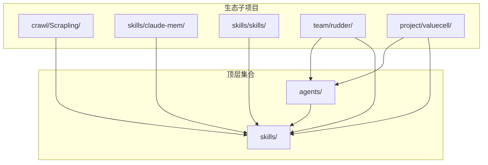
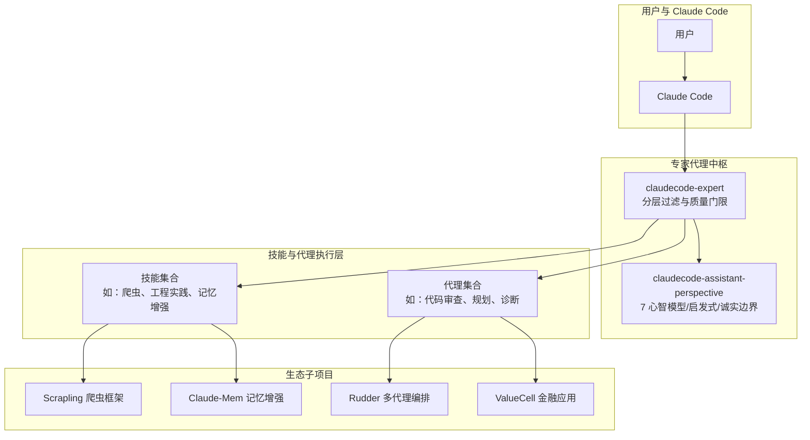
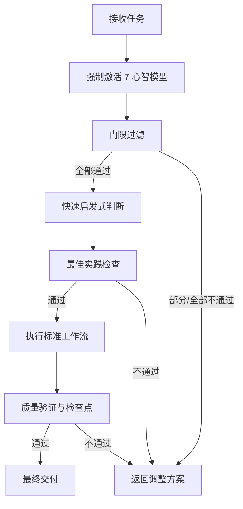
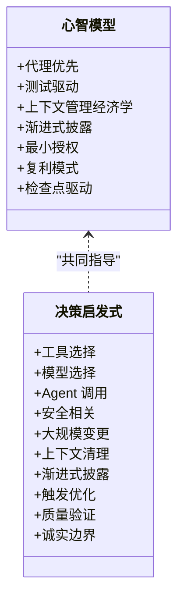
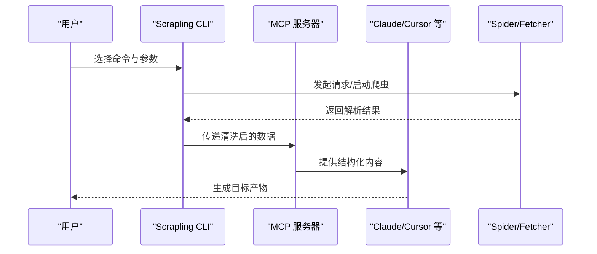
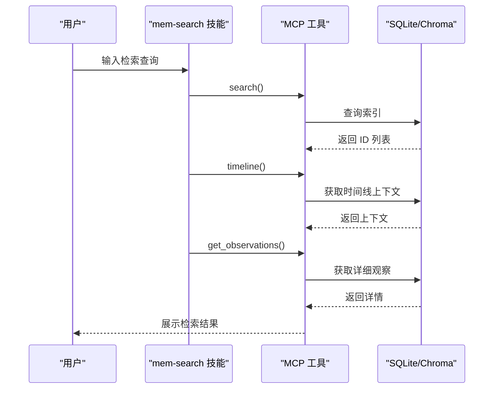
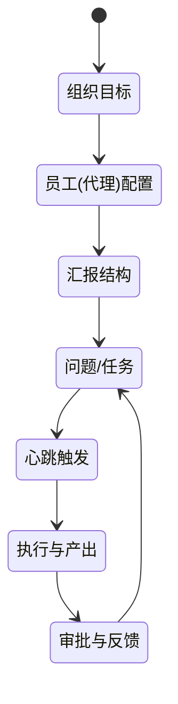
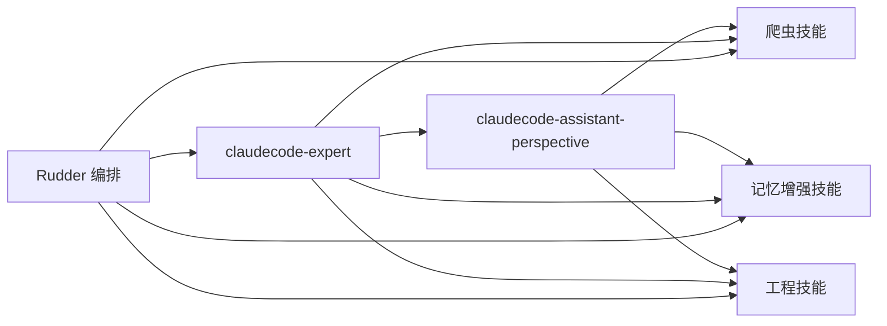

# 项目概述

<cite>
**本文引用的文件**
- [README.md](file://README.md)
- [README.zh-CN.md](file://README.zh-CN.md)
- [agents/claudecode-expert.md](file://agents/claudecode-expert.md)
- [skills/claudecode-assistant-perspective/SKILL.md](file://skills/claudecode-assistant-perspective/SKILL.md)
- [crawl/Scrapling/agent-skill/Scrapling-Skill/SKILL.md](file://crawl/Scrapling/agent-skill/Scrapling-Skill/SKILL.md)
- [crawl/Scrapling/README.md](file://crawl/Scrapling/README.md)
- [skills/claude-mem/README.md](file://skills/claude-mem/README.md)
- [skills/skills/README.md](file://skills/skills/README.md)
- [team/rudder/README.md](file://team/rudder/README.md)
- [team/rudder/CONTRIBUTING.md](file://team/rudder/CONTRIBUTING.md)
- [project/valuecell/README.md](file://project/valuecell/README.md)
- [LICENSE](file://LICENSE)
</cite>

## 目录
1. [简介](#简介)
2. [项目结构](#项目结构)
3. [核心组件](#核心组件)
4. [架构总览](#架构总览)
5. [详细组件分析](#详细组件分析)
6. [依赖关系分析](#依赖关系分析)
7. [性能考量](#性能考量)
8. [故障排查指南](#故障排查指南)
9. [结论](#结论)
10. [附录](#附录)

## 简介
Claude Code Skill Agents 是一个面向 Claude Code 的模块化、可扩展的 AI 专家代理与可复用技能集合平台。项目旨在通过“专家级代理 + 技能”的组合，帮助开发者在日常开发、代码审查、工作流优化、问题诊断等场景中获得可复用、可验证、可演进的智能支持。

- 核心目标
  - 以“专家代理”为中枢，统一调度与治理多类技能与代理，确保输出质量与可复用性。
  - 以“技能”为最小可组合单元，沉淀最佳实践、工作流与反模式清单，降低认知与实现成本。
  - 与 Claude Code 生态深度集成，提供即插即用的使用体验与持续演进能力。

- 主要特性
  - 专家代理：如 claudecode-expert，负责跨任务的门限过滤、质量校验与协同编排。
  - 可复用技能：如 claudecode-assistant-perspective，提供 7 个心智模型、决策启发式与诚实边界。
  - 易于集成：通过 Claude Code 的技能与代理机制即可直接使用。
  - 文档完善：每个技能与代理均配套使用说明、工作流与最佳实践。
  - 开源许可：MIT 许可证，支持个人与商业使用。

- 价值主张
  - 提升效率：通过预置的专家代理与技能，减少重复劳动与试错成本。
  - 保证质量：通过多层门限过滤、检查点驱动与验证测试，确保交付物稳定可靠。
  - 促进复用：以“渐进式披露”“最小授权”“复利模式”等原则，最大化产出的可复用价值。
  - 降低门槛：提供清晰的触发条件、使用示例与工作流，帮助初学者快速上手。

**章节来源**
- [README.md:30-48](file://README.md#L30-L48)
- [README.zh-CN.md:30-48](file://README.zh-CN.md#L30-L48)

## 项目结构
项目采用“顶层集合 + 多子项目并行”的组织方式：
- 顶层集合：agents 与 skills 目录，提供专家代理与技能定义。
- 生态子项目：crawl/Scrapling、skills/claude-mem、skills/skills、team/rudder、project/valuecell 等，分别覆盖爬虫、记忆增强、工程技能、多代理编排与金融应用等方向。

**图表来源**
- [README.md:153-166](file://README.md#L153-L166)
- [crawl/Scrapling/README.md:1-568](file://crawl/Scrapling/README.md#L1-L568)
- [skills/claude-mem/README.md:1-420](file://skills/claude-mem/README.md#L1-L420)
- [skills/skills/README.md:1-177](file://skills/skills/README.md#L1-L177)
- [team/rudder/README.md:1-136](file://team/rudder/README.md#L1-L136)
- [project/valuecell/README.md:1-281](file://project/valuecell/README.md#L1-L281)

**章节来源**
- [README.md:153-166](file://README.md#L153-L166)

## 核心组件
- 专家代理：claudecode-expert
  - 职责：在执行任何任务前，强制激活 claudecode-assistant-perspective 技能的 7 个心智模型，并通过门限过滤、启发式与最佳实践清单进行质量控制。
  - 能力：分层决策机制、渐进式披露、最小授权、复利模式、检查点驱动。
  - 场景：技能从零开发、Agent 设计与优化、问题诊断与解决。
- 技能：claudecode-assistant-perspective
  - 职责：提供 7 个心智模型、内在矛盾、决策启发式与诚实边界，指导技能与代理设计。
  - 特点：主体内容 <500 行，细节置于 references/，便于渐进式披露。
- 爬虫技能：Scrapling-Skill
  - 职责：提供网页抓取、动态渲染、反反爬绕过、浏览器自动化与蜘蛛框架，支持 MCP 服务器与 AI 协作。
  - 特点：命令行与代码两种使用路径，适配不同复杂度场景。
- 记忆增强：claude-mem
  - 职责：在 Claude Code 会话间持久化上下文，提供自然语言检索与分层披露。
  - 特点：MCP 搜索工具链、Web 查看器、隐私控制与多语言模式。
- 工程技能集合：skills/skills
  - 职责：提供工程实践技能，包括对齐、共享语言、TDD、诊断、架构改善等。
  - 特点：可组合、可适配、与任意模型兼容。
- 多代理编排：team/rudder
  - 职责：为代理团队提供协作结构、工作对象、审批与反馈闭环，实现“类人类协作”的代理运营层。
  - 特点：组织目标、职责汇报线、工作可追溯、预算与支出可见。
- 金融应用：project/valuecell
  - 职责：多代理金融应用平台，提供研究、交易与可视化能力。
  - 特点：多市场覆盖、多模型支持、本地存储与安全隔离。

**章节来源**
- [agents/claudecode-expert.md:1-440](file://agents/claudecode-expert.md#L1-L440)
- [skills/claudecode-assistant-perspective/SKILL.md:1-106](file://skills/claudecode-assistant-perspective/SKILL.md#L1-L106)
- [crawl/Scrapling/agent-skill/Scrapling-Skill/SKILL.md:1-409](file://crawl/Scrapling/agent-skill/Scrapling-Skill/SKILL.md#L1-L409)
- [skills/claude-mem/README.md:121-270](file://skills/claude-mem/README.md#L121-L270)
- [skills/skills/README.md:143-177](file://skills/skills/README.md#L143-L177)
- [team/rudder/README.md:11-70](file://team/rudder/README.md#L11-L70)
- [project/valuecell/README.md:44-87](file://project/valuecell/README.md#L44-L87)

## 架构总览
整体架构围绕“专家代理中枢 + 技能与代理执行层 + 生态子项目”的三层设计展开：

**图表来源**
- [agents/claudecode-expert.md:23-440](file://agents/claudecode-expert.md#L23-L440)
- [skills/claudecode-assistant-perspective/SKILL.md:10-106](file://skills/claudecode-assistant-perspective/SKILL.md#L10-L106)
- [crawl/Scrapling/agent-skill/Scrapling-Skill/SKILL.md:1-409](file://crawl/Scrapling/agent-skill/Scrapling-Skill/SKILL.md#L1-L409)
- [skills/claude-mem/README.md:121-270](file://skills/claude-mem/README.md#L121-L270)
- [team/rudder/README.md:11-70](file://team/rudder/README.md#L11-L70)
- [project/valuecell/README.md:44-87](file://project/valuecell/README.md#L44-L87)

## 详细组件分析

### 专家代理：claudecode-expert
- 设计理念
  - 强制激活心智模型：在任何实际工作前，先加载 claudecode-assistant-perspective 的 7 个心智模型，确保决策经过完整过滤。
  - 分层过滤：门限过滤 → 快速启发式 → 最佳实践清单，逐层收敛。
  - 质量门限：为技能与代理分别设定通过标准，未达标则迭代改进。
- 核心流程
  - 技能从零开发：需求澄清 → 现有方案扫描 → 资料收集 → 并行调研 → 质量检查点 → 心智模型提炼 → 组装 SKILL.md → 双代理精炼 → 验证测试 → 最终检查 → 交付安装。
  - Agent 设计与优化：角色定位 → 工具授权（最小化）→ 模型匹配 → 思维框架 → 安全基线 → 触发时机 → 工作流步骤化 → 质量验证 → 协同测试 → 文档与交付。
  - 问题诊断与解决：问题分类 → 信息收集 → 假设生成与验证 → 方案设计 → 实施修复 → 回归测试 → 预防措施 → 知识沉淀。
- 输出规范
  - 决策输出：包含过滤结果、验证方案、风险与权衡、参考来源。
  - 最终交付：交付内容清单、验证结果、质量评分、使用说明、维护建议。

**图表来源**
- [agents/claudecode-expert.md:47-335](file://agents/claudecode-expert.md#L47-L335)

**章节来源**
- [agents/claudecode-expert.md:23-440](file://agents/claudecode-expert.md#L23-L440)

### 技能：claudecode-assistant-perspective
- 心智模型（7 个）
  - 代理优先、测试驱动、上下文管理经济学、渐进式披露、最小授权、复利模式、检查点驱动。
- 内在矛盾
  - 复用优先 vs 简单直接、最小授权 vs 任务灵活性、检查点质量 vs 交付速度、渐进式披露 vs 上下文完整。
- 决策启发式（10 条）
  - 工具与模型选择、Agent 调用、安全相关、大规模变更、上下文清理、触发优化、质量验证、诚实边界等。
- 诚实边界
  - 能做什么、不能做什么、信息时效性与局限性说明。

**图表来源**
- [skills/claudecode-assistant-perspective/SKILL.md:10-106](file://skills/claudecode-assistant-perspective/SKILL.md#L10-L106)

**章节来源**
- [skills/claudecode-assistant-perspective/SKILL.md:1-106](file://skills/claudecode-assistant-perspective/SKILL.md#L1-L106)

### 爬虫技能：Scrapling-Skill
- 能力概览
  - 单请求到全规模爬取：HTTP 请求、动态渲染、反反爬绕过、浏览器自动化、多会话并发、暂停/恢复、代理轮换、Robots.txt 遵守、开发模式缓存、内置导出。
  - MCP 服务器：与 AI 协作提取目标内容，减少 token 使用。
- 使用路径
  - 命令行：extract 子命令族（get/post/put/delete/fetch/stealthy-fetch），支持多种参数与 CSS/XPath 选择器。
  - 编程式：Fetcher/StealthyFetcher/DynamicFetcher 与 Spider 框架，支持多会话、并发与暂停恢复。
- 安全与合规
  - 仅在授权范围内抓取，尊重 robots.txt 与服务条款，避免付费墙与敏感数据。

**图表来源**
- [crawl/Scrapling/agent-skill/Scrapling-Skill/SKILL.md:64-209](file://crawl/Scrapling/agent-skill/Scrapling-Skill/SKILL.md#L64-L209)
- [crawl/Scrapling/README.md:230-274](file://crawl/Scrapling/README.md#L230-L274)

**章节来源**
- [crawl/Scrapling/agent-skill/Scrapling-Skill/SKILL.md:1-409](file://crawl/Scrapling/agent-skill/Scrapling-Skill/SKILL.md#L1-L409)
- [crawl/Scrapling/README.md:230-274](file://crawl/Scrapling/README.md#L230-L274)

### 记忆增强：claude-mem
- 核心能力
  - 持久化记忆：跨会话保存工具使用观察、生成语义摘要，支持自然语言检索与分层披露。
  - 搜索工具链：search → timeline → get_observations 的三层工作流，显著节省 token。
  - Web 查看器：实时内存流与观察 ID 引用。
- 配置与模式
  - 设置文件管理（模型、端口、数据目录、日志级别、上下文注入），支持多语言模式（如 code--zh）。

**图表来源**
- [skills/claude-mem/README.md:234-270](file://skills/claude-mem/README.md#L234-L270)

**章节来源**
- [skills/claude-mem/README.md:121-270](file://skills/claude-mem/README.md#L121-L270)

### 多代理编排：team/rudder
- 设计理念
  - 将“人类协作”映射为“代理协作”：目标、角色、工作对象、流程、审批与反馈闭环。
- 关键能力
  - 组织目标与工作归属、代理角色与运行时配置、明确的汇报线与可审计的自治边界。
  - 通过心跳触发与问题驱动，实现持续协作与可控执行。
- 适用场景
  - 从单一提示转向“真实团队”的长期代理工作。

**图表来源**
- [team/rudder/README.md:11-70](file://team/rudder/README.md#L11-L70)

**章节来源**
- [team/rudder/README.md:11-70](file://team/rudder/README.md#L11-L70)
- [team/rudder/CONTRIBUTING.md:15-41](file://team/rudder/CONTRIBUTING.md#L15-L41)

### 工程技能集合：skills/skills
- 设计动机
  - 解决“代理未按预期执行”“过于冗长”“代码质量差”“陷入泥潭”等常见问题。
- 核心技能
  - grill-me / grill-with-docs：对齐与共享语言。
  - tdd：红绿重构循环。
  - diagnose：系统化诊断流程。
  - improve-codebase-architecture：代码库架构改善。
  - zoom-out：更高层视角审视代码。
- 价值
  - 小而美、易适配、可组合，适用于任意模型与工程场景。

**章节来源**
- [skills/skills/README.md:42-142](file://skills/skills/README.md#L42-L142)

### 金融应用：project/valuecell
- 产品定位
  - 多代理金融应用平台，提供研究、策略与交易能力，强调本地存储与数据安全。
- 能力矩阵
  - 多市场覆盖、多模型支持、多代理框架兼容、交易所直连与风控。
- 快速开始
  - 提供桌面应用与一键启动脚本，支持多平台部署与配置。

**章节来源**
- [project/valuecell/README.md:44-181](file://project/valuecell/README.md#L44-L181)

## 依赖关系分析
- 专家代理与技能
  - claudecode-expert 依赖 claudecode-assistant-perspective 的心智模型与检查清单，形成“代理优先”的协同。
- 技能与生态
  - 技能可复用到爬虫、记忆增强、工程实践与金融应用等子项目。
- 编排与执行
  - Rudder 作为运营层，协调多代理在组织目标下的协同执行。
- 许可与贡献
  - 顶层集合采用 MIT 许可；部分子项目采用 Apache-2.0 或 BSD-3-Clause；贡献流程遵循各项目规范。

**图表来源**
- [agents/claudecode-expert.md:23-440](file://agents/claudecode-expert.md#L23-L440)
- [skills/claudecode-assistant-perspective/SKILL.md:10-106](file://skills/claudecode-assistant-perspective/SKILL.md#L10-L106)
- [team/rudder/README.md:11-70](file://team/rudder/README.md#L11-L70)

**章节来源**
- [LICENSE:1-22](file://LICENSE#L1-L22)
- [team/rudder/CONTRIBUTING.md:7-14](file://team/rudder/CONTRIBUTING.md#L7-L14)

## 性能考量
- 上下文与 Token 成本
  - 通过“渐进式披露”与“检查点驱动”，在保证质量的同时控制上下文长度与 token 消耗。
- 工具与模型匹配
  - 根据任务复杂度选择合适模型（架构用 Opus、审查用 Sonnet、轻量用 Haiku），减少不必要的计算开销。
- 并发与稳定性
  - 爬虫框架支持并发与暂停/恢复，结合代理轮换与反反爬能力，提升整体吞吐与鲁棒性。
- 搜索与检索
  - 记忆增强采用三层检索工作流，先索引后详情，显著降低 token 使用。

**章节来源**
- [agents/claudecode-expert.md:65-78](file://agents/claudecode-expert.md#L65-L78)
- [crawl/Scrapling/agent-skill/Scrapling-Skill/SKILL.md:142-177](file://crawl/Scrapling/agent-skill/Scrapling-Skill/SKILL.md#L142-L177)
- [skills/claude-mem/README.md:234-270](file://skills/claude-mem/README.md#L234-L270)

## 故障排查指南
- 专家代理
  - 若出现“反模式”提示，应立即回退到上一检查点，补齐验证后再继续。
  - 对于“零发现”场景，接受零发现本身也是一种有效输出。
- 技能与代理
  - 若触发失败或上下文丢失，优先检查“触发优化”与“渐进式披露”是否满足。
  - 对于大规模变更，先过 Planner 再动手，避免一次性大改动导致的不可控风险。
- 爬虫
  - 遇到反反爬挑战时，优先尝试 stealthy-fetch 并启用 Cloudflare 解决；必要时配置代理轮换。
  - 对于被封禁请求，使用内置检测与重试逻辑，并调整并发与延迟。
- 记忆增强
  - 使用 search → timeline → get_observations 的三层工作流，先索引再取详情，减少 token 消耗。
  - 出现检索偏差时，调整查询关键词或增加过滤条件（类型/日期/项目）。
- 多代理编排
  - 明确汇报线与职责边界，避免重复工作与责任不清。
  - 通过心跳与问题驱动，确保工作可追踪、可审计。

**章节来源**
- [agents/claudecode-expert.md:404-420](file://agents/claudecode-expert.md#L404-L420)
- [crawl/Scrapling/agent-skill/Scrapling-Skill/SKILL.md:404-409](file://crawl/Scrapling/agent-skill/Scrapling-Skill/SKILL.md#L404-L409)
- [skills/claude-mem/README.md:234-270](file://skills/claude-mem/README.md#L234-L270)
- [team/rudder/README.md:35-42](file://team/rudder/README.md#L35-L42)

## 结论
Claude Code Skill Agents 通过“专家代理中枢 + 可复用技能 + 生态子项目”的架构，为 Claude Code 用户提供了从“专家指导”到“工程实践”再到“多代理协作”的完整能力谱系。其模块化、可扩展与渐进式披露的设计，既降低了使用门槛，也保障了交付质量与可复用价值。配合 MIT 与 Apache-2.0 等开源许可，项目在个人与商业场景中均具备良好的可落地性与可持续演进空间。

## 附录
- 安装与使用
  - 直接克隆或下载发布包，将 agents 与 skills 复制到 Claude Code 目录，或通过符号链接引用。
  - 在 Claude Code 会话中通过 @ 与 /skill 触发专家代理与技能。
- 贡献与支持
  - 欢迎通过 Issues、Discussions、PR 等方式参与贡献；遵循各子项目的贡献指南与许可要求。
- 许可证
  - 顶层集合采用 MIT 许可；部分子项目采用 Apache-2.0 或 BSD-3-Clause；请在使用时保留原始许可与版权信息。

**章节来源**
- [README.md:49-89](file://README.md#L49-L89)
- [README.zh-CN.md:49-89](file://README.zh-CN.md#L49-L89)
- [LICENSE:1-22](file://LICENSE#L1-L22)
- [team/rudder/CONTRIBUTING.md:15-41](file://team/rudder/CONTRIBUTING.md#L15-L41)